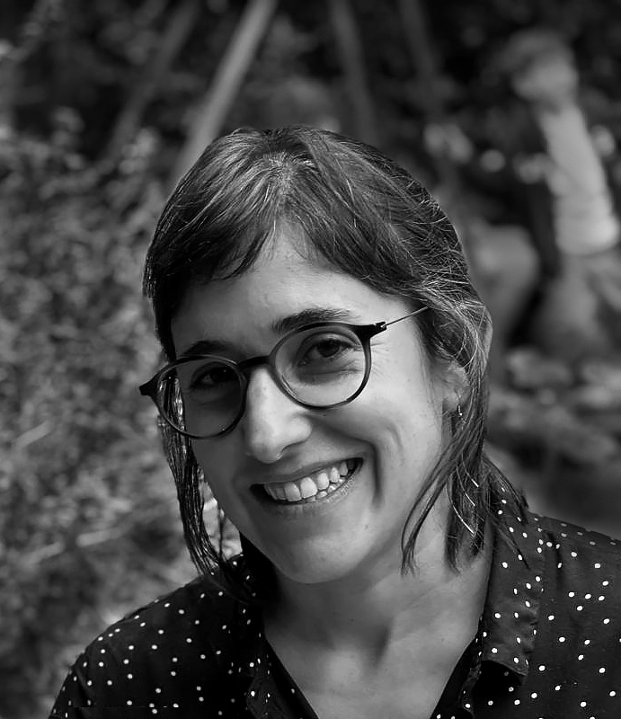

# Irene Costa

Desde niña tengo gran interés y dedicación por las artes plásticas y visuales, siempre curiosa de como funcionan las cosas y si era posible, realizarlas o reutilizarlas. 
Otra de mis inquietudes ha estado volcado a la vida social y como habitamos los espacio. Mi paso por la universidad y mi rol de madre me han cuestionado sobre los roles que tenemos y como nos involucramos con nuestro entorno. 
Estudié diseño gráfico y audiovisual, y años más tarde diseño Industrial, siempre inquieta buscando nuevas experiencias y conocimientos. Complementando con talleres y encuentros en distintas áreas.
Me defino una persona observadora y cuestionadora que me gusta estar en constante actividad, pensando en comunidad.

