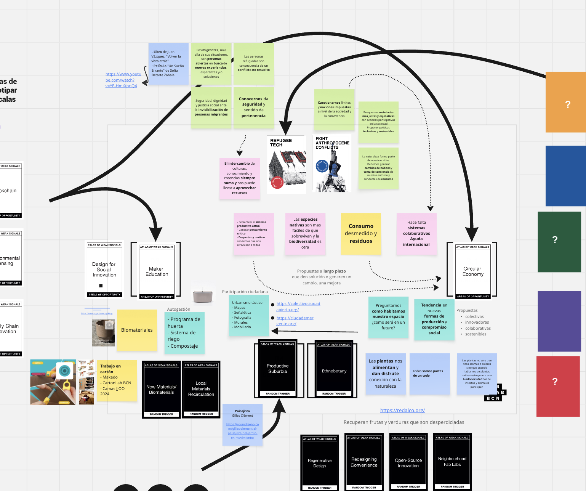

---
hide:
    - toc
---

# MD01

En este primer Módulo de Diseño  se plantea trabajar con el **Atlas de Señales Débiles** (Weaks Signals) en un **Espacio de diseño**.

Como Espacio de diseño se utiliza **MIRO**, una plataforma de pizarra digital colaborativa en línea, donde todos podemos ver y comentar nuestros tableros.  
Esta herramienta permite recopilar y referenciar proyectos, materiales, prototipos, etc. de manera de ir definiendo colecciones de ideas y conceptos. 
La dinámica Weaks Signals va formando una cartografía visual con cartas, por medio de la reflexión de la teoría y la práctica. Es dinámica y fluida. Nos permite abrirnos y al mismo tiempo enfocarnos en nuestros temas de interés.
El juego consta de cartas que permite identificar **oportunidades de diseño** para **futuros emergentes**. 
Existen distintas categorías de tarjetas, que al interactuar en el proceso de diseño (cada una con sus roles)  ordena las ideas en la búsqueda de soluciones de diseño, permitiendo agrupar o generar nuevos conceptos, así como resignificar su sentido.

Las cartas tienen tres categorías, **las señales débiles** que son disparadores a futuros emergentes, acciones hacia nuestros presentes alternativos. Hay distintas temáticas, según su color.
Luego las cartas blancas con **Zonas de oportunidades** o Activación, contiene palabras calves que nos guían a explorar las señales débiles, eventos que pueden incidir en nuestro proceso de diseño.
Y por último las cartas negras con **Disparadores o Desafíos**, para provocar nuevas ideas, retos para la innovación e investigación. Sirven para encontrar oportunidades o relaciones no pensadas. 

La dinámica consiste en sacar dos cartas de cada categoría y comenzar a construir un mapa de situaciones actuales, con posibles escenarios. Tendencias actuales que puedan adaptarse o modifciarse según nuestros intereses en el campo de la investigación. 
Esta tiangulación genera desafíos necesarios para detectar posibles futuros emergentes interconectandos; ejemplos, referencias, temas, palabras que me traen estas cartas.

>Este es el mapa que comencé a armar a partir de las cartas que me tocaron y las interacciones e ideas que me surgieron

### Conexión de los pasos anteriores

Una vez mapeado el espacio de diseño con todo lo que fue surgiendo de esa triangulación, se genera una frase que pueda dar una narrativa a este espacio.
Hay que ver que temáticas, ideas y oportunidades nos resultan más resonantes para armar la narrativa.
Para la formulación de la frase pienso en *mis intereses* (AZUL), que *idea me surge* (VERDE) y con eso *crear oportunidades* (AMARILLO). Esto me permite ir dando forma a posibles **futuros emergentes**.

>> Partiendo de la premisa de arriba, escribí mi frase

### Alternativas presentes

Con esa frase fui describiendo continuidades actuales y presentes alternativos a los cuales poder llevar tres acciones de diseño a distinta escala.

>> Esto es un primer acercamiento,  me va encaminado hacia mis áreas de interés

### Mapeo multiescalar de recursos

Con las temáticas más definidas donde poder tomar acciones desde el diseño e investigar, me planteo las posibilidades que tengo a *distintas escalas*.
Busco oportunidades de co-desarrollo e intervención, y organizo la información en distintas categorías.
Estas acciones de diseño las planteo parada desde FPP (first person perspective). Comenzando a una escala local, pensando desde donde me paro para poder trabajar en comunidad, teniendo claro donde poner mi centro al hacer frente a futuros alternativos. 
Desde mi escala, entorno, cosas que conozco, que he realizado o leído y como eso se podría llevar a otra escala.

#### Notas

Desde que comenzó la EFDI (por momentos parece que fue hace dos días, por otro ya hace un mes) me ha servido para reafirmar cosas que ya sabía y conocer otras nuevas en distintas partes del proceso de diseño. 
Por momentos un poco bombardeada de procesar todo lo nuevo y al mismo tiempo reafirmando cosas que ya sabía y quizás ahora tienen un nombre o un concepto.
Este ejercicio me ha resultado super interesante, recién comienza y no he podido dedicarle o bajar toda la data que tengo en mis pensamientos para comunicar, pero ha sido un buen comienzo para encaminar mis ideas de diseño.

