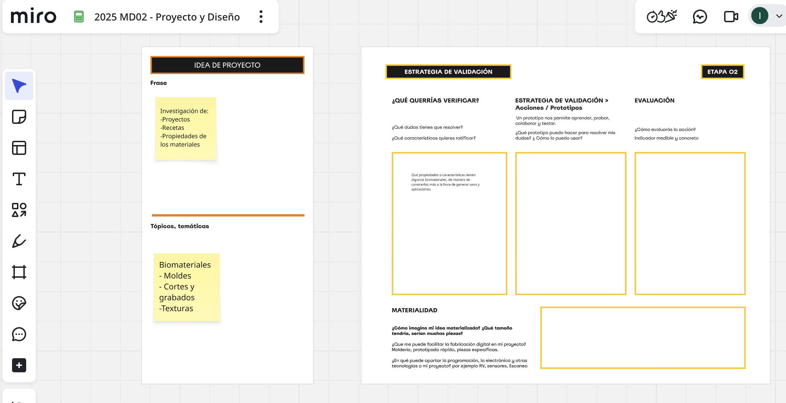

---
hide:
    - toc
---

# MD02
Esta semana sin clases me sirvió para parar y pensar en que proyecto quiero trabajar y que temática tengo ganas de investigar y probar, ya que desde el principio estuve dudando mucho. Revisé los trabajo que fuimos haciendo desde el Atlas of Weak Signals en adelante y me fui replanteando las preguntas desde un abordaje del consumo cotidiano.
 El tema urbanismo, y principalmente infancias me interesan, me preocupa y siento que desde el diseño hay mucho por hacer.
Por otro lado, el tema del consumo, la cantidad de desecho que generamos a diario y la cadena productiva, siempre me inquieta.  
 
Así es que resolví volcar mi proyecto para el mundo de los biomateriales, estudiar mejor sus propiedades, plantear hipótesis y poder desarrollar alguna linea de investigación. 
A nivel producto, que tipo de piezas se podrian generar y que variantes aplicar.
Experimentar, conectando un proceso manual y otro digital. Me resulta super interesante conectar estos dos métodos de trabajo.

**Refelexión**
A veces cuesta definir. Siempre tengo mucho temas que me interesan trabajar y que se pueden abordar desde el diseño.
Desde que me anoté a la especialización, he intentado identificar mis intereses y fortalezas pensando en como acotar y centrarme en un tema.
En el tema urbanismo me parece que hay mucho por hacer, que puede tener un impacto más inmediato con ciertas intervenciones y además, cuento con un entorno de profesionales que militan en el tema. Pero también lo veo más complejo porque depende de muchas políticas públicas, además del cambio de hábito de la gente, como en toda intervención de diseño.
Por otro lado, me motiva mucho más investigar en biomateriales, combinar una parte de laboratorio casero y otra de fabricación digital. Si me sincero es un tema que lo tengo en la cabeza desde hace mucho tiempo, por eso decidí continuar con esta linea.

