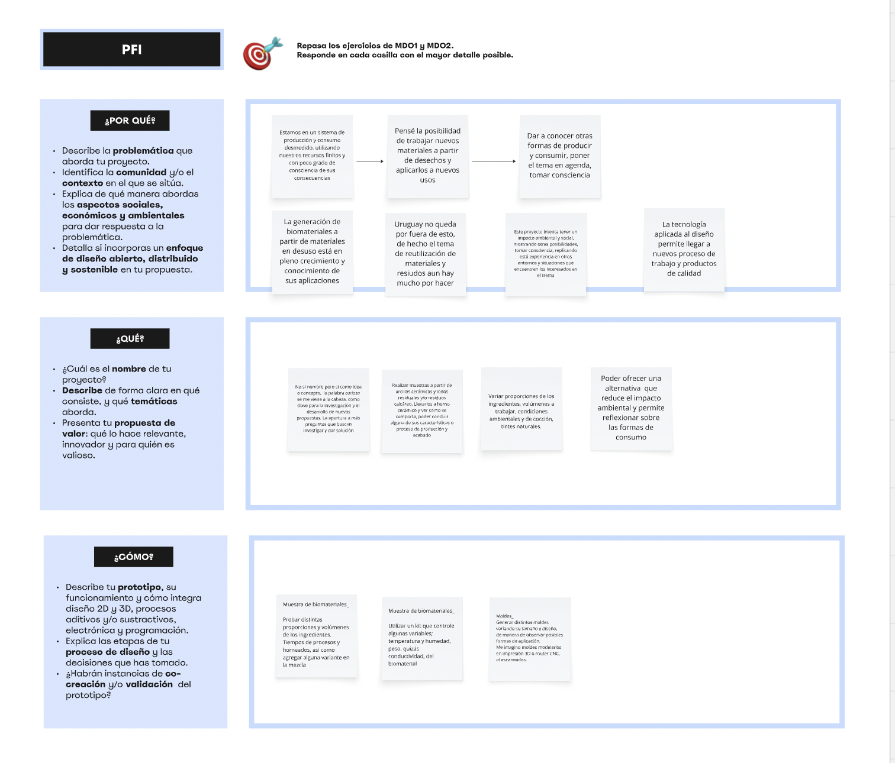
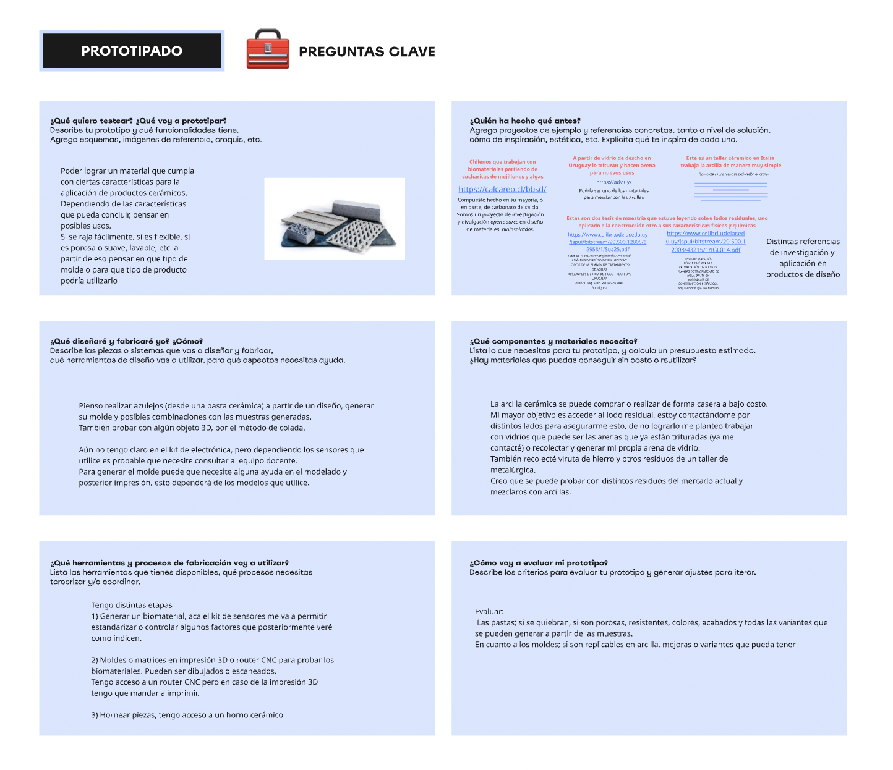
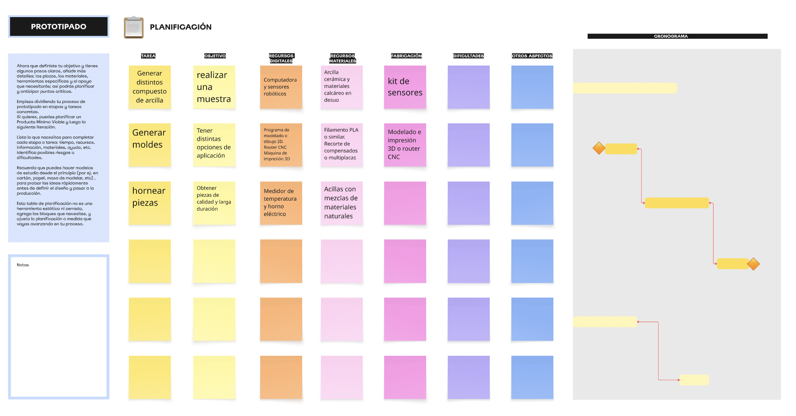

---
hide:
    - toc
---

# MD03

En este módulo comencé repasando los módulos anteriores de diseño MD01/MD02. Completé un poco más el Miro, las fichas anteriores, ya que en la medida que avanzo voy aclarándome hacia atrás, del mismo modo en que voy definiendo por donde seguir.
Partiendo desde el “qué” y “para quien” fui identificando y desarrollando mi idea de experimentar arcillas con otros materiales naturales en desuso. 

Prototipar moldes y generar una muestra de arcillas para concluir cuales podrían ser sus aplicaciones futuras, que problema podría solucionar o apaliar, y que impacto territorial pueda tener.

Como será utilizado con las distintas tecnologías de fabricación digital vistas a lo largo de la especialización. Cuales de ellas me permiten lograr muestras de calidad, y mejorar los procesos productivos y sus ciclos de vida.

Y así, intentar concluir si puede llegar a dar una solución al problema de algunos residuos que en Uruguay se generan diariamente, con carácter innovador en su aplicación, pudiendo darle otros usos y tomando conciencia de nuestros hábitos de consumo.

