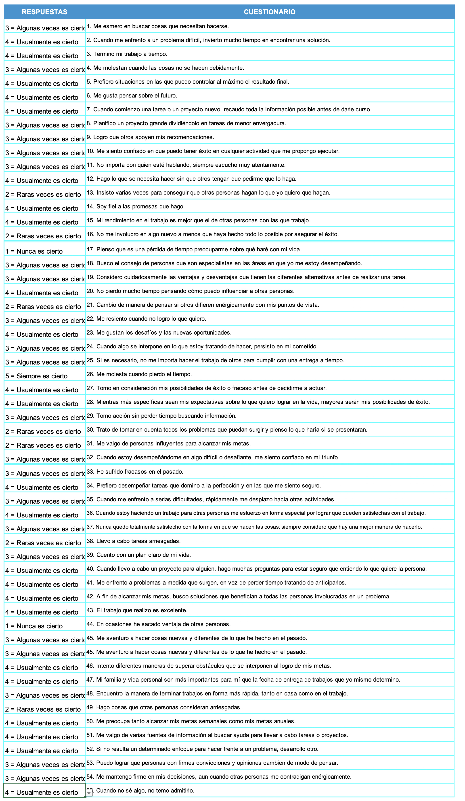
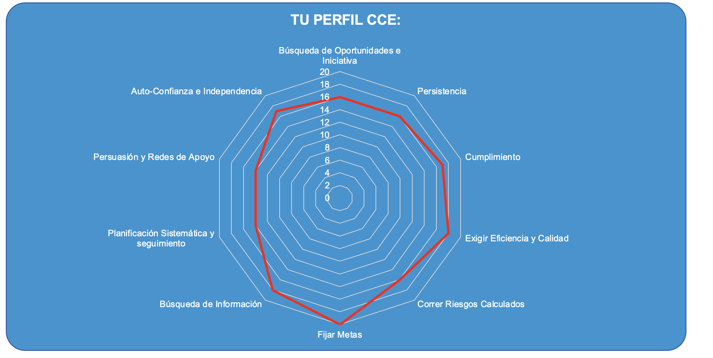

---
hide:
    - toc
---

# Móldulo emprendedor

**¿Qué puedo ofrecer al mercado? Herramientas y estrategias para emprender.**

Es una propuesta dentro del EFDI que me parece una herramienta básica e imprescindible para cualquier profesional, sobre todo cuando solemos tener nuestros propios proyectos y emprendimientos.

Fue un módulo breve, donde no se pudo profundizar mucho, pero si quedaron planteadas algunas preguntas para tener más claro que es lo que tengo para ofrecer, y que herramientas y estrategias puedo aplicar para conocer mejor el mercado.

Es fundamental tener presente las capacidades y habilidades que uno tiene, la pasión que nos moviliza, así como los aprendizajes y dificultades en el recorrido de emprender. 

Realizamos un cuestionario para tener más claro desde donde partimos, conocer nuestro perfil emprededor, y desde allí ver que herramientas necesitamos para lograr los objetivos planteados, y que cosas podemos cambiar o mejorar.

