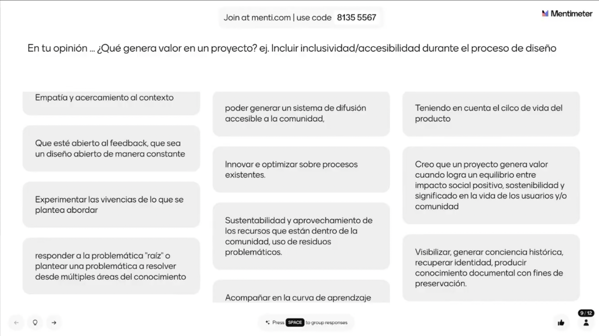
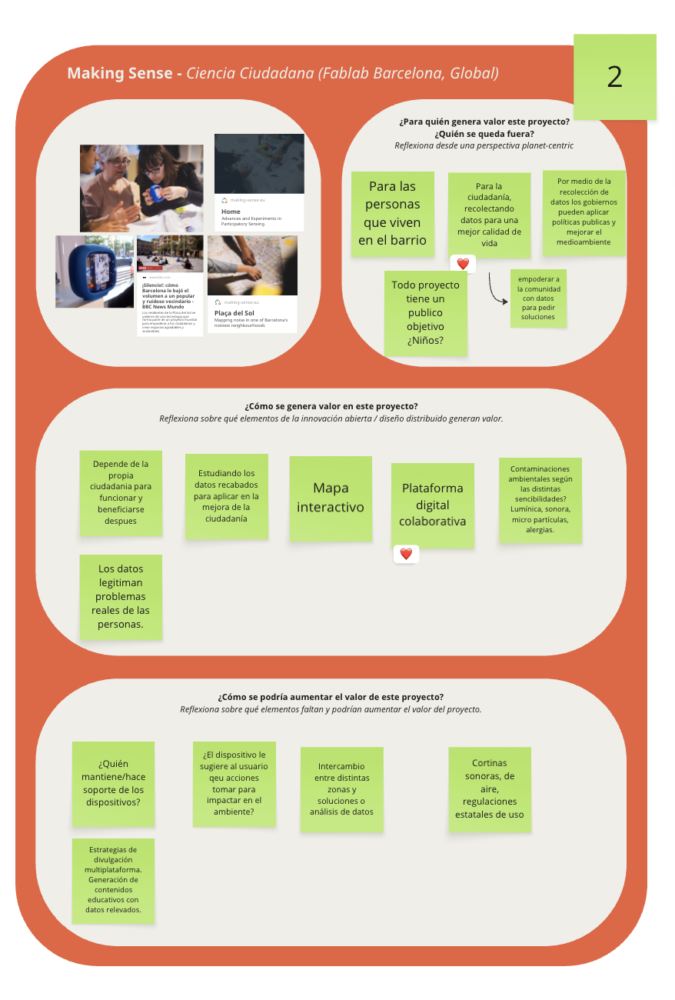
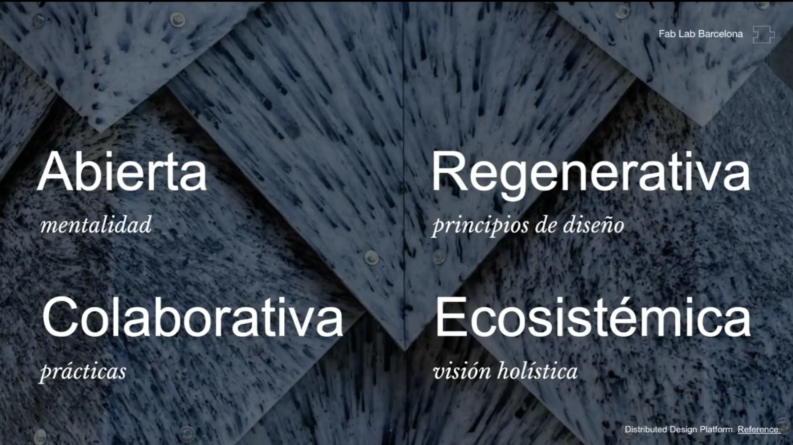
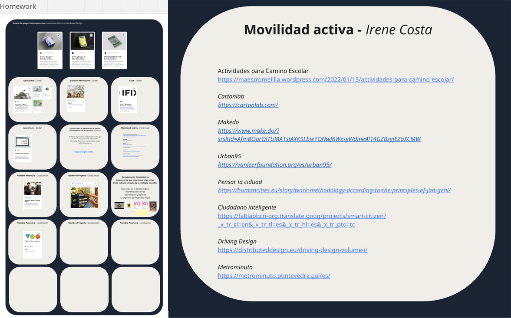
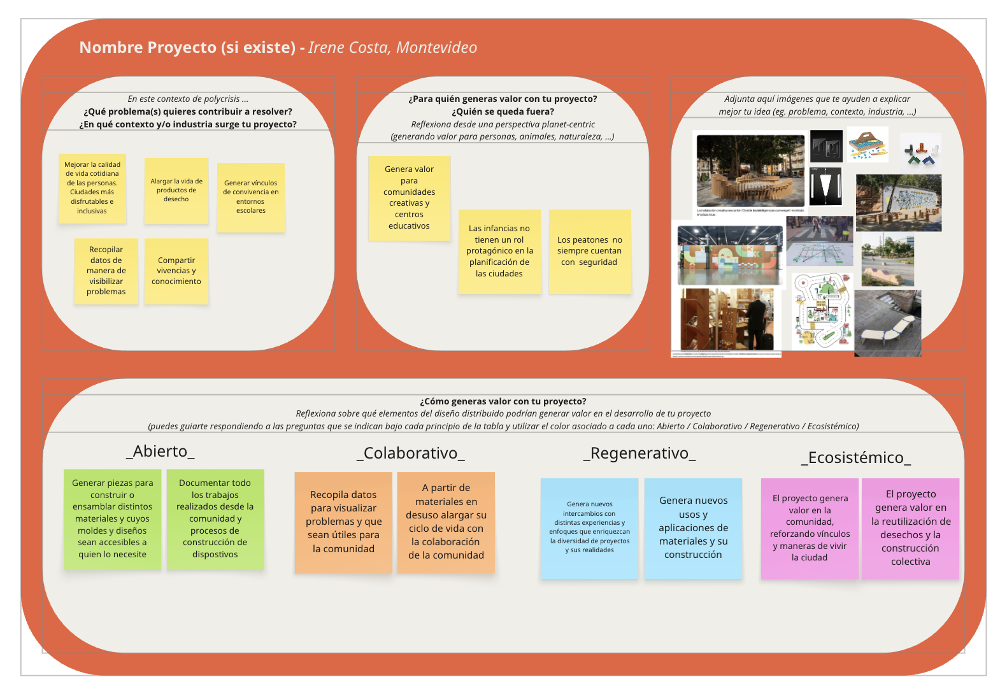

---
hide:
    - toc
---

# MI01

***Módulo de innovación y sostenibilidad***

En este módulo trabajamos sobre el **Diseño Distribuido e Innovación Abierta**, Paola Zanchetta fue quien nos presentó el tema.

Comenzamos hablando de los principios que respaldan estas prácticas.

*Ejercicio.1*

 - **Generación de valor**, la pregunta disparadora fue, ¿Qué genera valor en un proyecto?

Realizamos una lluvia de ideas que fuimos comentando y reflexionando sobre el tema en cuestión.

Surgieron muchos conceptos de lo que es generar valor pensando en el usuario, en sistemas innovadores y sustentables, accesibles y de fácil comunicación.
Como ejemplo vimos *Fiction Factory* que es una empresa que reutiliza desechos de cortes en CNC, alargando la vida de esos desechos y generando productos con una nueva personalidad y de manera colectiva por medio de plataformas digitales.
Esto nos introdujo al mundo del *Open Source*.
-  **Innovación Abierta** 
Consta de tres principios que la definen: ***Transparente, Replicable y Accesible***

Como ejemplo me resultó muy claro, el de las recetas de cocina. Todos podemos tener una misma receta (Transparente) pero luego cada persona pone los suyo (lo hace replicable) con lo que tiene en su entorno (accesible).

Quienes dieron pie al movimiento Open source fueron Makers y los Fablabs, innovando y poniendo en cuestionamiento el debate entre lo que es público y privado, y proponiendo que pueden haber otras formas de producir y consumir.

La innovación abierta implica la creación de un producto final, sea un servicio u objeto a través de un proceso de código abierto y de libre aplicación. Esto permite que sean fabricados, modificados y distribuidos por cualquier persona de forma ecosistémica y compartiendo beneficios. 
Es una solución que beneficia a otros y disminuye el impacto ambiental, pasando de un contexto local a uno global. Este es un principio del **diseño colaborativo**.

Con todo esto conversado, realizamos otro ejercicio. Esta vez, a partir de un ejemplo, explicar como se generó valor y para quien, y como se podría continuar con el proyecto de manera de aumentar su valor, pensando en que en el diseño colectivo siempre se puede seguir modificando y sumando cosas.
En mi caso trabajé con Josefina y Lucho en el proyecto Ciencia Ciudadana (Fablab Barcelona, Global)

*¿Cuáles son los valores de diseño que proporcionarán nuevas alternativas al presente y que nos guiarán hacia la creación de futuros emergentes?*
Con esta pregunta disparadora y contemplando  conceptos que vimos en Diseño 01 sobre futuros emergentes, fuimos profundizando en los **conceptos de valores** aplicado al diseño.

- **Mentalidad abierta**. Las personas para trabajar en comunidad deben tener esta mirada y así lograr proyectos transmisibles. Cuanto mas accesible mas replicable.
- **Regenerativa**. Este concepto no entra solo del contexto ambiental, sino también en un contexto social y económico. 

- **Colaborativa**. Estas prácticas son las que lleva acabo la innovación abierta de las que estuve hablando anteriormente. El trabajo en comunidad genera mayor alcance e impacto.

- **Ecosistémico**. Es inherente a cómo se desarrollan los proyectos colaborativos, con propuesta regenerativas y mentalidad abierta. 

*Ejemplos vistos en clase_*
Domingo Club, Preous Plastic, Tamaragua y Fernanado La Pose, artista mexicano.

*Ejercicio.2*

Luego de ver varios ejemplos, realizamos esta primer etapa donde pensamos referentes que se vinculen a nuestra idea de proyecto y nos resulten inspiradores.

Con estas referencias, se planteó el siguiente ejercicio.
 Preguntarnos ¿qué valor de diseño aportan nuestros proyectos?, ¿qué aportarán a la comunidad?, ¿de qué manera se puede trabajar pensando en un diseño distribuido y con innovación abierta?

**Reflexiones**

Estos temas generan pensamiento crítico respecto al sistema actual y las maneras alternativas de diseñar que tenemos a nuestro alcance. Tomar conciencia de lo que generamos y como nos puede enriquecer realizar un proceso colaborativo.
Construir nuevas formas de innovar es posible  desde una comunidad que entienda otra forma de crear y compartir conocimientos con un trabajo multidisciplinario. 
Todos los casos vistos son ejemplos de que es posible generar nuevas formas de colaborar e innovar para enriquecernos todos y realmente llegar a construir otro tipo de soluciones. 
Es indispensable pensar en un diseño distribuido e innovador que permita explorar el potencial del proyecto, sus valores asociados al trabajo multidisciplinario y democratizando las creaciones. El desafío esta en construir una solución sistemática con nuevas formas de colaborar e innovar juntos.

Me pregunto en Uruguay donde estamos parados, si la sociedad lo entiende igual, como transmitir estos pensamientos, fantaseando con que es posible, que se puede dar el ejemplo y la difusión con las herramientas que hay a la mano.
Este trabajo también me permitió reever mi formación acadéica y los tiempos actuales. Ver desde donde partir y las dimensiones que puede llegar a tener mi proyecto, según mis decisiones. 

