---
hide:
    - toc
---

# MI02

***Módulo de innovación y sostenibilidad***

En este módulo con Paola Zanchetta Muñoz seguimos profundizando en nuevos paradigmas de producción y consumo. Realizar el ejercicio de pensar no solo en nuestra realidad actual sino a futuro qué consecuencias puede tener.

Como diseñadores a la hora de generar nuevos proyectos todas nuestras decisiones van a realizar cambios económicos, sociales y ambientales, por eso es importante identificar y reflexionar sobre estos temas. Idear soluciones sostenibles y circulares de manera de promover la sostenibilidad y le economía circular como modelos de producción y consumo.

Profundizamos en la economía circular, las decisiones y estrategias que el sistema define.
El Butterfly Diagram (o Diagrama de la Mariposa) dos ciclos; el biológico (izquierdo), para materiales biodegradables que regeneran la naturaleza, y el técnico (derecho), para mantener productos en uso mediante reparación, reutilización y reciclaje. 
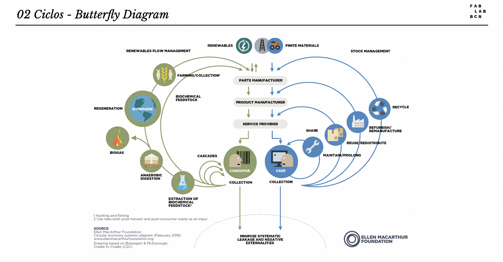

La Economía del Donut (o de la rosquilla) fue otro tema planteado. Este método propone un modelo económico sostenible y distributivo, donde las necesidades básicas de todos los seres humanos esten cubiertas (base social) sin sobrepasar los límites ecológicos del planeta (techo ecológico). El objetivo es prosperar en el "espacio justo y seguro" entre ambos anillos. Esto fue planteado por la economista Kate Raworth.
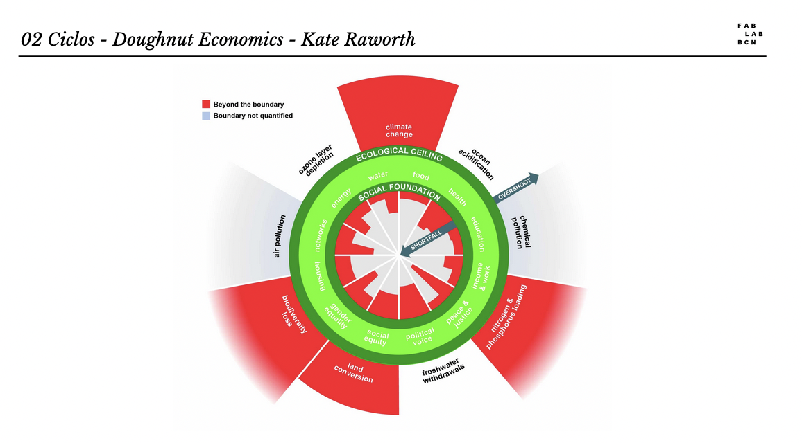

 
LCA (Life-Cycle Assessment) y Hotspots. Realiza un análisis del Ciclo de Vida (LCA) es una metodología que evalúa el impacto ambiental de un producto desde la extracción de materias primas hasta su fin.
Los Hotspots son las etapas críticas identificadas por el LCA con el mayor impacto, permitiendo enfocar esfuerzos de sostenibilidad donde más importa.
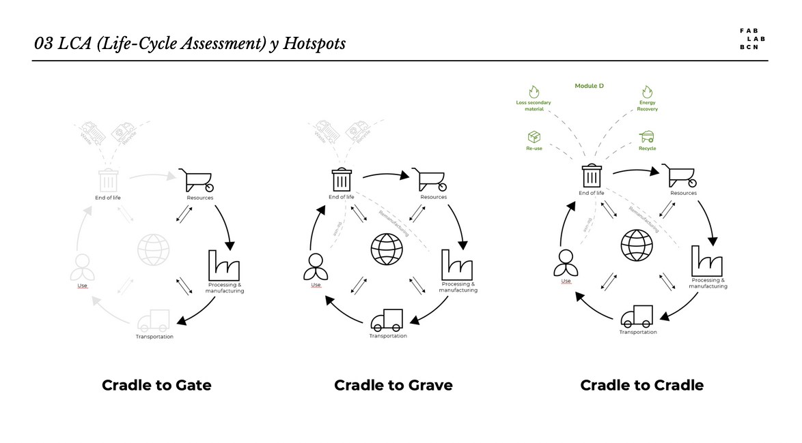

Como ejemplo nos contó de un proyecto en el que trabajó, Inter Matter, en el que clasifican materiales y sus posibilidades de reutilización en el mundo de la construcción.

Hablamos de los Círculos de influencias que promueven la economía circular, enfocándose en reducir, reutilizar y reciclar para extender la vida útil de los materiales. Este enfoque implica diseñar para la sostenibilidad, consumir localmente, reparar productos y adoptar hábitos conscientes para minimizar residuos. 
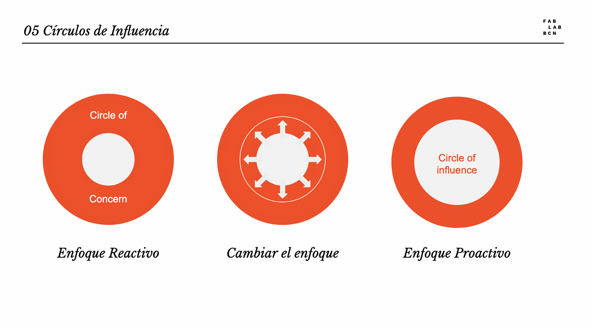

Repasamos los Principios de Diseño Circular 
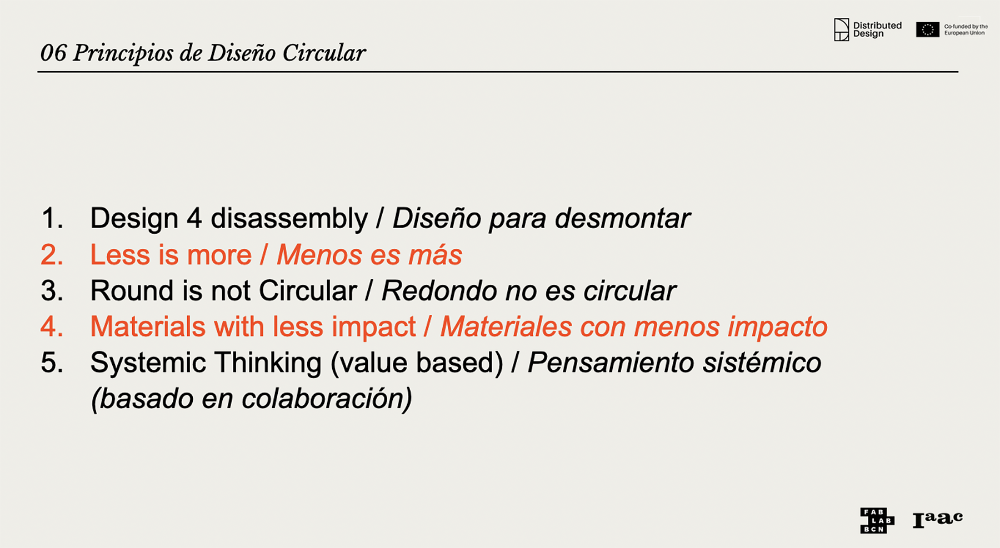

También vimos varios proyectos que aplican estos principios, y que por suerte cada vez son más, y algunos libros para tener presente como El poder del “Storytelling” - The Future We Choose o Los caminos hacia la sostenibilidad a través del diseño de Ramón Úbeda.
A partir de estos temas hablados realizamos un par de ejercicios.
Quedó planteado el tema y cada uno fue evaluando sus comportamientos de consumo, que grado de importancia o consciencia le damos.
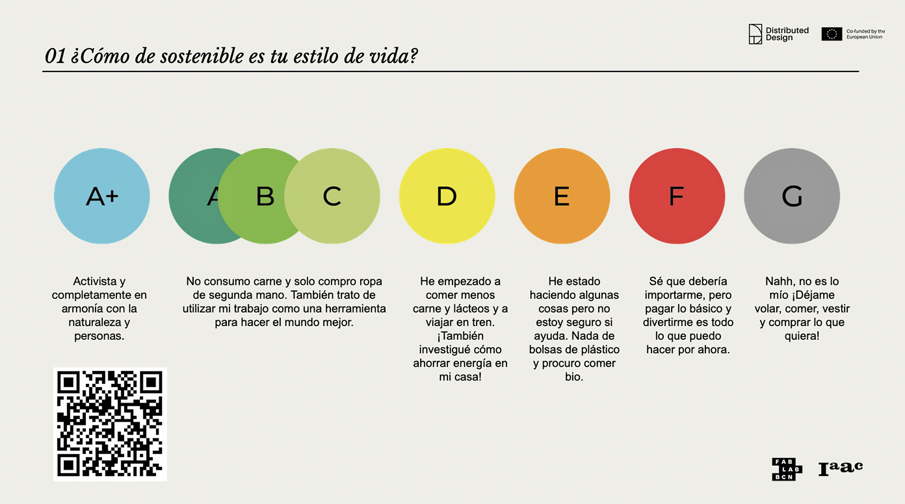

Luego de definir como actuamos o como creemos que actuamos respecto a estos temas, realizamos el ejericio de pensar en algo que hubiésemos comprado hace poco y cual era su impacto.

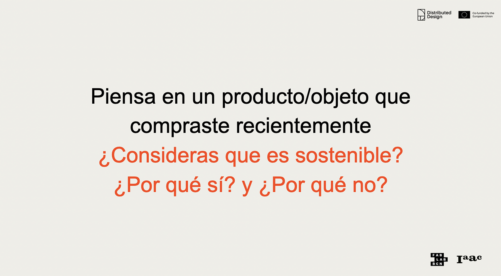

**Reflexiones y comentarios_**

Estos temas me interpelan no solo profesionalmente sino como parte del sistema de consumo en el que vivo.
Cuando profundizo en estos temas me quedo pensando en todo lo que utilizo, compro y desecho y luego lo pienso a escala mundial y me desborda e inquieta pensar en cómo va seguir esto sino hay un cambio real. 
Estos ejercicios estuvieron muy buenos y debería hacerlo cada tanto, porque una cosa es como uno se percibe y otra lo que hacer. 
Me deja pensando por un lado que a veces es contradictorio como actuamos si lo pienso más drásticamente, hago esto y aquello de manera consciente y sustentable pero luego consumo otra cosa que vino del otro lado del mundo con sistemas productivos y materiales super contaminantes.
Y a otro nivel mas positivo pienso todo lo que se puede hacer y mejorar con poco. 

*Para explicar de forma resumida algunos de los conceptos trabajados, me ayudé en la redacción de los textos con la IA generada por Google.*

**LAB_Minas**

Siguiendo con el módulo de innovación y sostenibilidad tuvimos el taller de biomateriales en UTEC Minas a cargo de Ma. Clara Freyre (Maca).
Pudimos ver un gran muestrario de biomateriales realizados con distintas recetas e ingredientes y tuvimos una presentación del tema, sus variantes y precauciones de laboratorio a la hora de trabajar.
Todas estas recetas tienen ingredientes y cantidades que hay que seguir, pero acepta un montón de variantes en sus agregados, y los resultados son bien distintos. 
En la medida que fuimos pasando por las estaciones cada equipo fue dando su toque personal y los resultados fueron bien distintos.

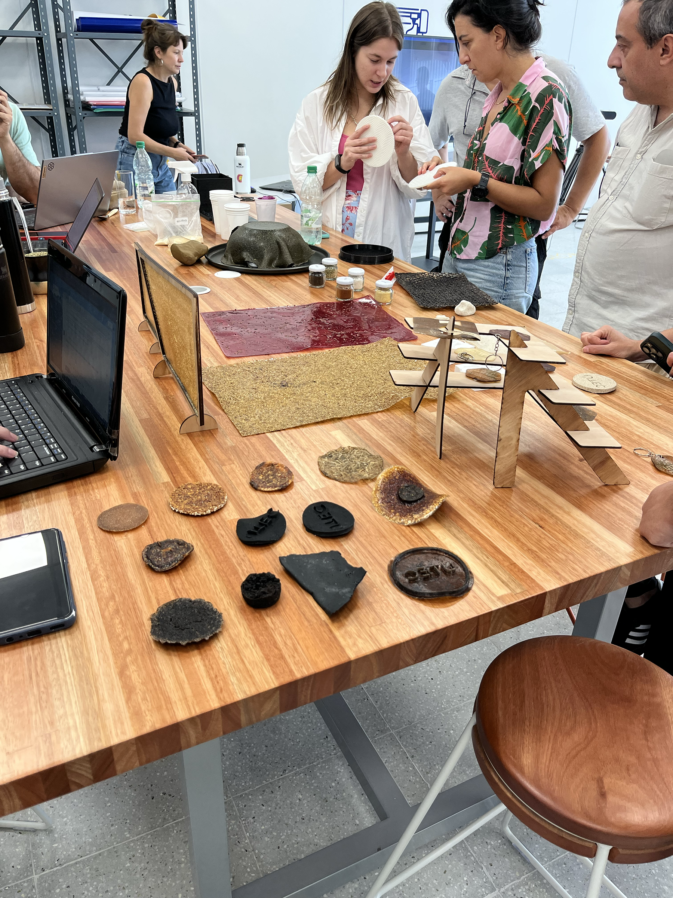

Nos propuso cuatro estaciones para probar distintos biomateriales
1.	En base ALGINATO DE SODIO (biohilos)
2.	En base a GELATINA
3.	En base a RESINA
4.	En base a BIOCERÁMICA

**- Bioplástico en base de Alginato de sodio**

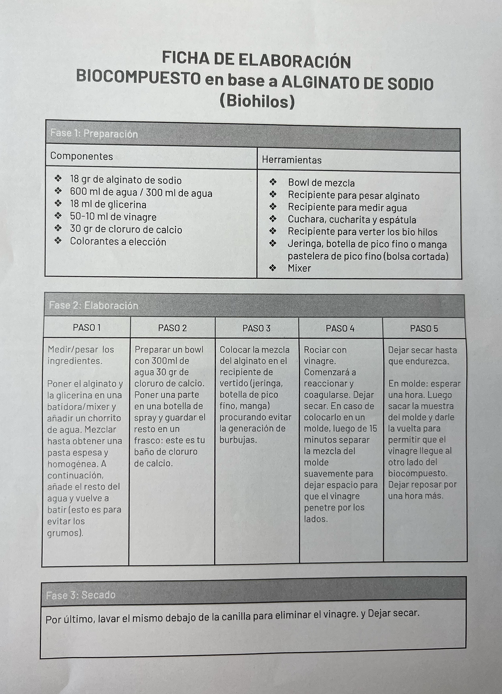
1.En el caso de biohilos podes jugar con el espesor de hilo variando de jeringa o instrumento para fabricarlos, asi como de colorante.
Es importante que no toque los bordes del recipiente, sino se pega o corta el hilo.

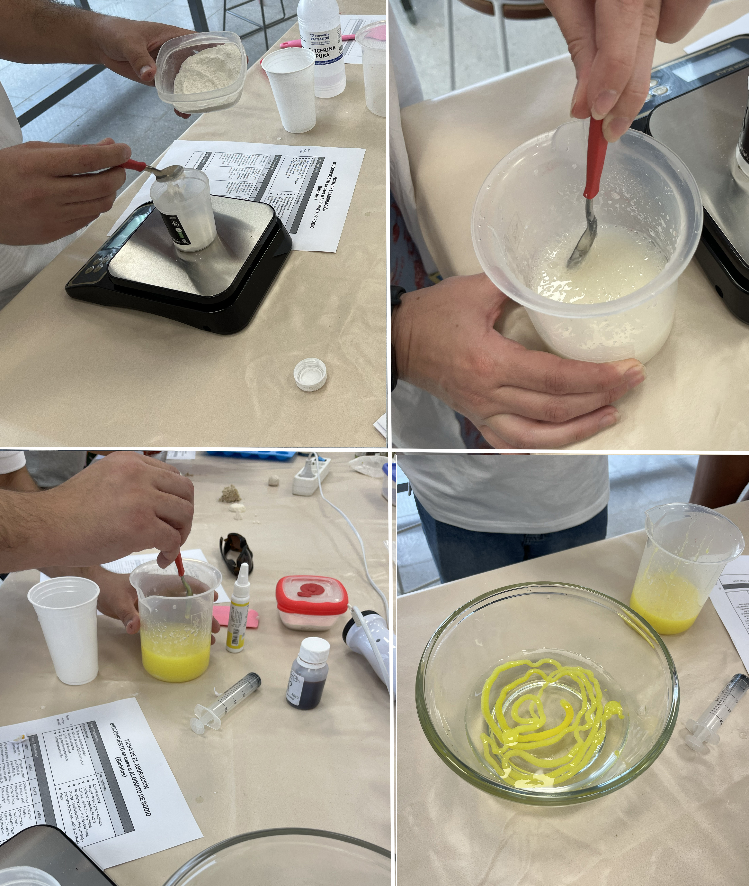

https://youtube.com/shorts/IDX3rLBLDIM?feature=share

**Bioplástico en base a Gelatina**

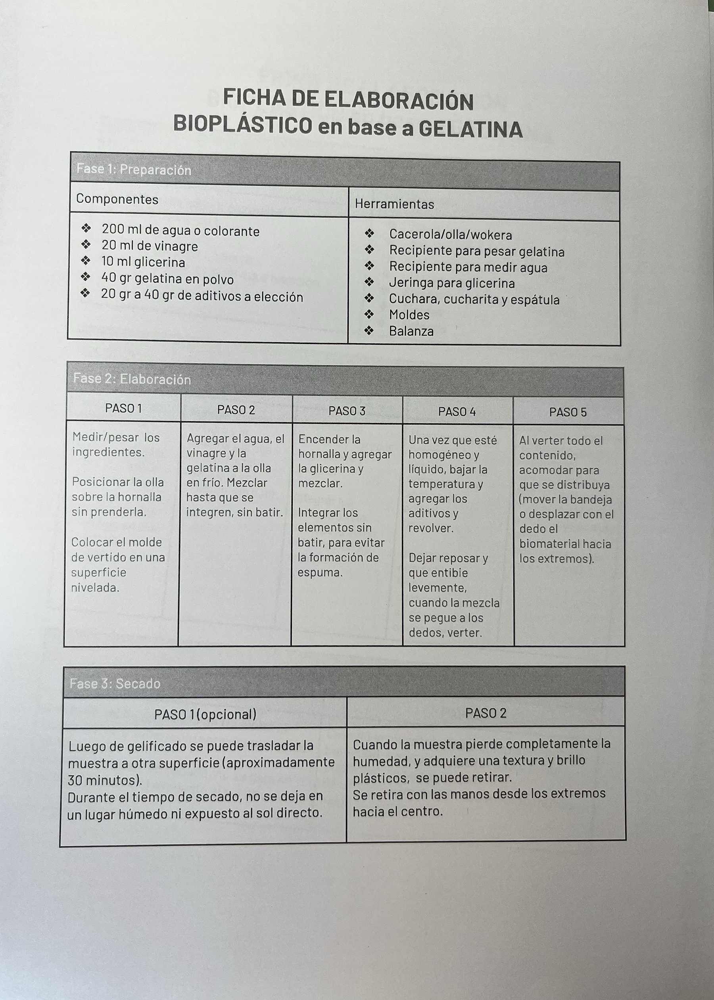

2.En el caso de la gelatina fue bien distinto, algunos con colorantes, con fragmentos de materia orgánica seca (esto es calve para que no agarre hongos el material, siempre asegurarnos que está seca, la podemos poner al horno o dejar varios días).
También varía si batimos o no la muestra, si la dejamos tal cual es más bien translúcida, si la batimos queda de un color crudo y más espumosa.

En está práctica usamos cascara de naranja, café, yuyos, yerba, cascara de cebolla, colorante de flor de santa Rita y había otras opciones más. Es infinito.
Cuando se queda pejaosa la mezcla ya la podemos mezclar con los agregados y verter al molde.

https://www.youtube.com/shorts/FRD4gCoj-Ug

https://youtube.com/shorts/9O1nzMbxYLU

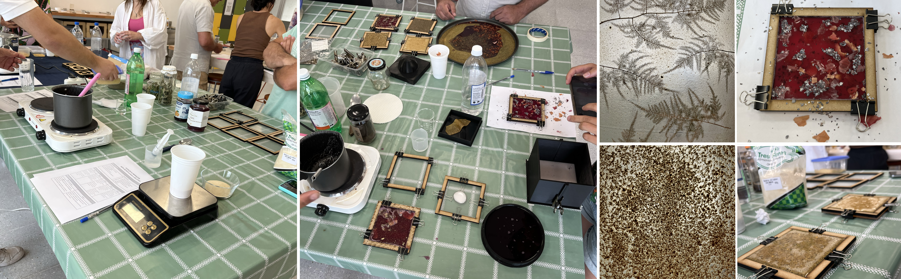

Dejamos secar en los moldes de MDF por una semana de manera que mantenga la forma, sino al secarse se encoge mucho. 
Si bien lo dejé una semana como lo plantaron, un poco se deformó y se ve que tensó porque se rajó mínimamente en dos de las esquinas previo a que lo saque. La cara de arriba estaba bien seca, la cara de abajo (contra el vidrio) aun un poco húmeda, quizás es mejor algún soporte que lo deje respirar.
Con los días se siguió secando y deformando.

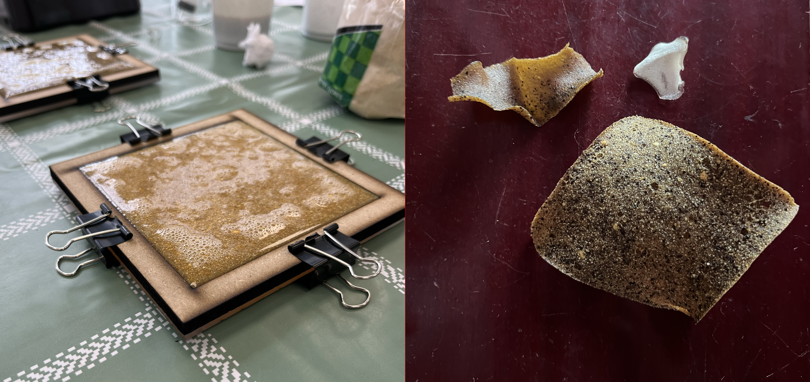
La muestra blanca que se ve en la foto de la derecha esta batida la mezcla sin nigún otro aditivo.

**Bioplástico en base a Resina**

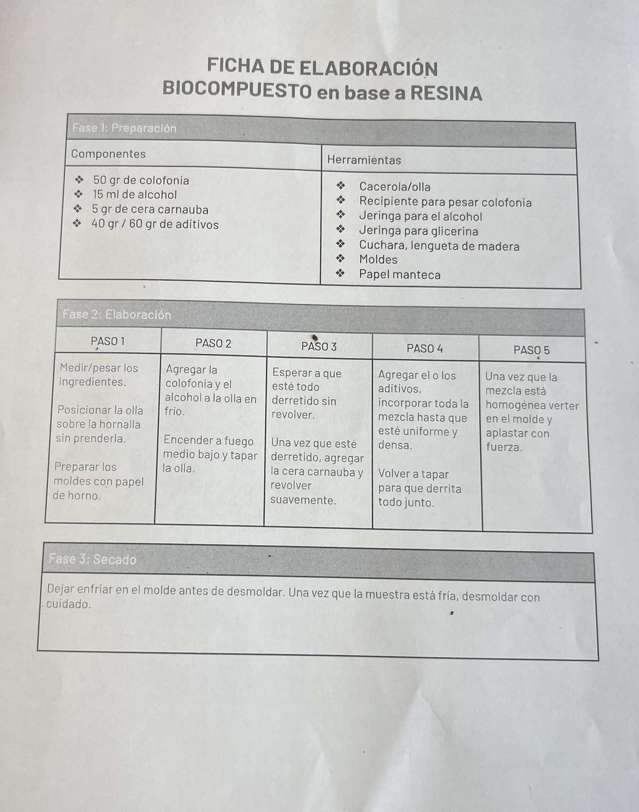

3. La muestra (negra) fue con borra de café y la otra con cascara de naranja y yerba, no recuerdo si algo más. La primera quedó super rígida y homogénea, en la segunda muestra se evaporó muy rápido el alcohol, hubo que poner más y luego como que no terminó de secar, largaba un jugo húmedo. 

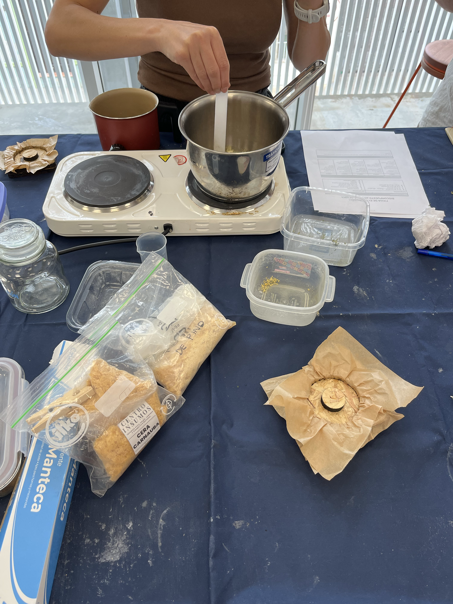

https://www.youtube.com/shorts/YbNlFLZ8i40
Esta es la muestra donde hubo que agregar alcohol

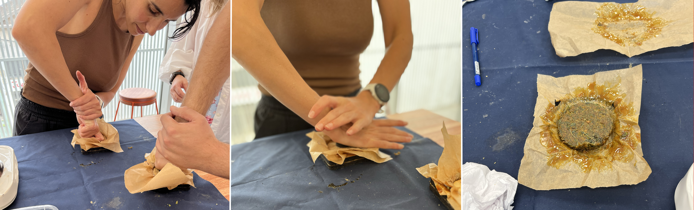

Muestra con café
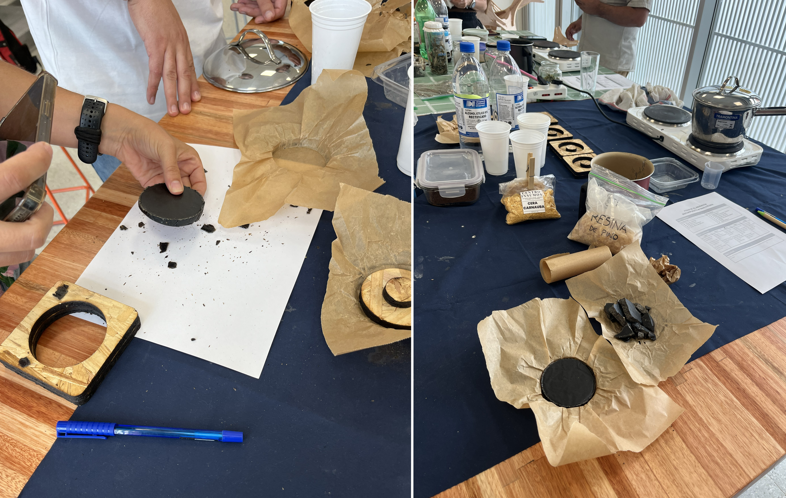

https://youtube.com/shorts/gk8DdtCCX5U
Si bien quedó super rígida y homogenea, Lucho probó tirarla desde 2, 3 metros de alto y se rompió.

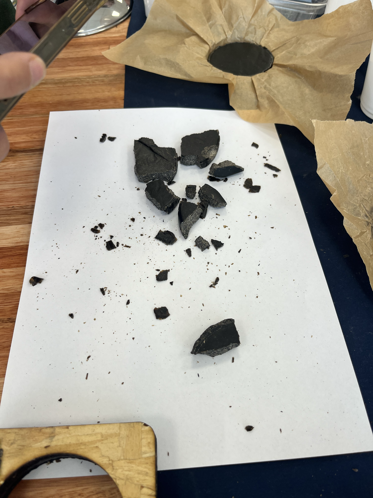

Es parte de realizar las pruebas, aprender y ajustar. Todo está en juego, las cantidades, el calor, los tiempos. Quedaron muy distintas las muestras de la primera receta a la de la segunda.

**Bioplástico en base de Biocerámica**

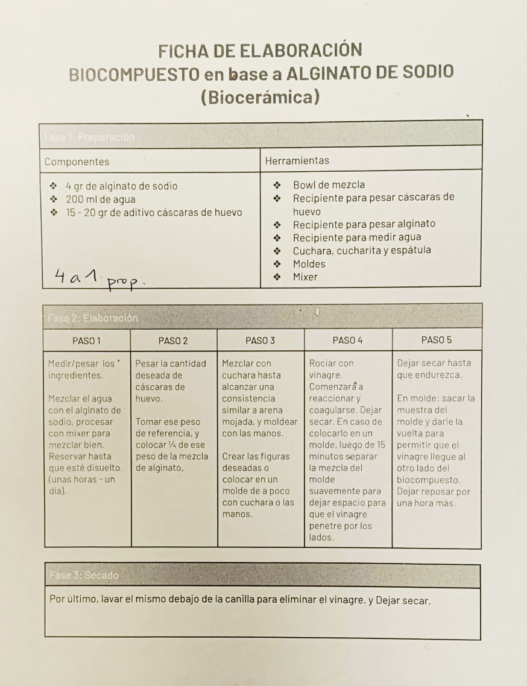

4. En el caso de la biocerámica que estaba el preparado a base de cascara de huevo, luego probamos mezclando con mejillones molidos, como otro posible material calcáreo y el resultado visual fue bien distinto y funcionó bien.

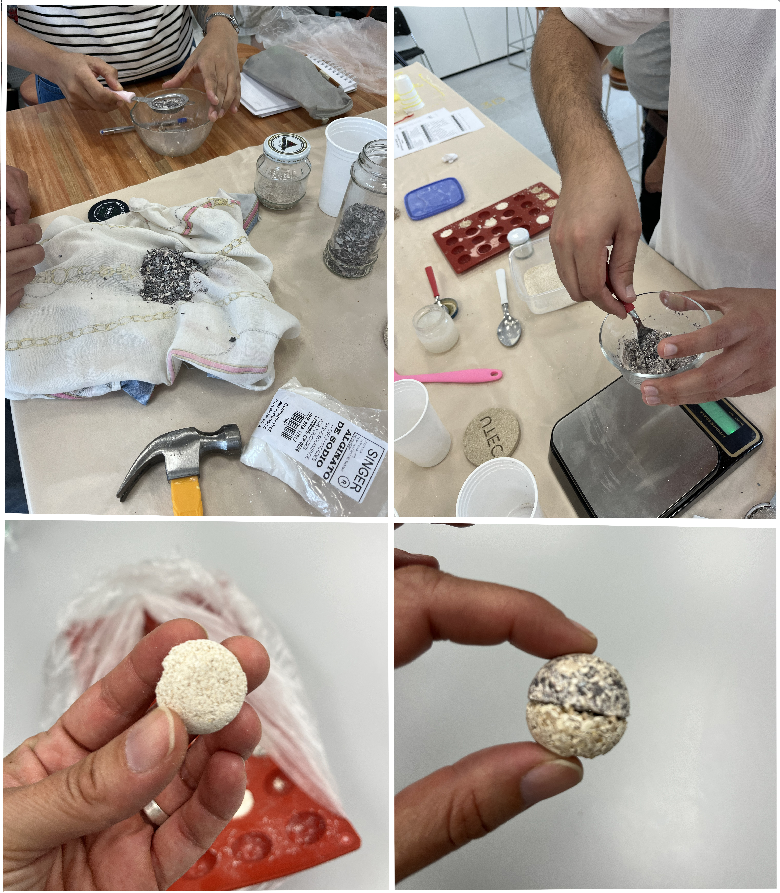
 

Todas estas recetas son de fácil fabricación y tienen distintos resultados para diferentes aplicaciones.
Es increíble la cantidad de variantes que te ofrece, son muchísimas las posibilidades.

