---
hide:
    - toc
---

# Procesos y desarrollo en el taller

### *-Relevamiento y recolección de residuos*

El punto de partida fue un mapeo de desechos de fácil acceso en mi entorno local. Analicé sus propiedades para comprender cómo interactuarían con los componentes de la arcilla cerámica (donde la arcilla aporta plasticidad, los silicatos y el cuarzo dan estructura, y el talco facilita la sinterización).

A partir de este análisis, recolecté tres categorías de descarte:
- **Residuos metálicos:** Obtuve viruta de guillotina, residuos de corte por plasma CNC y barrido de taller de una metalúrgica de Montevideo. En Uruguay existe una única planta que realiza el proceso completo de fundición y producción de acero a partir de chatarra reciclada; trabajar con estos descartes menores ayuda a visibilizar las mermas del sector.

- **Residuos vítreos:** Me contacté con Arenas de Vidrio, un emprendimiento pionero de economía circular. Me facilitaron dos muestras de su vidrio molido post-consumo, un proyecto clave considerando que en el país se enterraban unas 20.000 toneladas de envases al año por no contar con una industria vidriera activa.

- **Residuos calcáreos:** Recolecté cucharitas de mejillón en la orilla de la playa, las cuales lavé, limpié y trituré. Este residuo orgánico costero es una fuente excelente y renovable de Carbonato de Calcio.

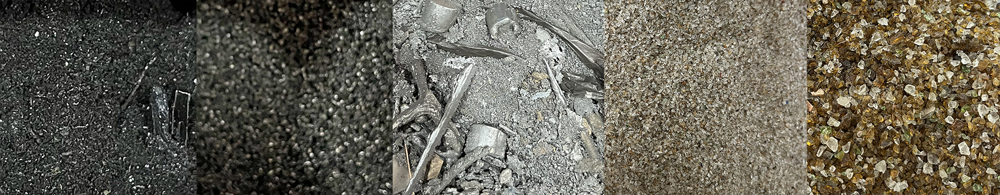
 >>Muestas de los residuos metálicos y vítreos 

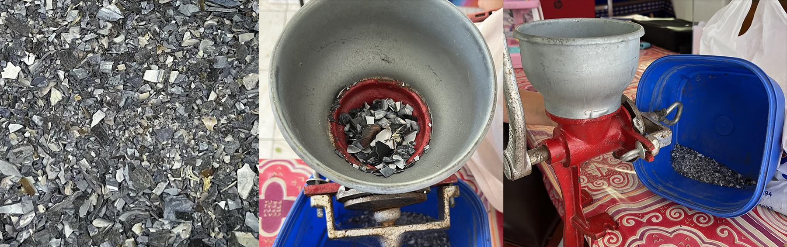
 >>Una vez limpias las cucharitas de mejillones, fueron trituradas con un molinillo

**1. Criterios de ensayo y variables de control**
Armé los cuadros de lo que buscaba investigar con cada muestra.

**Ficha de muestra**
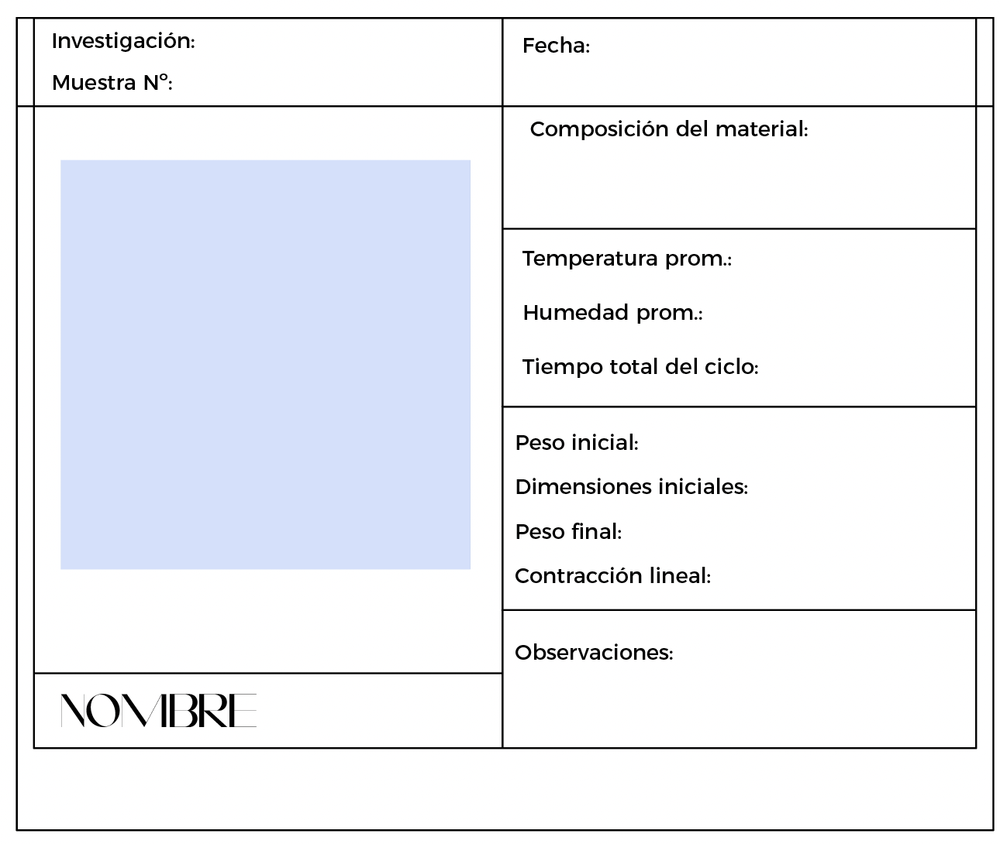

En paralelo armé los cuadros para el registro. 

**Cuadro de cerámica**
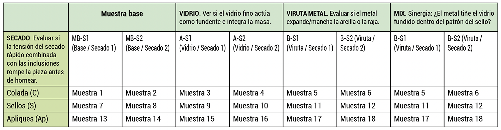

Al cruzar los métodos de aplicación con el Vidrio (A) y la Viruta (B), probar la viabilidad mecánica, estudio de flujos y deformaciones de la masa:
•    **Colada + Inclusiones (Vidrio / Viruta):** Qué estoy probando: La capacidad de suspensión y el comportamiento del material líquido. Evalúo si el peso del vidrio o el metal hace que decanten al fondo del molde de yeso antes de que la arcilla absorba el agua, o si obstruyen el vaciado de la barbotina. También pruebo la capilaridad: si la inclusión bloquea o altera la absorción de agua por parte del yeso.
•    **Sellos + Inclusiones:** Qué estoy probando: La definición de detalle, la plasticidad y la textura superficial. Al presionar un sello sobre una masa con viruta o vidrio, evaluo si las partículas grandes “desgarran” la superficie al ser arrastradas por el sello, o si la masa pierde fidelidad para copiar relieves finos debido a los componentes no plásticos.
•    **Apliques + Inclusiones:** Qué estoy probando: La tenacidad de la masa en estado plástico y la resistencia de las uniones (pastillaje). Evalúo si las inclusiones reducen la capacidad de cohesión de la arcilla al unir dos piezas húmedas (el aplique con la base) y si generan planos de fractura internos.

**Cuadro bioplásticos**
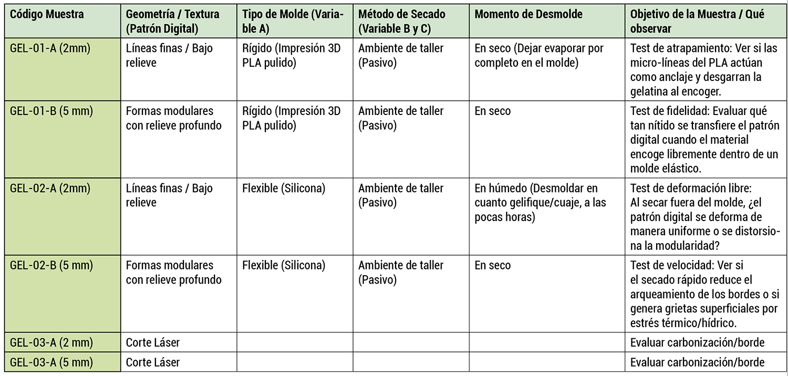

**Repito con Método de Secado** (Variable C) cámara de secado , En húmedo (Desmoldar en cuanto gelifique/cuaje, a las pocas horas)
**Test de deformación libre:** Al secar fuera del molde, ¿el patrón digital se deforma de manera uniforme o se distorsiona la modularidad?
**Test de velocidad:** Ver si el secado rápido reduce el arqueamiento de los bordes o si genera grietas superficiales por estrés térmico/hídrico.

**2. Desarrollo de la Infraestructura Técnica y Herramientas**
Antes de ponerme a preparar las mezclas, definí qué tipo de moldes iba a usar y cómo iba a controlar el ambiente, que cosas necesitaba para la máquina de secado. Como son materiales experimentales y bastante inestables, sumado a que los residuos tampoco son siempre iguales, quería tener esto resuelto desde el principio.

### *- El Desafío del Clima: Diseño de la Cámara de Secado*
Tanto las pastas cerámicas híbridas como los bioplásticos son extremadamente sensibles a las condiciones ambientales y propensos a contraerse de forma despareja. Como estos materiales experimentales son difíciles de controlar, antes de preparar las masas decidí diseñar e implementar una cámara de secado automatizada para monitorear y controlar las variables de temperatura y humedad de manera constante. Su función fue garantizar un entorno estable que permitiera un secado uniforme, reduciendo las tensiones internas de las piezas y evitando fisuras o arqueamientos críticos antes de la quema o el desmolde final.

- **1. Estructura y Hardware**
**Dimensiones y estructura:** Definí que el tamaño de la cámara fuera de 30x30x45 cm, considerando las dimensiones del horno cerámico que utilizo habitualmente. La carcasa y soporte estructural de la cámara se diseñaron digitalmente primero con Fusion 360 y luego en RD Works que permite cortar (Cut), Escanear/Grabar (Scan). Esto es variando las velocidades y potencia (en MT03 está explicado más en detalle). Luego se materializaron utilizando la máquina de corte láser, logrando un ensamble preciso y modular para los componentes electrónicos. 
Su puerta tiene un vidrio de 20x20cm y 5mm de espesor, que permite visualizar lo que está sucediendo dentro.

- **Circulación de aire:** Instalé dos ventiladores de 5V para extraer el aire húmedo interior (puse dos porque uno solo se quedaba corto de potencia) y un tercer ventilador interno dedicado exclusivamente a mover el aire y homogeneizar el ambiente.

- **Control térmico:** Tras consultarlo con los docentes, entendí que mover el aire interno no era suficiente si no controlaba la temperatura. Incorporé una manta calefactora para reptiles de 14W (de 28x28 cm, ideal para la escala de la cámara) regulada por un temporizador. Como el piso de la cámara pasó de melamínico a MDF de 5 mm y la manta levanta calor, coloqué por debajo una losa cerámica de 28x21 cm como aislante de seguridad.
- **Optimización y espacio:** Forré el interior con una lámina térmica y refractante para aprovechar al máximo el calor, y agregué dos parrillas de cocina de 28x28 cm para duplicar el espacio de estibado y poder secar más piezas en simultáneo.

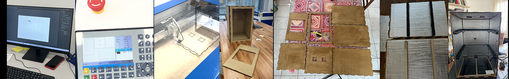

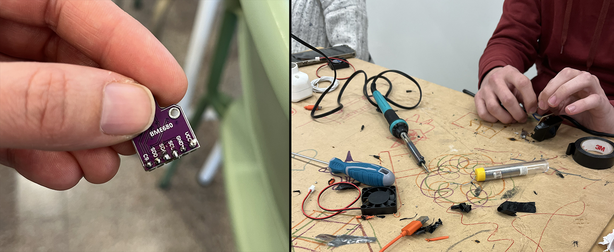

**2. Electrónica y Automatización (El mayor desafío)**
Mis conocimientos de electrónica eran básicos (lo aprendido en los módulos de la especialización) y se sumaba la dificultad de combinar componentes de voltajes cruzados (ventiladores de 5V, manta de 220V y el microcontrolador). El sistema se estructuró así:
**El Cerebro:** Un **ESP32** encargado de procesar los datos y dar las órdenes.
**El Sensor:** Un **BME680**, un componente muy potente que mide temperatura, humedad y calidad del aire.
**Los Actuadores:** Dos módulos de relés que funcionan como interruptores digitales entre la corriente de los periféricos y el ESP32.

Durante una instancia presencial con los docentes, logré soldar el sensor, probar los ventiladores y armar el circuito de los relés con la manta. Esto me ayudó muchísimo a entender el flujo real de las conexiones.

Sin embargo, el trabajo en casa tuvo sus complicaciones. Al conectar todo en la protoboard, el ESP32 ocupaba casi toda la placa y me quedé sin espacio para los cables, lo que me obligó a comprar una segunda placa de pruebas. El momento crítico llegó cuando, con todo cableado y las luces encendidas, el sistema no respondía. Tras investigar, consultar a compañeros y docentes, poco a poco razonar el circuito, descubrí que era un problema de asignación de pines. Estaba usando los pines **GPIO 2 y 4**, que son pines de arranque (boot) y se veían afectados por el voltaje de los componentes externos. Cambié la programación a los pines **GPIO 13 y 14** (puertos seguros de propósito general) y el sistema finalmente funcionó. Con el hardware validado, subí el código final desde el entorno de Arduino, como ya había trabajado con ESP32 tenía la biblioteca descargada, luego fue copiar y pegar lo que le había pedido a la IA que fue: "Tengo un ESP32 que quiero que haga esto y esto otro, tengo un EMB680, un reles conectado a una manta de calor y otro a tres ventiladores".

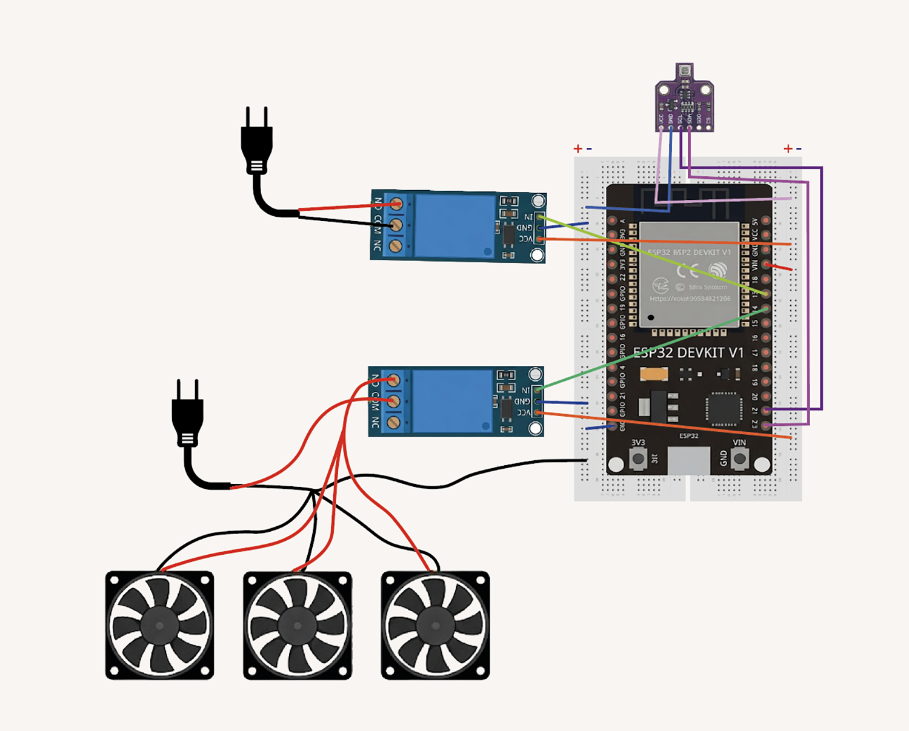

**3. Fundamentación Climática y Lógica del Código**
Para programar la cámara, primero investigué el contexto real del clima local. Según un estudio estadístico de la Dirección de Climatología y Documentación del INUMET (Instituto Uruguayo de Meteorología), las temperaturas promedio en Montevideo oscilan entre los 13°C y 18°C en mayo, y descienden a una media de 10°C a 15°C en junio, acompañadas por una humedad relativa elevada que ronda el 80% durante todo el año.
Estas condiciones complican el secado natural, considerando los rangos óptimos de cada material:
- **Cerámica:** Requiere una fase inicial de 20°C a 25°C (con 70-80% de humedad) y una fase final de 40°C a 60°C (con 20-40% de humedad).
- **Bioplásticos:** Exigen un entorno de 25°C a 35°C y una humedad controlada entre el 40% y el 50%.
Para estas primeras pruebas busqué un promedio intermedio y programé las siguientes dos órdenes lógicas en el ESP32:

**Lógica de Humedad** (Extractores de aire):
Si el ambiente satura, los ventiladores sacan el aire húmedo; al estabilizarse, se apagan para mantener el microclima.
- **SI Humedad > 66%** — Envía señal LOW (enciende el relé y arrancan los extractores).
- **SI Humedad ≤ 64%** — Envía señal HIGH (apaga el relé y se detienen).
**Lógica de Temperatura (Manta térmica):**
La manta calienta la cámara si hace frío, pero se corta si sube demasiado para no arruinar o quemar las probetas.
- **SI Temperatura < 24°C** — Envía señal LOW (enciende el relé para que la manta caliente).
- **SI Temperatura ≥ 27°C** — Envía señal HIGH (apaga el relé y corta el calor).

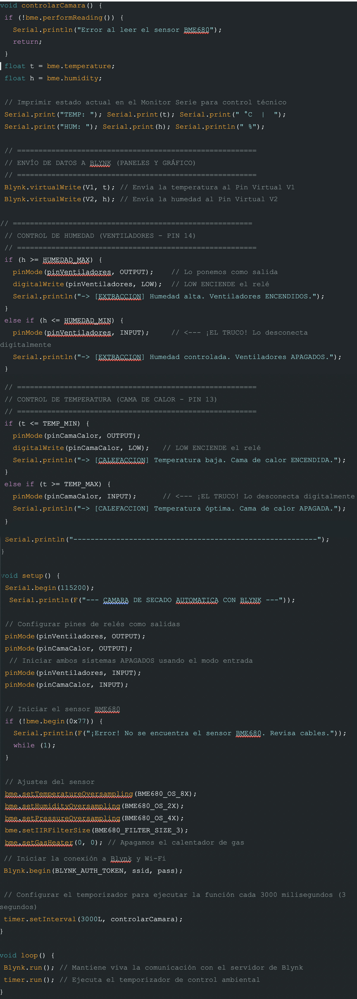

**4. Monitoreo IoT (Blynk):** Integré la plataforma Blynk para el seguimiento inalámbrico del proceso. Esto permite visualizar los gráficos de comportamiento en tiempo real desde dispositivos móviles, asegurando un registro continuo y un control a distancia de la evolución del secado. Repasé el MT07 , definí los gráficos con  indicadores radiales para la humedad y la temperatura y una gráfica con la evolución en el tiempo. Le pedí a la IA que sumara a mi codigo.
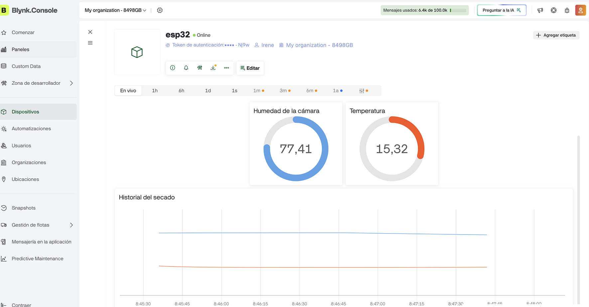

**Alcance actual y Proyección:** Si bien esta primera versión se consolidó a escala de maqueta funcional (prototipo operativo), el sistema demostró un funcionamiento correcto de toda su electrónica y flujo de datos. Debido a los tiempos del proyecto, no fue posible realizar pruebas comparativas con un secado al aire libre, pero la infraestructura quedó completamente validada y operativa, estableciendo una plataforma tecnológica sólida para continuar trabajando e iterando en futuras investigaciones.

### *- Fabricación Digital de Moldes*
Para asegurar copias fieles, utilicé dos estrategias de moldeado:
- Moldes rígidos impresos en PLA y moldes de silicona: Diseñados digitalmente y fabricados a partir de una matriz rígida para lograr precisión y evaluar la repetibilidad de las piezas.
- Molde comercial: Adquirido en el comercio local para optimizar los tiempos en el proyecto y poder evaluar otros detalles.

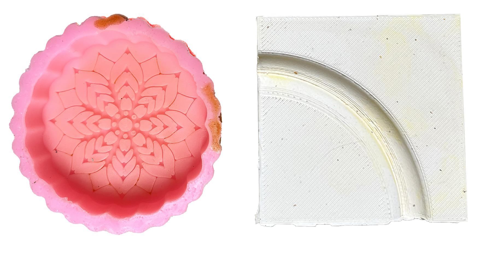
>>  Molde comprado en el mercado local con detalles muy precisos en su ilustración.(izquierda).
A partir del modelo 3D realicé un contramolde con silicona (derecha).

>> Proceso de realización de moldes en impresora 3D

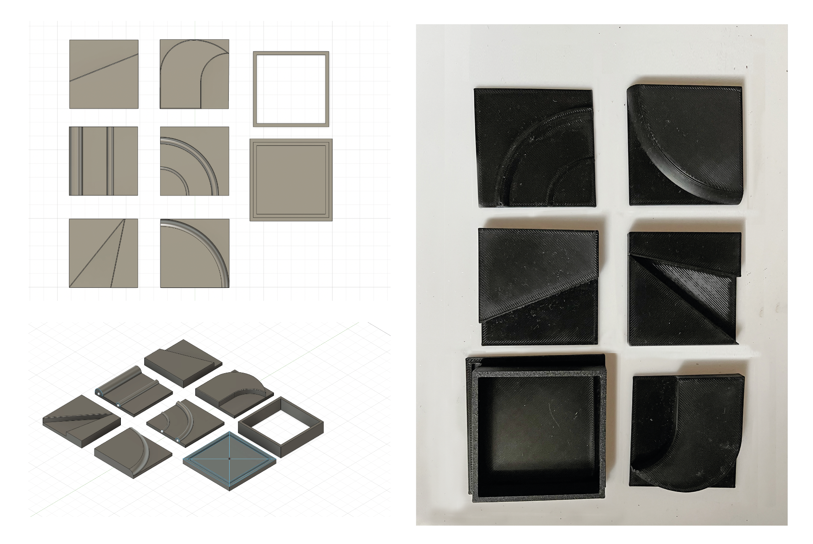

El desarrollo formal comenzó con la investigación de familias de azulejos modulares que se combinaran entre sí, permitiendo crear una gran variedad de composiciones de diseño. Opté por formas geométricas simples que compartieran puntos de contacto; de esta manera, al rotar o cambiar la posición de las piezas, se generaban muchísimas opciones visuales. El concepto de la modularidad me resultó ideal para este proyecto, ya que me permitía experimentar con distintas muestras materiales y, al mismo tiempo, proyectar cómo se comportarían al unirse en composiciones más grandes.

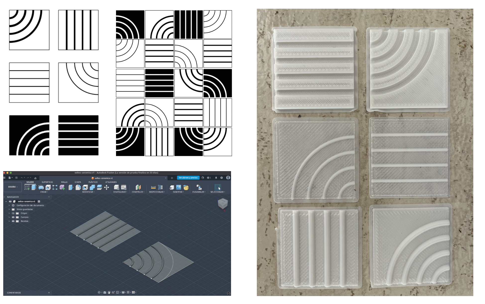

El flujo de trabajo digital se dividió en dos etapas:
- **Modelado y 3D (Impresión FDM):** Primero dibujé los perfiles en 2D utilizando Adobe Illustrator para explorar alternativas rápidamente. Una vez definidas las primeras geometrías modulares, las modelé en Fusion 360 para prepararlas para la impresión 3D. Las primeras impresiones de prueba las realicé en el laboratorio de Durazno, en RAISE3D Pro2Plus, y la producción final de los otros sellos lo hice en Minas utilizando una impresora Bambu Lab. Para el laminado y la impresión, apliqué los mismos parámetros técnicos analizados durante la especialización (MT05).
También modelé las carcasas para los dispositivos electrónicos, que quedara más prolijo y protegiera el sensor y los relés que pueden ser peligrosos.

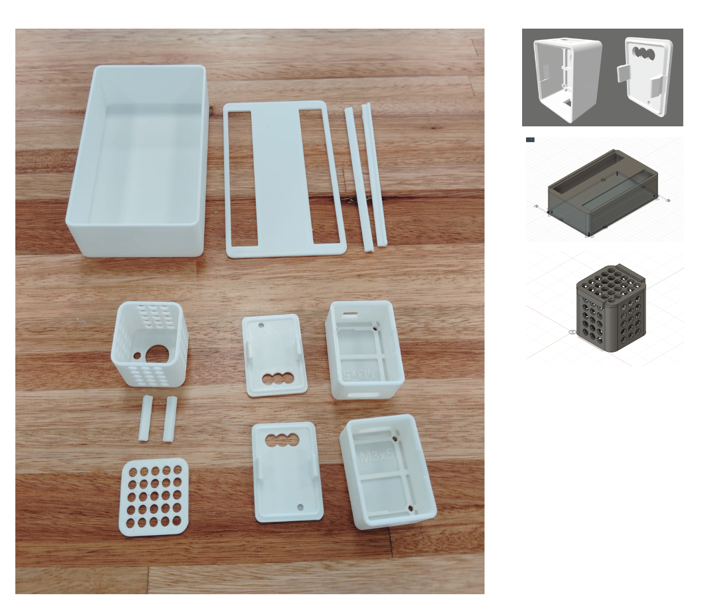

**Diseño 2D (Corte y Grabado Láser):** Para la fabricación de la estructura de la cámara de secado y otros componentes planos, el camino consistió en vectorizar los planos en 2D y configurar los parámetros de potencia y velocidad directamente en el software de la máquina de corte láser.

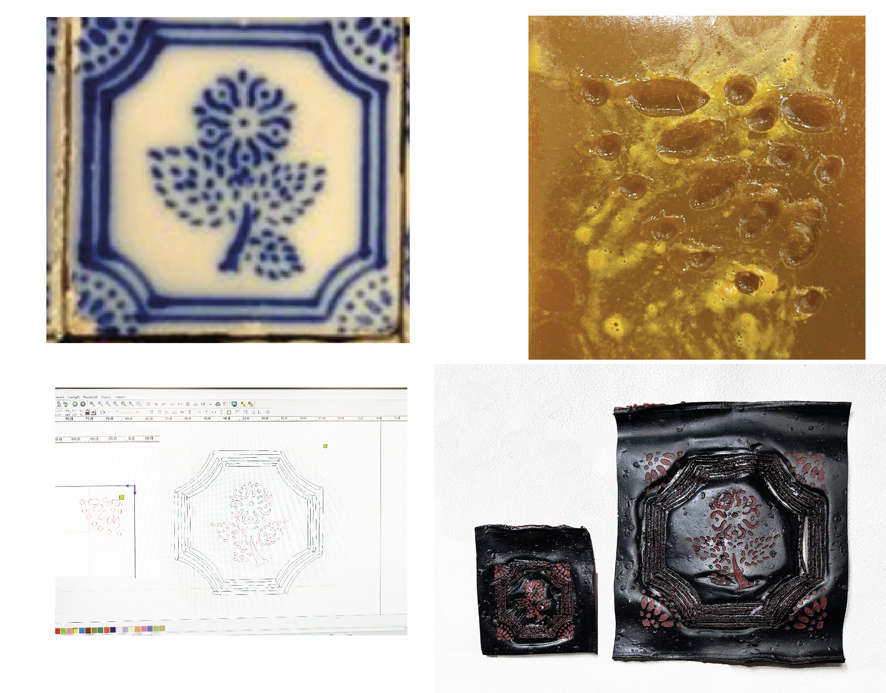
>> Busqué otro tipo de formas más libres. Partí de un azulejo típico de casa antiguas de Uruguay, lo dibujé en Adobe Illustrator y luego en  RD Works coloqué en cada capa lo que era para cortar y lo que era para grabar, ajustando velocidades y potencia.

### *- Catálogo de Ensayos y Resultados (Las 5 Muestras)*
Con la infraestructura lista y las bases metodológicas establecidas, inicié la producción de cinco muestras físicas (tres cerámicas y dos de bioplásticos). Los ensayos se sistematizaron bajo los criterios de control y las fichas de registro definidas previamente.

**Línea Cerámica:** Hibridación con Vidrio, Metal y Cucharitas de Mejillón
El residuo vítreo actúa como fundente promoviendo la vitrificación y reduciendo la porosidad, mientras que el hierro favorece la densificación y aporta color. Sin embargo, un exceso de ambos materiales corre el riesgo de deformar las piezas en el horno. Debido a los tiempos de iteración, concentré la experimentación en dos dosificaciones principales: una serie inicial con mayor porcentaje de residuo y otra posterior con carga reducida.

**Muestra Cerámica 1:** Técnica de Plancha + Inclusiones (Vidrio / Viruta / Valvas de Mejillón)
Objetivo del test: Evaluar el comportamiento físico y cromático de los tres residuos a altas temperaturas.
**Ficha Técnica:**
Fecha: 26/03/2026
Masa utilizada: "Arcilla Nacional" (Casa del Ceramista).
Dimensiones en crudo: 11 x 11 x 1 cm.
Peso en crudo: 287 g.
Dosificación de residuo: 30% del peso en crudo de la pasta.
Temperatura de horno: 1040 °C.
Tiempo de secado: 10 días (en ambiente).
**Resultado y Comportamiento:** Se analizó si los descartes se fundían, cambiaban de color o lograban mezclarse correctamente a la matriz arcillosa. El ensayo demostró que provoca porosidad y en alguna pieza se generó microfisuras o deformaciones por tensiones de contracción contrapuestas durante la quema.

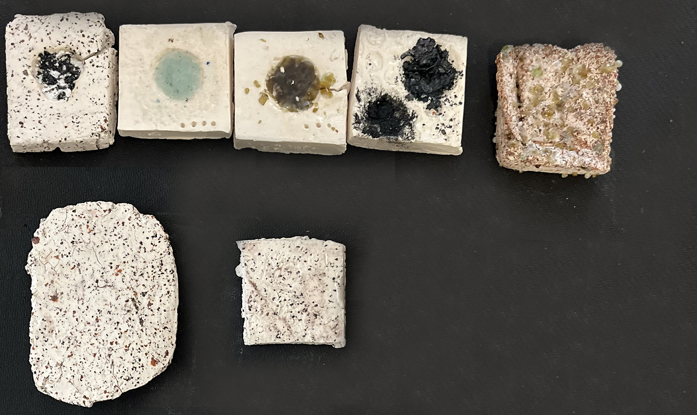
>> En esta primera muestra el mejillon quedó hecho un polvo blanco que no se logra distinguir, debería probar a menor temperatura (primer pieza).
En la muestra más a la derecha, el vidrio grueso se lo coloqué por encima y se formaron pequeñas pelotitas pegadas a la cerámica y el metal tiño más que en las muestras de abajo donde estaba mezclado previamente.
El hierro solo queda medio fundido y rígido al enfriar, muy áspero.

**Muestra Cerámica 2:** Técnica de Colada + Inclusiones (Vidrio / Viruta)
**Objetivo del test:** Evaluar la capacidad de suspensión de la barbotina híbrida y la capilaridad del molde de yeso utilizando una menor proporción de residuos.

**Ficha Técnica:**
Fecha: 29/05/2026
Fórmula de Barbotina: 1 kg de arcilla + 0,5 L de agua + 3 ml de desfloculante.
Dosificación de residuo: 20% del peso en crudo.
Variables ensayadas: Metal, vidrio fino, vidrio grueso y mix.
Proceso: Colada a las 2 horas de preparar la mezcla. Desmolde a las 24 horas.
Temperatura de horno: (Algunas piezas con bizcochada inicial): 740 °C.
Tiempo de secado: 11 días (en ambiente).
**Resultado y Comportamiento:** Quedaron piezas con dimensiones estables. El peso denso del vidrio grueso y el metal presentó una leve decantación en el fondo del molde antes de que el yeso absorbiera el agua por capilaridad y algunas piezas se rajaron.

**Análisis del Secado y horno:** Durante la primera semana de junio de 2026, la humedad relativa en Montevideo osciló entre el 80% y el 95%. Tras 11 días de secado ambiental, las piezas seguían húmedas, por lo que decidí realizar un pre-secado en horno doméstico a fuego mínimo por 30 minutos. Aun así, algunas piezas explotaron en el horno cerámico; esto constató que la masa no había alcanzado el "estado de cuero" ideal debido a la saturación ambiental. Asimismo, las muestras de barbotina mostraron rajaduras superficiales, lo que podría atribuirse a haber preparado la barbotina disolviendo arcilla empaquetada en lugar de formularla desde materias primas secas, alterando la orientación de las partículas de arcilla.
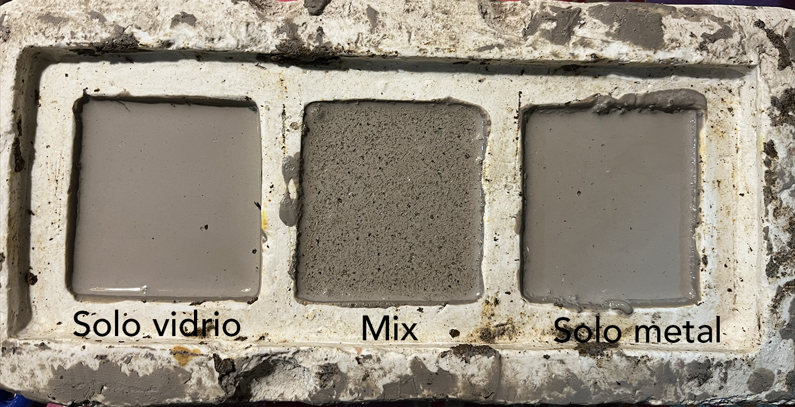
>> Muestras realizadas por coladas

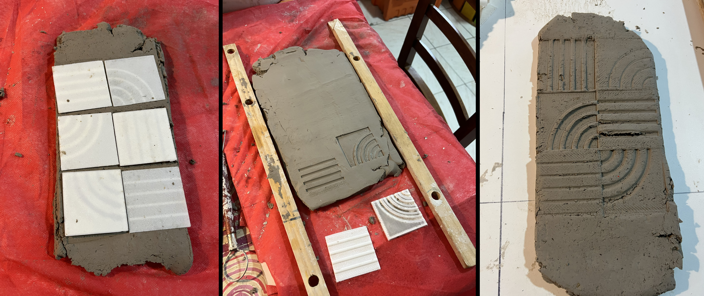
>> Muestras con aplicación de sellos

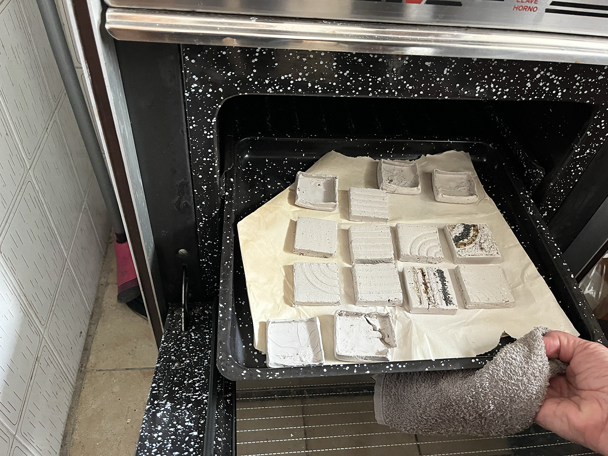
>> Horneada doméstica para terminar de secar las muestras

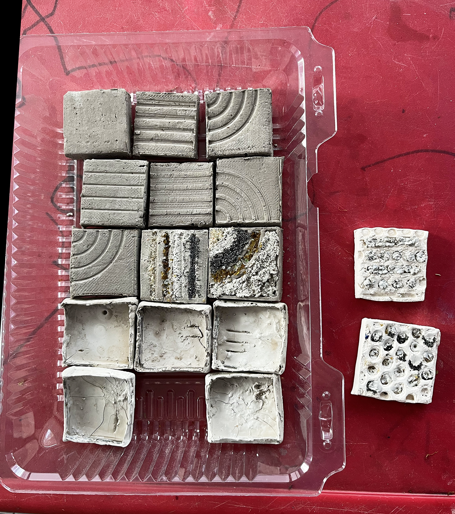
>> Además de las muestras con sellos y colada. Volvía meter las dos piezas que estan por fuera, que ya habían tenído una horneada a 1040º y en esta muestras le agregué residuos y barbotina

**Nota sobre el residuo calcáreo:** Las cucharitas de mejillón calcinadas a esta temperatura se transformaron por completo en un polvo blanco desmenuzable ($CaO$). Al no integrarse mecánicamente de esta forma, se descartó su uso directo en la barbotina, abriendo la interrogante de cómo procesarlo en fases futuras (por ejemplo, como fundente finamente molido dentro de un esmalte u horneadas a menor temperatura).

**Muestra Cerámica 3:** Técnica de Sellos + Inclusiones y Aplique de Esmalte
Objetivo del test: Evaluar la respuesta cromática ante un acabado brillante e impermeable.
**Ficha Técnica:**
Fecha: 14/06/2026
Masa utilizada: "Arcilla Nacional" (Casa del Ceramista).
Dosificación de residuo: 20% del peso en crudo.
Temperatura de quema: 740 °C.
Tiempo de secado: 10 días ambientales + 30 minutos de pre-secado doméstico.
**Resultado y Comportamiento:**  Al aplicar el esmalte transparente sobre el bizcocho, se evaluó cómo este interactuaba químicamente con las inclusiones metálicas y de vidrio expuestas, observando variaciones locales de color y textura alrededor de cada partícula.
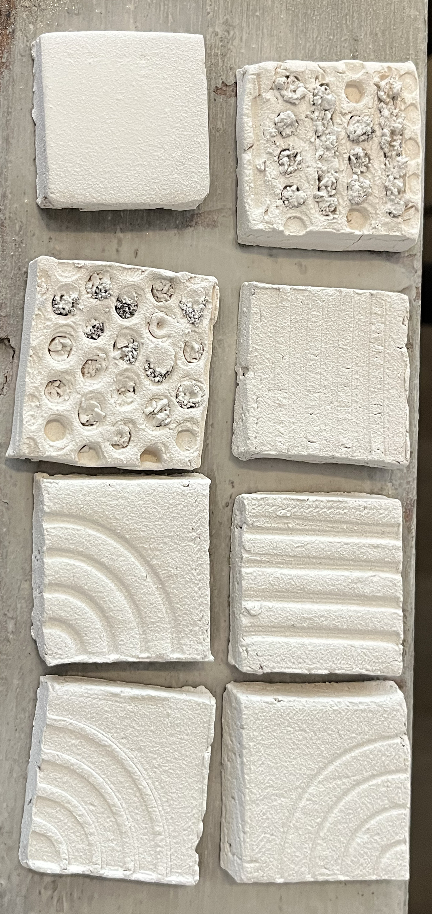
>> Piezas pulverizadas con esmalte, previo al horno

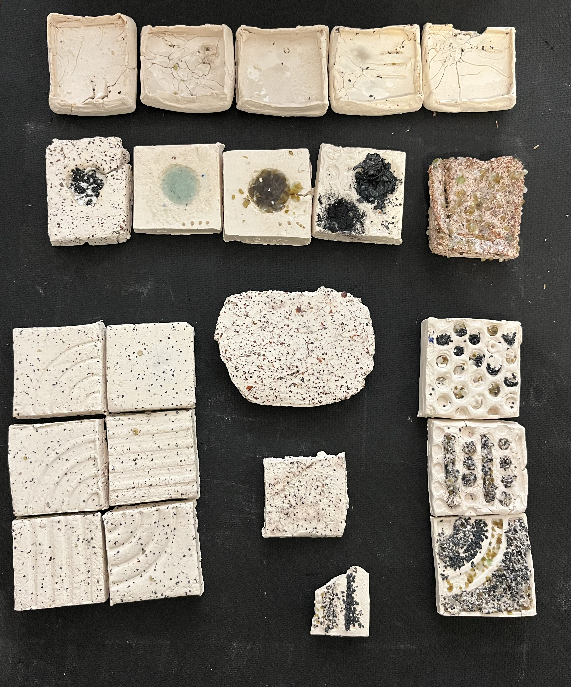
>> Las muestras 1 y 2 les apliqué esmalte incoloro, levantó mucho visualmente los colores y quedó un poco mas suave al tacto.

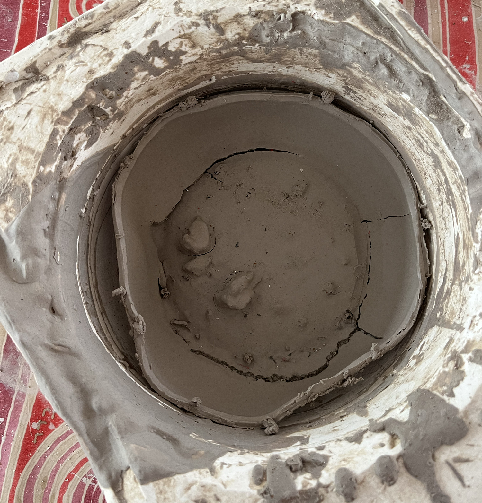
>> Como en las muestras pequeñas por colada algunas se rajaron un poco, decidí hacer una prueba a otra escala y paso lo mismo, se secaba y rajaba antes de desmoldar, por eso creo que el tema esta en la masa y no en los residuos, porque si pasa esto previo a la horneada, me da indicio que la barbotina utilizada no fue la mejor opción.

**Línea Biomateriales:** Bioplásticos de Matriz Flexible
Utilicé una formulación base de gelatina (seleccionada por su alta flexibilidad y procesamiento simple en solución acuosa) combinada con aditivos locales.
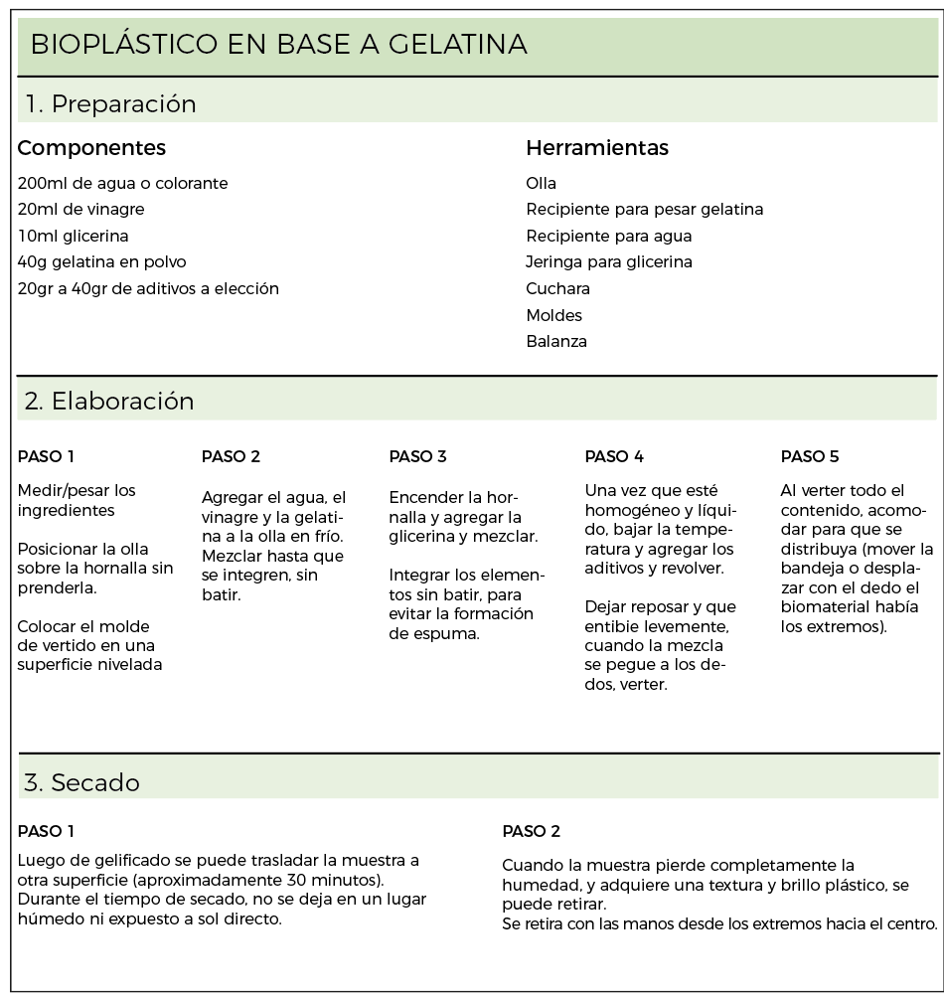

**Muestra Bioplástico 1:** Pigmentación Natural (Cochinilla)
Objetivo del test: Explorar las propiedades mecánicas de la matriz, su nivel de transparencia, la fidelidad de copiado con sellos y su aptitud frente al mecanizado láser.
**Ficha Técnica:**
Espesor: 1,5 cm.
Herramientas: Molde liso para lámina y sellos rígidos impresos en 3D.
Tiempo de secado: 1 mes (en ambiente).
**Resultado y Comportamiento:** Los sellos rígidos copiaron la textura perfectamente en las zonas controladas. Sin embargo, debido a una falla en el sellado de la base del molde (se filtró líquido por debajo), la pieza final presentó variaciones accidentales de espesor y transparencia.
Post-procesamiento digital: Al someter la lámina curada a la máquina de corte y grabado láser, se observó que el corte no fue limpio; incluso aumentando la potencia, los bordes perdieron definición en ambas escalas de ensayo. Por el contrario, el grabado láser logró una definición excelente, quemando la superficie de manera precisa y controlada sin derretir la matriz circundante.

María Clara Freyre, docente de la EFDI, me compartió estos parámetros, para realizar las primeras muestras y luego ajustar si hiciera falta.

**Grabado**: Velocidad 200 m/s, Potencia 10% ( de 15% a 20% para mayor definición)
**Corte**: Velocidad 100 m/s, Potencia 20% (esto para láminas finas, en tu caso recomiendo probar V 80, P 25)
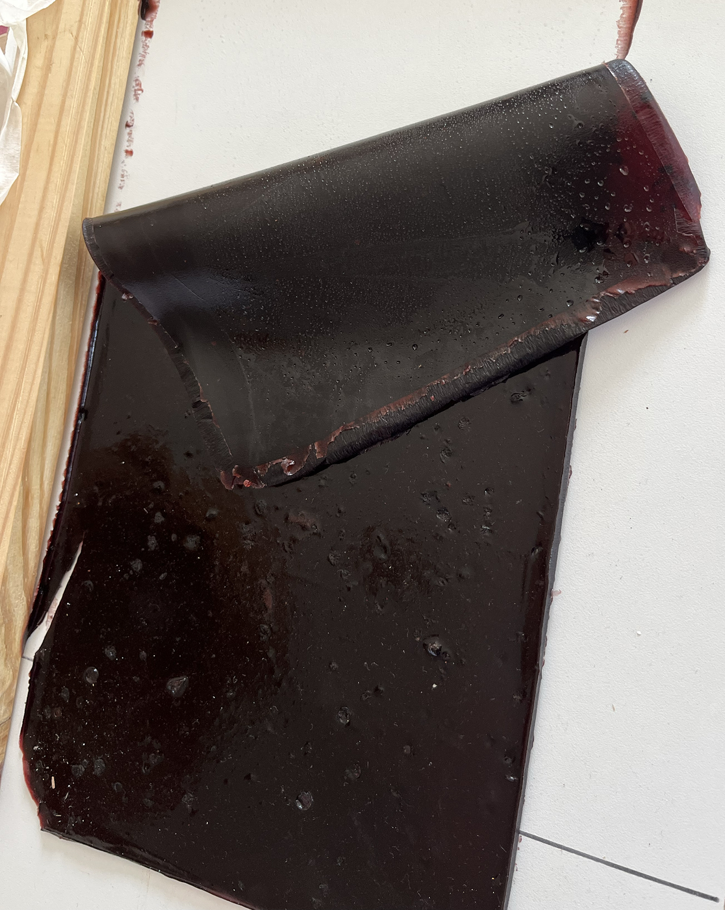
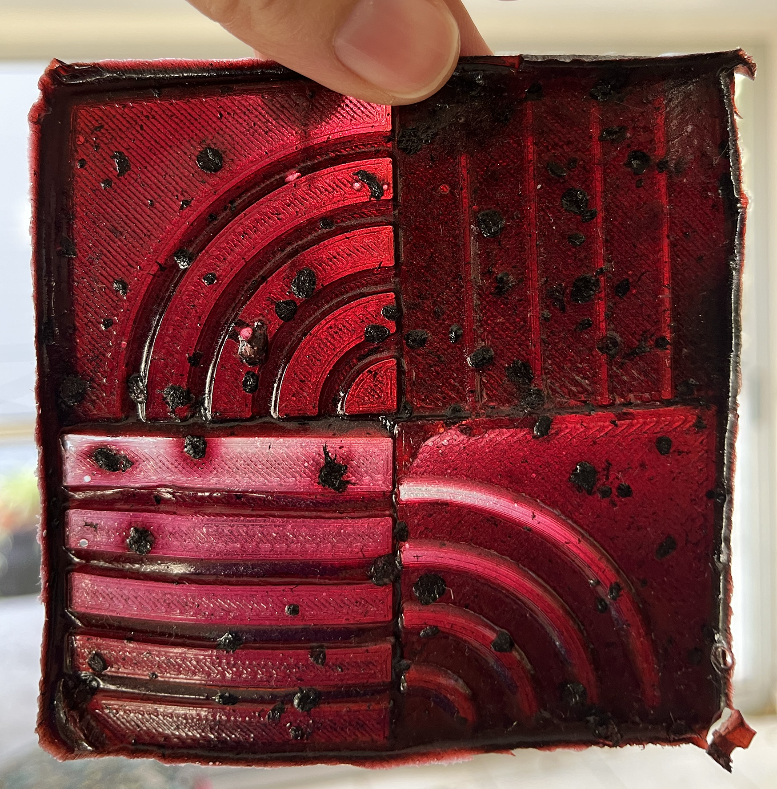
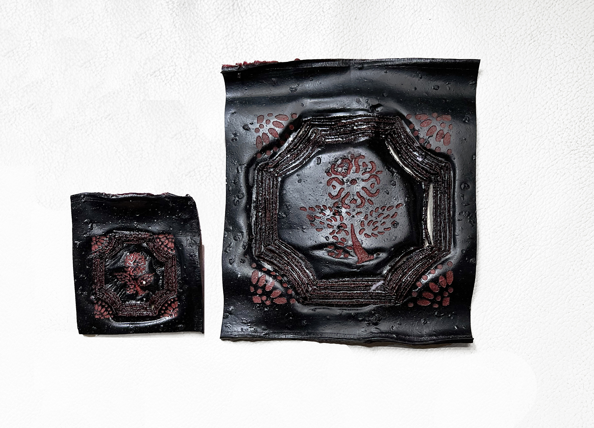

**Muestra Bioplástico 2:** Pigmentación Natural (Cúrcuma).
Objetivo del test: Experimentar con un espesor mayor en moldes de silicona (moldes blandos) y testear la respuesta al corte láser.
**Ficha Técnica:**
Espesor: Entre 2 y 2,5 cm.
Herramientas: Moldes de silicona (combinando una matriz copiada de impresión 3D y un molde comercial).
Tiempo de secado: 11 días (en ambiente).
**Resultado y Comportamiento:** El desmolde en silicona mantuvo la fidelidad geométrica gracias a la flexibilidad del molde. Sin embargo, al intentar realizar el corte láser a los 11 días, el material aún retenía demasiada agua en su interior debido al promedio de humedad de junio (85-90%). El calor del láser provocó que el agua hirviera dentro de la matriz, generando un efecto de burbujas y un dibujo extraño y distorsionado en los bordes de corte. Este resultado demostró la necesidad crítica de un secado prolongado y estandarizado en la cámara automatizada para piezas de gran espesor.
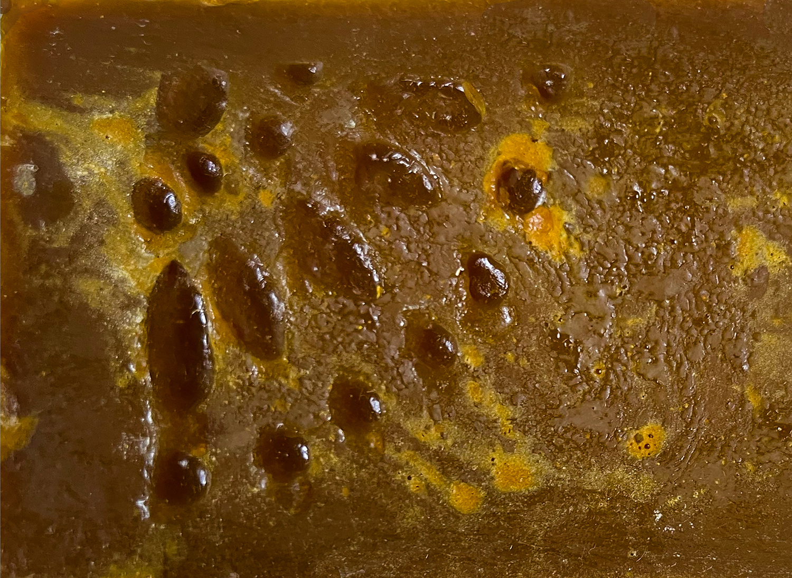

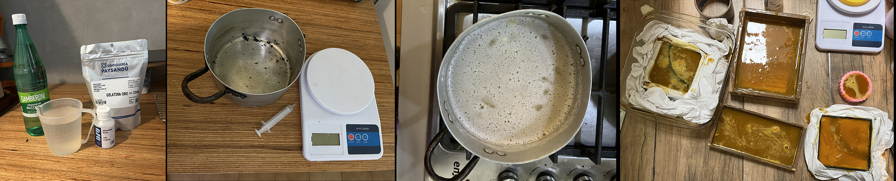
>> Proceso de la elaboración del material

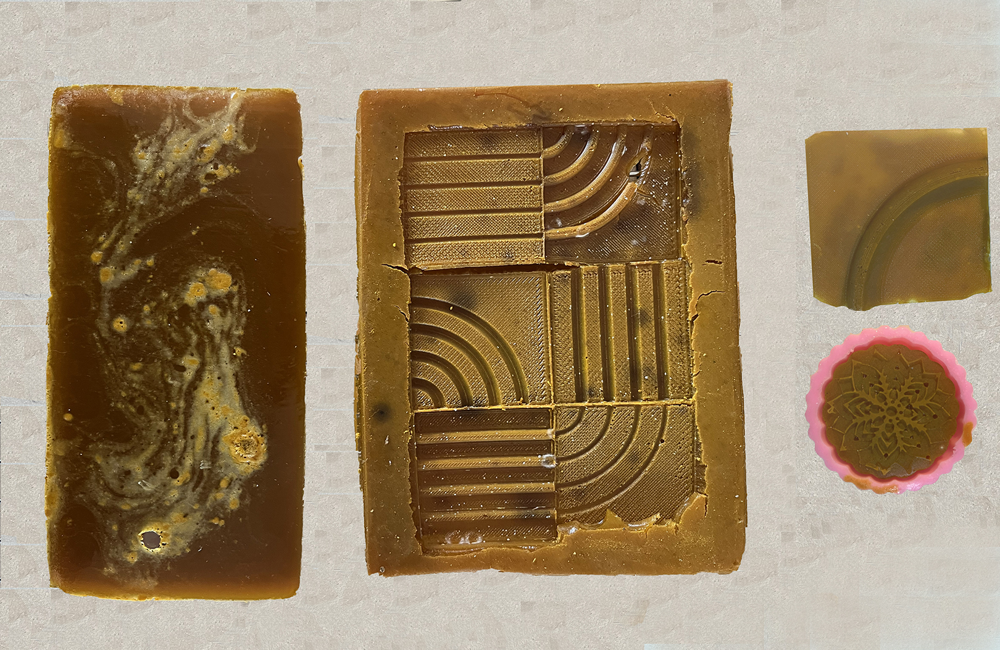

**4. Conclusiones y Decisiones Clave**
El cierre de esta experiencia práctica permitió validar los cinco pilares fundamentales que guiaron la investigación:
- Uso de residuos locales: Permitió trabajar de forma honesta con la disponibilidad real del territorio, reduciendo los impactos logísticos y generando consciencia sobre las mermas industriales y los hábitos de consumo cotidianos.
- Combinación con matriz ceramico-plástica: Aseguró la cohesión estructural y permitió comprender la viabilidad técnica y los límites térmicos de los descartes minerales y metálicos a altas temperaturas.
- Incorporación de moldes de precisión: Aportó el rigor geométrico, la escalabilidad y la copia fiel al detalle indispensables para compensar las grandes contracciones e inestabilidades propias de ambos materiales experimentales.
- Integración tecnológica (Cámara de secado IoT): Se validó como una infraestructura crítica para estandarizar y controlar las variables climáticas extremas de nuestro entorno local (como las altas humedades de junio), las cuales alteran los tiempos del taller y provocan fallas por estrés hídrico (explosiones o burbujeos).
- Enfoque netamente experimental: Se priorizó el "aprender haciendo". Cada error —desde las piezas cerámicas que explotaron hasta el bioplástico filtrado— aportó información técnica valiosa, completando un ciclo de experimentación práctica sumamente enriquecedor para mi formación, aunque lamento no haber podido planificar mejor las muestras para ser más clara en las observaciones que realicé.

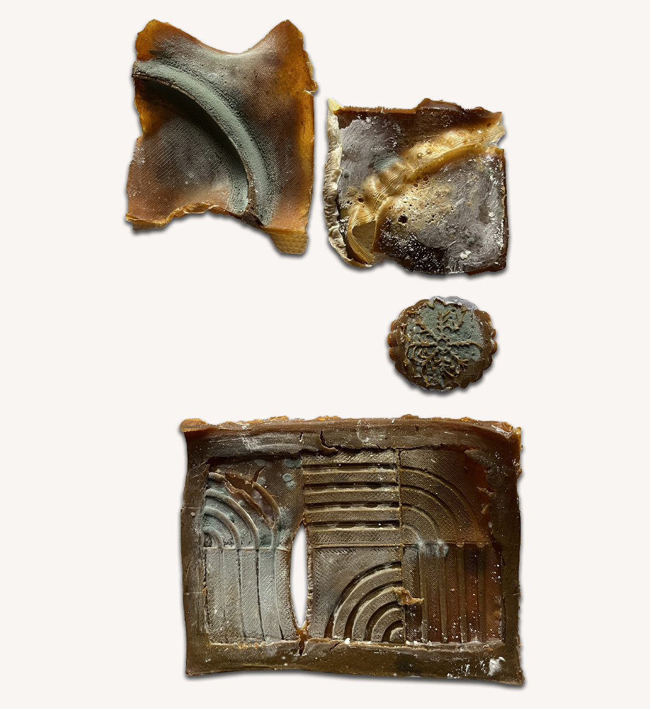
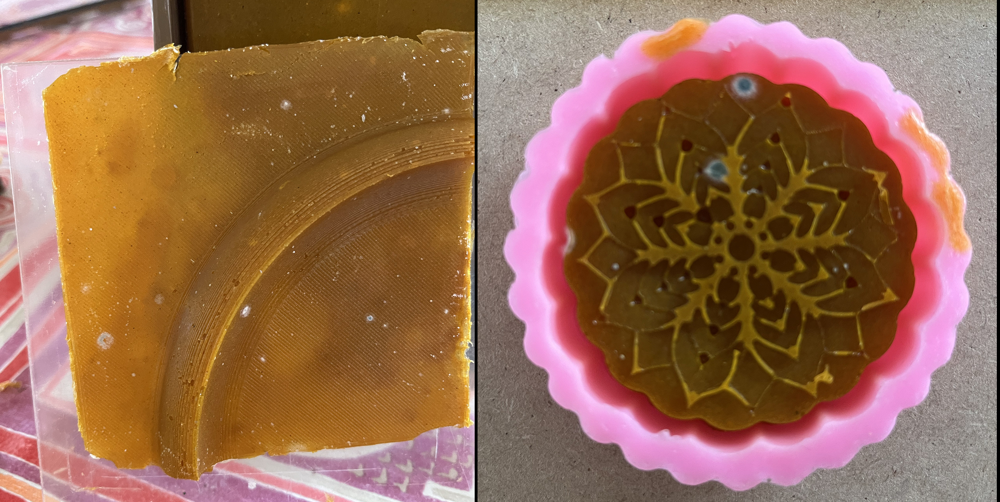
>> Con el pasar de los días todos los biomateriales se llenaron de hongos. Fueron días críticos de humedad, baja temperatura y poco sol, pero para mi fue una validación de que la cámara de secado es un aporte al proceso de secado, al igual que haber tenido que hornear de forma doméstica  las piezas cerámicas porque pasados los 10 días aun no lograban llegar a su estado de cuero.

