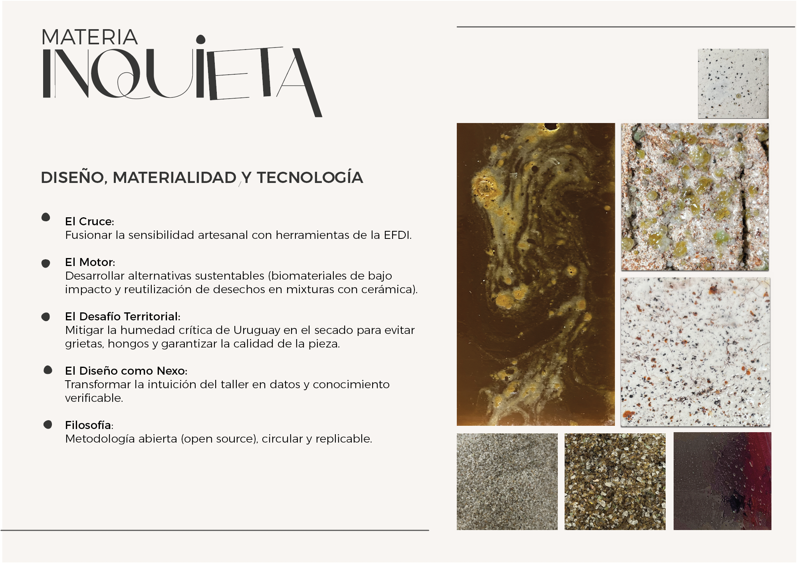
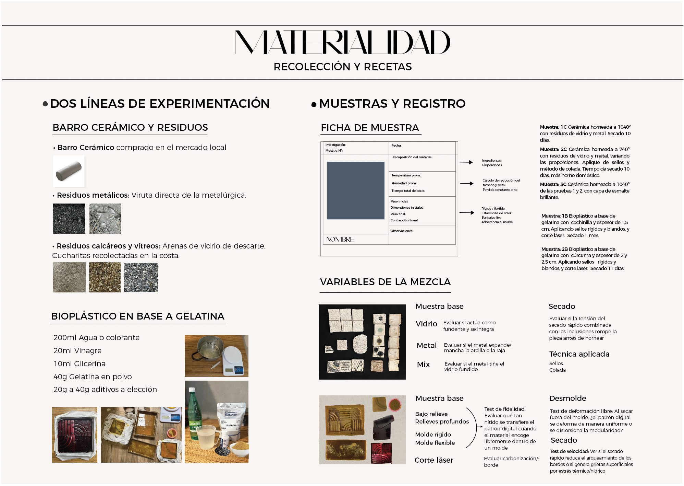
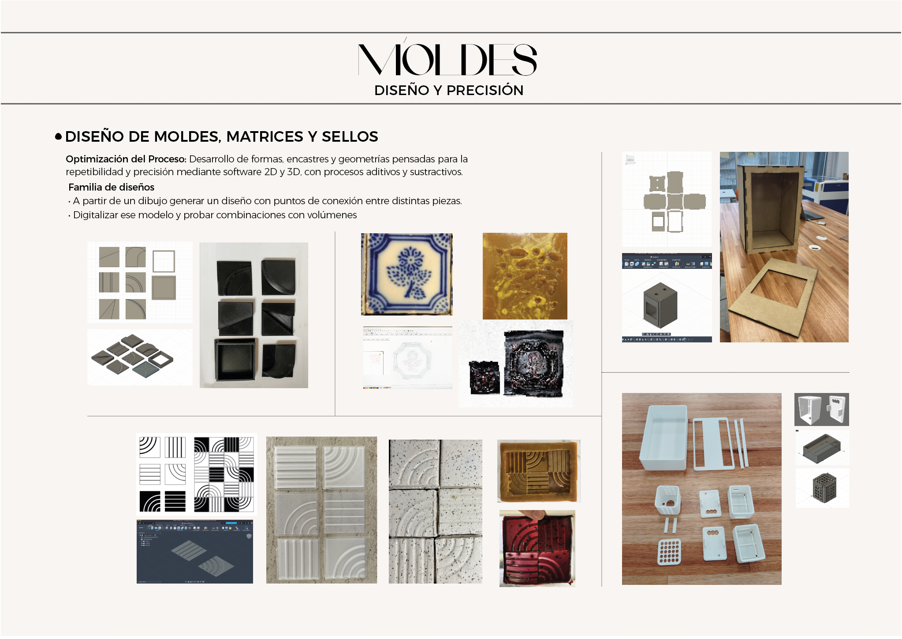
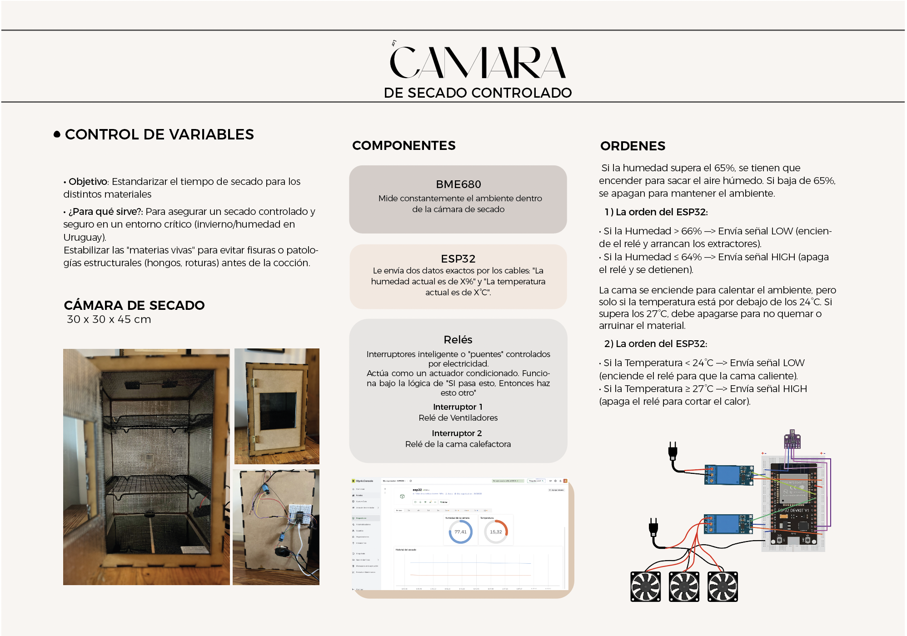
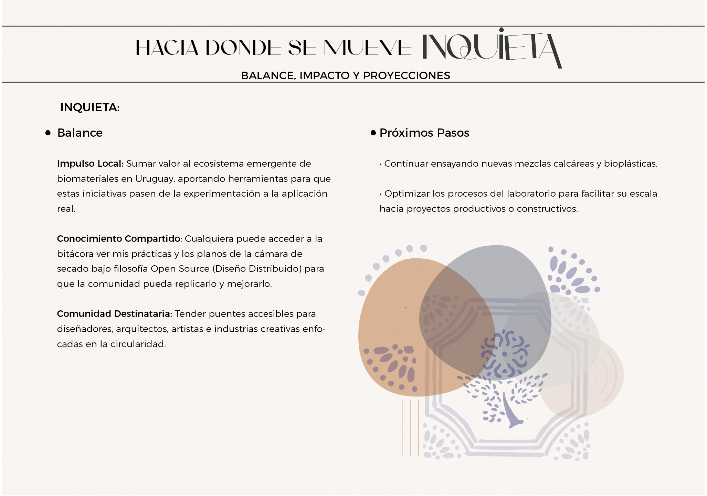

---
hide:
    - toc
---

# Proyecto final integrador
### *Inquieta:* Exploración de híbridos materiales y control ambiental aplicados al diseño local
### 1. Introducción y Objetivos Generales

Este proyecto integrador surge como un espacio para aplicar los conocimientos adquiridos a lo largo de la Especialización de forma efectiva y coherente, poniendo al servicio un desarrollo innovador que aporte valor real a las personas. El objetivo central es demostrar la capacidad de articular de forma armónica tres áreas fundamentales: **Diseño, Tecnología y Fabricación, e Innovación y Sostenibilidad**. 

A través de la experimentación y la difusión abierta de esta bitácora, *Inquieta* busca abrir la posibilidad de generar nuevos productos y estudiar su comportamiento en la realidad local. Se plantea como una metodología con potencial escalable y replicable en distintos entornos, capaz de generar un impacto ambiental y social positivo mediante la visibilización de caminos productivos alternativos.
### 2. Área de Diseño (MD) — El "Qué" y "Para Quién"

**El Origen de la Búsqueda: *Inquieta***
Después de darle muchas vueltas, entendí que el núcleo del proyecto debía ser aquello que encendía mi búsqueda: una exploración continua de alternativas donde todo se transforma a través de la experimentación con nuestro entorno.

Así es que este proyecto se titula *Inquieta*. Esa palabra encierra la naturaleza y conducta del material (que se mueve, cambia, se contrae), describe mi estado como investigadora (que no se conforma y quiere seguir probando) y define la metodología del proyecto: un proceso dinámico, vivo y en constante evolución. Lejos de seguir una receta lineal y cerrada, esta investigación se motoriza a través de una curiosidad que no se detiene. Inquieta es, en definitiva, el estado de una investigación abierta que asume el ensayo, el error y la experimentación permanente como la única vía posible para dar vida a nuevas soluciones de diseño.

**La Propuesta Técnica**
La propuesta consiste en el desarrollo de nuevos materiales híbridos a partir de la incorporación de residuos calcáreos y metálicos de origen local en matrices de arcillas cerámicas y otros compuestos aglutinantes. A través de la experimentación con altas temperaturas y la exploración de diversos acabados, el proyecto busca generar piezas (como baldosas, placas u objetos funcionales) capaces de sustituir materiales e insumos de la industria tradicional. Para estabilizar estos compuestos experimentales, se incorpora tecnología de control de variables críticas (humedad y temperatura) y el diseño de moldes de alta fidelidad que aseguren la precisión y repetibilidad de las piezas.

**Público Objetivo y Necesidades que Resuelve**
La investigación está dirigida a una red interdisciplinaria que abarca a diseñadores, artistas, arquitectos, la industria creativa y, potencialmente proyectos enfocados en la sostenibilidad integral.

*Inquieta* resuelve la falta de alternativas sostenibles frente a los materiales industriales tradicionales y mitiga problemas locales de gestión de residuos al revalorizar desechos sin uso productivo actual en Uruguay. Asimismo, resuelve un problema técnico del taller artesanal: el secado seguro y controlado de mezclas complejas expuestas a las inclemencias del clima.

**Propuesta de Valor**
- **Relevancia:** Aborda una problemática ambiental global desde una escala de acción local, reduciendo el impacto en producción y consumo, pero sobre todo, planteando nuevas matrices de pensamiento respecto a la cultura material que nos rodea.
- **Innovación y Diferenciación:** Se enfoca en el uso de residuos locales poco explorados a través de un cruce genuino entre diseño, materialidad y tecnología, decantando en un desarrollo experimental con potencial real de transferencia al mercado.
### 3. Tecnología y Fabricación (MT) — El "Cómo"
**Justificación del Problema y de la Tecnología**
El desarrollo de biomateriales y compuestos biobasados experimenta un crecimiento mundial urgente ante la crisis climática. En el contexto de Uruguay, el sistema de recuperación de residuos presenta severas limitaciones, lo que provoca que una gran parte de los materiales potencialmente reutilizables terminen en el vertedero común.

La aplicación de tecnología digital a los procesos artesanales no busca reemplazar el oficio, sino ampliar las posibilidades creativas y productivas sin perder el valor manual, identitario y cultural del material. La tecnología actúa aquí como un catalizador: permite el intercambio entre generaciones y disciplinas, y facilita el desarrollo de procesos precisos y reproducibles que vuelven viable la experimentación, el control de variables críticas, la personalización de objetos y la futura escalabilidad del sistema productivo reduciendo el margen de error.

**Resolución Técnica e Integración de Herramientas**
El "Cómo" del proyecto se despliega a través de tres ejes tecnológicos perfectamente integrados:
- **Diseño 2D / 3D (CAD/CAM):** Modelado digital de piezas, moldes, encastres y geometrías complejas empleando software especializado. El diseño se adapta estrictamente a las capacidades y restricciones de contracción y comportamiento de la masa material estudiada.
- **Fabricación Digital:** Implementación de procesos sustractivos mediante corte y grabado láser para texturas y componentes, combinados con procesos aditivos a través de impresión 3D para la materialización de matrices, moldes complejos y sellos de alta precisión.
- **Electrónica y Control de Variables (IoT):** Desarrollo de un sistema de hardware programable de bajo costo enfocado en el monitoreo térmico y atmosférico durante la etapa crítica de secado y cocción. Mediante sensores y automatización básica, se registran los datos ambientales para estabilizar el comportamiento del material y optimizar de forma eficiente los resultados del taller.

### 4. Innovación y Sostenibilidad (MI) — El "Para Qué"

**Procesos y Matriz de Experimentación Co-Creada**

Para dar cumplimiento a los enfoques de sostenibilidad integral, economía circular y diseño distribuido, este proyecto estructura sus dinámicas de taller bajo un formato de código y documentación abierta. Con el fin de que cualquier creador en otro entorno pueda replicar, co-crear y dar continuidad a estas recetas, se definió una matriz sistemática de variables dividida en tres etapas críticas de control:

- **Variables de Proceso:** Modificación y porcentaje de componentes en las recetas, herramientas de vertido empleadas, variaciones en el paso a paso metodológico, tiempos y dinámicas de desmolde, y curvas ambientales de secado.
- **Fases de Control y Dimensiones:** Registro de las dimensiones nominales del molde, medición del espesor al verter versus el espesor al secar (para calcular el coeficiente de contracción de la masa), evolución del peso de la muestra para trazar la pérdida de agua, tiempo de secado acumulado, temperatura y porcentaje de humedad atmosférica ambiental.
- **Propiedades Físicas y Estéticas:** Caracterización sensorial cualitativa y cuantitativa de la textura, coloración, olor, grado de flexibilidad versus rigidez, y comportamiento lumínico (brillante, mate, transparente u opaco).

### 5. Conclusiones y Próximos Pasos: El Camino de la Inquietud

El desarrollo del proyecto me ha permitido validar que el cruce entre diseño, materialidad y tecnología es un terreno fértil para generar respuestas locales a problemáticas globales. Inquieta demuestra que las herramientas de fabricación digital e IoT no desplazan al oficio artesanal, sino que lo dotan de una infraestructura de precisión que permite comprender la impredictibilidad de las materias vivas.

En este recorrido, la falta de homogeneidad en los residuos y los primeros resultados inestables — fisuras y fragilidad material— evidenciaron la necesidad de una metodología científica rigurosa para poder escalar y optimizar los procesos. Si bien consolidar este método de manera definitiva resulta inviable en un plazo de dos meses, este trabajo fue fundamental para aclarar el panorama, ensayar una práctica real y priorizar metodologías de trabajo futuras. De hecho, el diseño y desarrollo de la cámara de secado controlado fueron como un campo de estudio en sí mismo; una herramienta con la que pretendo profundizar en el comportamiento de estas materias, controlando su pérdida de peso (líquido) y su coeficiente de contracción para lograr procesos de secado parejos y seguros.

Como diseñadora, reafirmo la urgencia del diseño circular. Soy consciente de que este proyecto representa un aporte mínimo e insignificante frente al volumen global de los residuos urbanos. Sin embargo, el valor fundamental de esta investigación radica en poner el tema sobre la mesa y activar una reflexión social. Demuestra que producir de otra manera es viable y posible, equiparable a tantos otros productos que consumimos a diario; es, en definitiva, una cuestión de apostar por alternativas más sustentables y tomar conciencia sobre el ciclo de vida de lo que compramos: qué pasa después del consumo y a dónde va a parar. Por más pequeño que sea el aporte, es un ejercicio de cambio que el diseño local debe empezar a ejercitar.

### Reflexión del Proceso y Líneas de Continuidad
Llevar adelante este proyecto integrador implicó enfrentarse a múltiples dificultades técnicas y operativas. Lejos de desmotivarme, estos desafíos resultaron estimulantes, aunque operaron como una limitante en el tiempo disponible de ejecución. Este proceso significó una práctica intensa y desafiante: no solo supuso plantear el problema y los objetivos desde el diseño, sino resolver de forma autónoma el "cómo" llevarlo a cabo, partiendo de conocimientos previos limitados en algunas áreas.

Soy consciente de que logré consolidar la infraestructura práctica y resolver la viabilidad técnica del sistema, pero el factor temporal impidió cumplir con la totalidad de los objetivos teóricos y de caracterización planificados. Esta asimetría entre el tiempo real y la ambición del proyecto fue algo que asumí desde el principio; una forma de desafiar mis propios límites y de proyectar mi perfil profesional hacia donde realmente quiero llegar.

Por lo tanto, los próximos pasos se enfocarán en dar continuidad y rigor a lo construido, teniendo como objetivo prioritario transformar la serie de muestras en un catálogo material, respaldado por fichas técnicas y aplicaciones de diseño reales. Esta primera etapa me permitió estructurar el proyecto desde su base fundamental: comprender la materia in situ, asimilando sus limitaciones y sus posibilidades. A partir de allí, fue posible vislumbrar sus primeras aplicaciones tangibles de la mano de la tecnología, articulando el oficio con procesos computarizados como el desarrollo de sellos, moldes impresos en 3D, cortes y grabados láser.

Ha sido un proceso profundamente enriquecedor que aún me encuentro procesando. En la práctica del taller suceden dinámicas complejas que no siempre se pueden racionalizar en un texto, sino que se necesitan vivir; y ese fue, precisamente, el espíritu que guió mi experimentación. Por esta razón, concibo a Inquieta como un trabajo abierto, con la expectativa de que otros inquietos puedan tomar estos hallazgos como punto de partida. El fin último de esta bitácora es trascender el ámbito individual para activar redes comunitarias y activar diálogos transdisciplinarios que continúen expandiendo el futuro de nuestros materiales locales.

La masa sigue siendo inquieta, el invierno uruguayo mantiene su humedad desafiante y las primeras tandas de muestras ya están listas para el horno. El proceso no termina con este informe; apenas se estabiliza la base de una búsqueda material que se niega a quedar conforme.

 ### Presentación del proyecto

 **Diapos de la presentación**

### Video de presentación

https://www.youtube.com/shorts/CleMgoVJkdI

### Rereferencias 

Arenas de vidirio
https://adv.uy/

Metalúrgica 
https://www.guzmanvillalba.com.uy/

INUMET
https://www.inumet.gub.uy/

