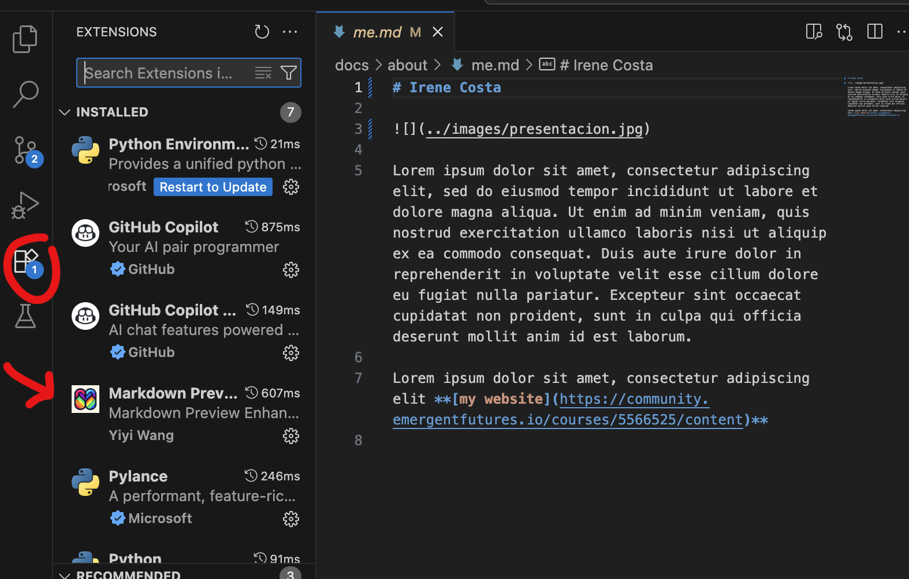
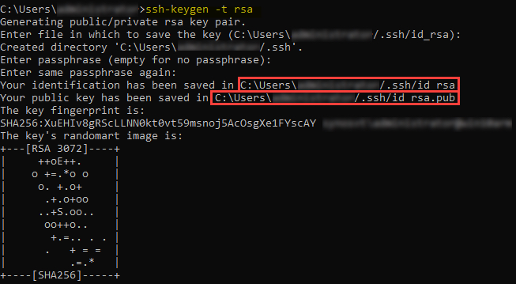
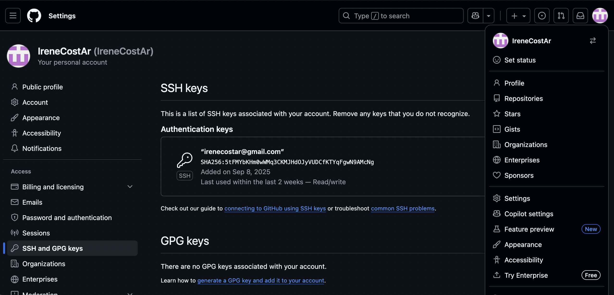
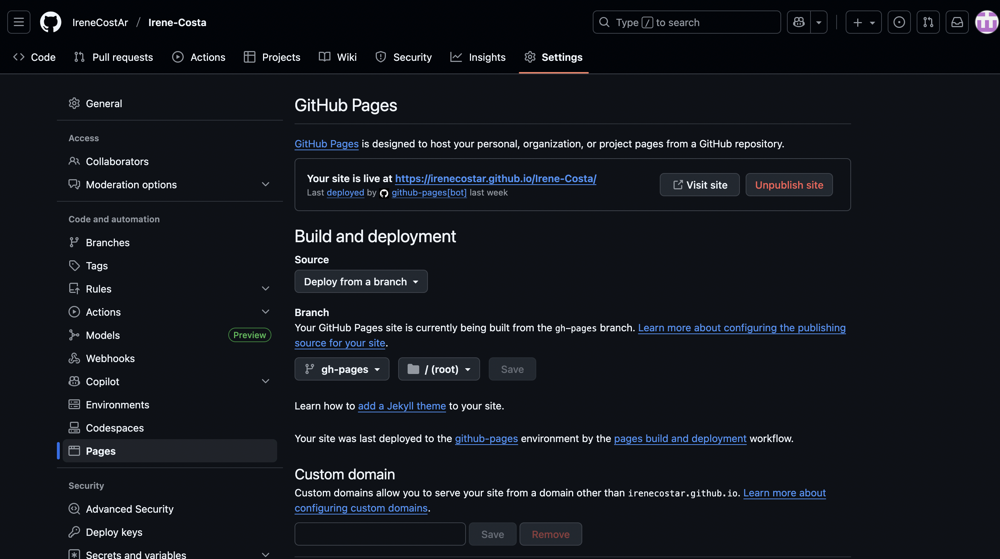
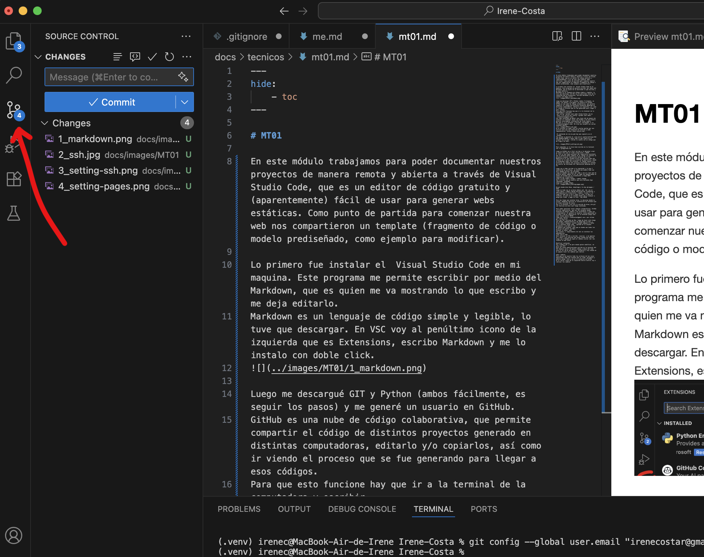

---
hide:
    - toc
---

# MT01

### Instalación de los programas

En este módulo trabajamos para poder documentar nuestros proyectos de manera remota y abierta a través de **Visual Studio Code**, que es un editor de código gratuito y  fácil de usar para generar webs estáticas. 
Como punto de partida para comenzar nuestra web los docentes nos compartieron un **template** (fragmento de código o modelo prediseñado que sirve de ejemplo para modificar). Ahí también puedo visualizar los links para descargar los distintos progrmas.

Lo primero fue instalar el  Visual Studio Code (VSC) en mi maquina, quien por medio de **Markdown**, que es una extensión, me va mostrando lo que escribo y me deja editarlo. Markdown es un lenguaje de código simple y legible, lo tuve que descargar. 
En VSC ir al penúltimo icono de la izquierda que es _Extensions_, escribo Markdown y me lo instalo con doble click.

Luego me descargué **GIT** y **Python** (ambos se instalan fácilmente, es seguir los pasos). Por último me generé un usuario en **GitHub**.
GitHub es una nube de código colaborativa, que permite compartir el código de distintos proyectos en diferentes computadoras, editarlo y/o copiarlos, así como ir viendo el proceso que se fue generando para llegar a esos códigos. 
Para que esto funcione hay que ir a la terminal de la computadora y escribir:
 git config --global user.name “Irene Costa” (en mi caso) y el correo git config --global user.email “irenecostar@gmail.com”.

 ### Calve SSH

Con todo instalado hay que generar una **clave shh** de manera de conectar el ordenador local con GitHub, esto permite intercambiar información de forma segura.
Hay que ir a la terminal y escribir ssh-keygen -t -b “irenecostar@gmail.com”. Se crea una carpeta con varias carpetas dentro.

 > Imagen obtenida de internet a modo repesentativo. (https://docs.oracle.com).

 El contenido de _id_rsa.pub_ hay que copiarlo en el GitHub, para eso realizo los siguientes pasos:
* Ir arriba la derecha al ícono de la cuenta
* Settings
* SSH and GPGKeys
* NUEVO 
* Copio todo lo que figura en mi carpeta _id_rsa.pub_ y valido la cuenta con un código que me llega a mi mail

Para comprobar si está bien hecho, escribir en la terminal ssh -t git@github.com 

Luego en GitHub ir a: 
* Fork (arriba a la derecha) 
* Crear un nuevo fork que lo llamo irene-costa / CREAR

* Ir a _Code_ (arriba a la izquierda) 
*  I undestarnd my workflows. go ahend and enable them con esto quedan activas las acciones.
* Ir a _Readme_ abajo del todo y con el lápiz editar los cambios de la URL. En lugar de _fablab_ pongo mi nombre de GitHub que es _IreneCostAr_ y en _EDFI template_ por _Irene-Costa_
* Ir a _Commit change_
*  _Commit change_
* Ir a _Actions_ que te muestra que esta haciendo algo (pensando, cargando...).
* Por último Settings/Pages

* En _Brunch_ donde dice _None_, despliego y elegir _gh-pages_ 
* SAVE
* Volver a _Code_ al archivo _mkdocs.yml_. Editar con el lápiz y cambiar _fablab barcelona_ por _IreneCosAr_ y _EFDitemplate_ por _Irene-Costa_ 
* _Commit_. (Linea 7 y 8)
* Ir a _Code_ 
* _ssh_ y copiar la ruta
*  Arbirla en terminal, parada en la carpeta donde voy a trabajar y escribir _git clone_  y pegar la ruta.
* ENTER 

 ### Homebrew (para MacOS)

En mac hay que instalar **brew**, se descarga desde su página. Homebrew facilita la instalación de software que no viene incluido de serie.
Ir a la _terminal_ y fijarse la versión de _brew_ y de _git_ con _–version_ y dice cuales están instaladas.
 
Para poder gestionar estos códigos colaborativos, GitHub utiliza _repositorios_, que son las carpetas donde almacena de manera remota y son accesibles a todos los colaboradores. Al generar mi usuario, estoy generando mi carpeta o sea mi repositorio. 
* En la terminal poner _user.name “Irene Costa”_ 
* ENTER
* Luego git _config “ irenecostar@gmail.com “_ y por último _git config –list_
Para que VSC funcione en Mac, luego de hacer esto hay que poner _command+shift+p_ y se despliega un menú y elegir _“Shell Command: Install ‘code’ command in PATH”_
En la terminal poner _code ._ (parada en la carpeta documento) y abre el VSC.
Genera una carpeta _.venv_ que es donde van todos los archivos de _pyhton_ (en Mac)
* Python3 -m venve .venv
* _Pip install -r requirements.txt_, ahi se instalan las dependencias
Con _clear_ borro todo.
* Abrir terminal en VSC y escribir  _“source”_  y aparece el _(.venv)_  así confirma que estoy usando ese entrono.
Luego en _Readme.md_ copiar el _“mkdocs serve”_ (ahí nos levanta la web local)

 ### Modificar contenido
En VSC ir a _mkdocs.yml_ y pararse donde se quiere modificar, en este caso MT01.
Para ver estas modificaciones escribir en la terminal del VSC _mkdocs serve_.
 Genera el código y abajo del todo está el URL de mi disco local. Actualizo y voy viendo en mi página local los cambios que realizo.

 ### Subir cambios
Para que no me muestre todo los archivos de las cosas modificadas hacer una carpeta que se llame .gitignore y adentro poner .venv y ya no se visualizo en GitHub.
En el tercer icono de la izquierda _Source Control_ ir a realizar los cambios.

Ahí poner un comentario referente al cambio que realicé y darle + a todo lo que me aparece _COMMIT_ , sincronizar _Sync Changes 1_ y ahí recién los pasa a la nube.

Volver a Github 
* _Repositorio_
* Irene-Costa 
* _Action_ y ver si esta procesando los cambios.
Si no se visualizan los camios, hay tres opciones:
* escribir Ctrl + shift+ R para  actualizar (en la web)
* Arriba a la derecha / mi icono o foto / delete browind Data… (dibujo de papelera)
* Abrir en pagina incógnita.

Markdowntutorial.com puedo ver los códigos para darle estilo al texto.
Recoerdar poner como títular alguna referencia a los cambios realizados.

Cada _commit_ es un cambio, puedo verlos, quien lo hizo, y todo lo que va pasando, podemos entrar y ver exactamente que cambios hicieron.

Si quiero que pare la terminal VSC pongo control+c o cierro.

 ### APUNTES 
 
**Pwd** (me dice donde estoy parada)
**cd + espacio + punto** (nombre de la carpeta)
**ls + espacio** (alisto a ver que hay en la carpeta)
**command + shift + punto**  (me muestra carpetas ocultas como ssh)

> **Fork** es una copia personal del repositorio existente que te permite hacer cambios en el código sin afectar al proyecto original (definición obtenida de la IA).

> **Repositorio** es una unidad básica que funciona como una carpeta en la nube para un proyecto de desarrollo, donde se almacenan todos los archivos, el código fuente y el historial de cambios del proyecto utilizando el sistema de control de versiones Git (definición obtenida de la IA)

 ### NOTAS
En mi caso trabajé  desde una MacBook Air con sistema macOS Monterrey 12.5. Esto me generó algunas trabas a nivel de permisos para poder trabajar e instalar los distintos archivos. Sumado a que muchos de los términos que trabajamos para mi son nuevos (por este motivo, fui buscando y explicando lo que hace o siginfica cada cosa).  
Recomiendo documentar desde el primer momento los pasos y el porqué de todo lo que se va haciendo. Eso fue un aprendizaje a como continuar documentando. 

