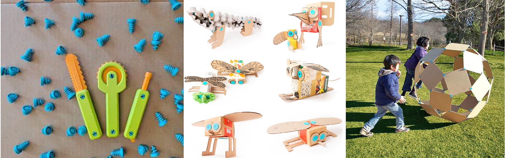
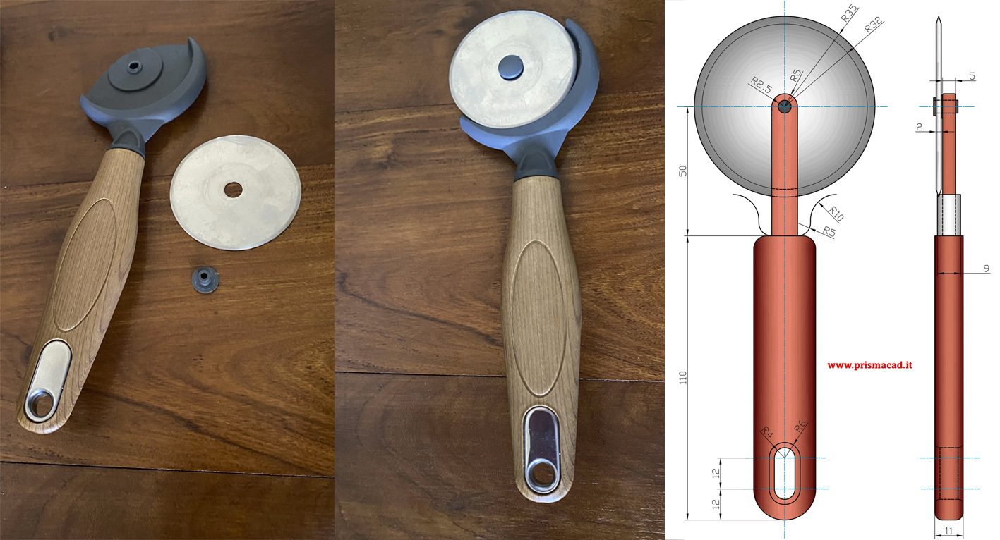
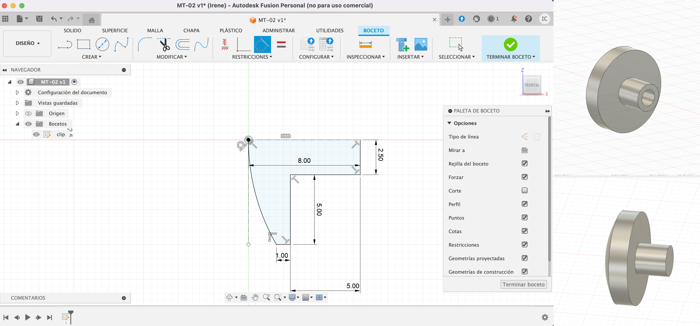
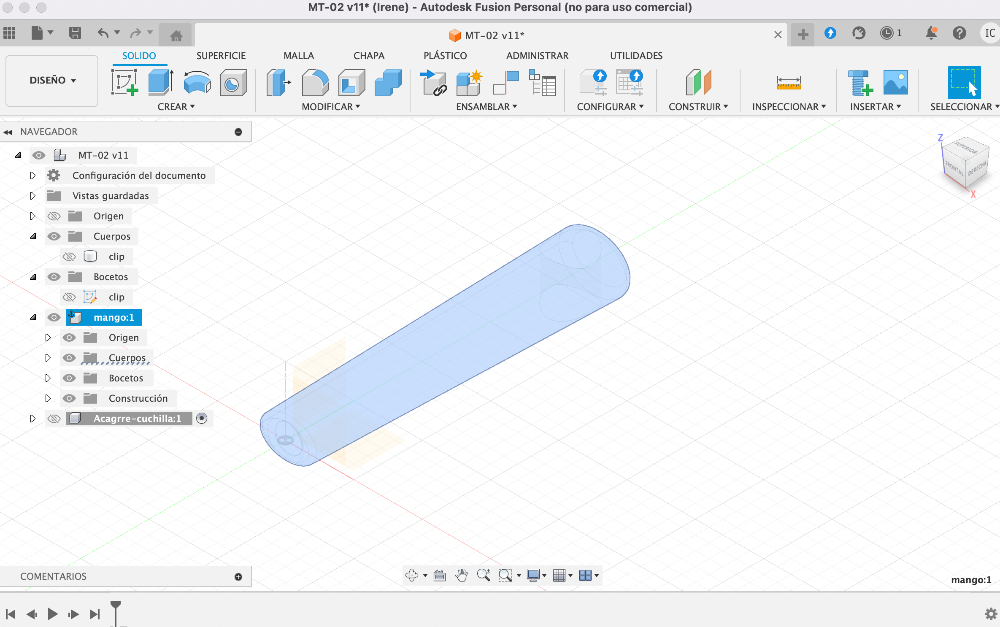
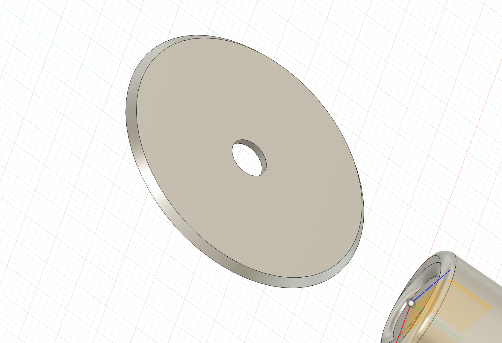
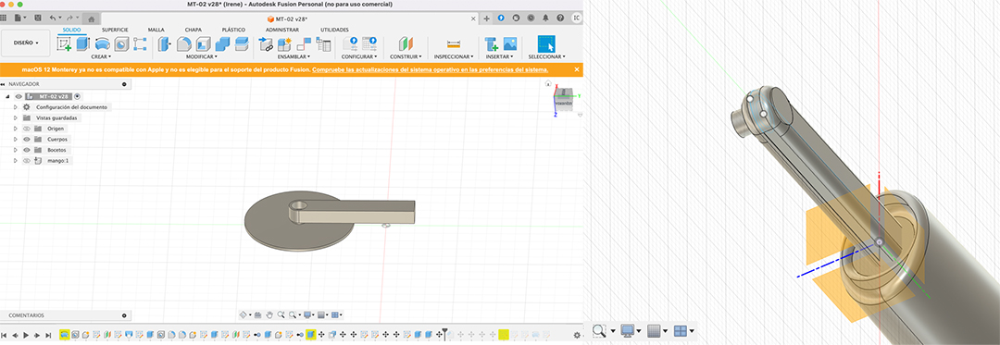
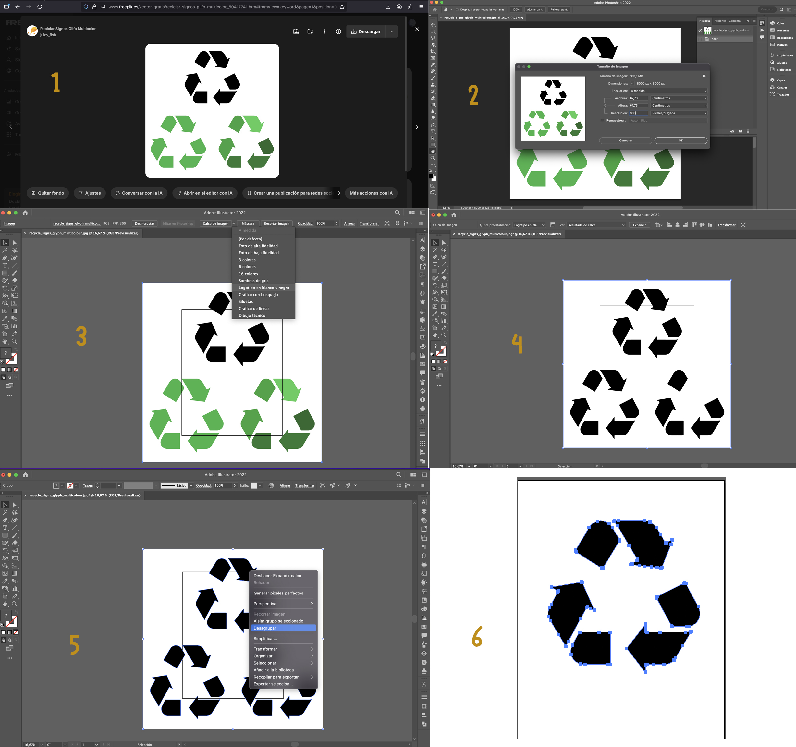
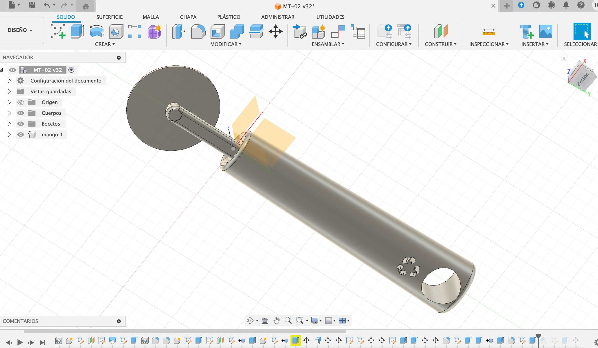
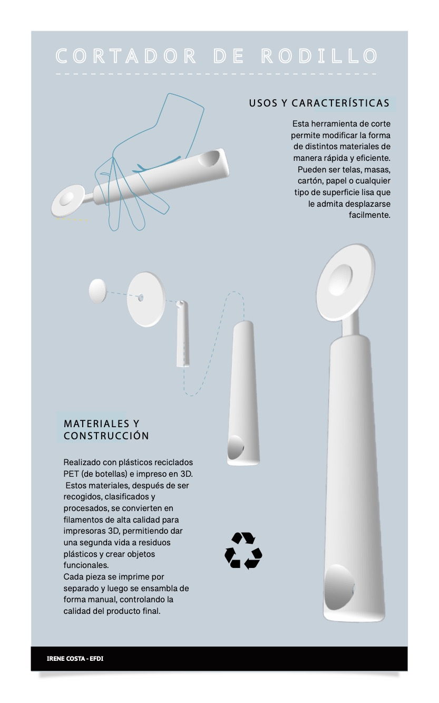

---
hide:
    - toc
---

# MT02

Este ejercicio permite fusionar distintos formatos de archivos para trabajar en conjunto. 

Fusion 360 ya lo he usado antes, siempre de forma autodidactica y con poca frecuencia, por lo cual tengo que hacer memoria y me lleva tiempo ir probando cosas.
En cambio programas de edición de imagen y vectores como Photoshop e Illustrator trabajo comunmente.

**Inspiración y relevamiento de medidas** 
No tengo del todo claro aun por donde va a ir mi proyecto, así que resolví buscar algo en casa para relevar. 
Entre herramientas y utensilios de cocina me decidí por el cortador de pizza, que combina su mango y agarre con la cuchilla circular. Esto lo asocié a la idea de trabajar en cartón y ciertas herramientas que vi para poder trabajarlo.

 > Estas herramientas fueron diseñadas para trabajar en cartón permitiendo cortar, troquelar y perforar de forma segura.

Luego de relevar las medidas que tenía en casa, busqué en internet tutoriales de Fusion 360 con cosas similares para apoyarme a la hora de dibujar. 
Y así, mirnado tutoriales, y con las medidas relevadas, fui haciendo el dibujo, simplifancdo cosas y adaptando otras.

Separé en partes el objeto.
1.	El clip y agarre que permite girar la cuchilla y sujatarla al mango 
2.	El mango
3.	La cuchilla

**Fusion 360** 

-  Abrí un archivo nuevo, definí la unidad de medida y el plano en el que iba a trabajar. 
- Luego con el despiece realizado previamente, resolví generar un cuerpo para cada parte, y dentro del clip y el agarre, cada uno sería un componente. 
Esto me ayuda a organizarme y trabajar lo más prolijamente posible.

**Clip**. Genero un sketch con la mitad de un plano del clip y defino un eje de simetría. Una vez terminando el sketch,  con la herramienta de **revolución** logro el clip completo.

No tengo claro como voy a hacer el agarre aún, así que continúo con las otras partes. El cortador de casa tiene unos detalles que no logro dibujar correctamente y los que veo en tutoriales no me entusiasman tampoco con sus proporciones y tamaños.

**Mango**. El que tengo en casa, tiene forma orgánica bastante compleja para mis conocimientos y tiempo disponible.
 Así que opté por algo mas simple, respetando las medidas de este y que tuviese de donde colgar. 
 - Primero dibujar en el sketch. Luego con la herramienta de **solevación** (tuve que recordar como se hacía esto, me daba error en al principio, no logré solucionarlo y comencé uno de cero).
 Como paso final **empalmar** los bordes para que no quede tan rígido.

 

**Cuchilla**. Esta pieza es muy simple de dibujar, hay que relevar las medidas y tener en cuenta la tolerancia con el clip que la atraviesa. 
Se parte de dos círculos concéntricos que luego se **extruyen** y por último se realiza el **chaflán** en una de sus caras.
 

 **Agarre**. Este fue el que me llevó mas tiempo  desde la parte constructiva. Quería realizar una pieza pero ninguno de los ejemplos me gustaban, al dibujarlas me complicaban o me parecían desproporcionadas. 
 Luego que logré bocetar en papel y definir como lo quería, fue muy simple.
 - Elegir el plano de sketch, dibujar la mitad para luego realizar una simetría. 
 - Terminar sketch y **extruir**. 

 Aca hay que poner atención en como ensamblar con los otros cuerpos, ya que es lo último que se realiza. Considerar la tolerancia para que encastre con el clip que ya está dibujado, y que permite sujetar y girar la cuchilla. Además, que esté centrado y penetre lo suficiente al mango para que quede seguro.
 - Como paso final **empalmar** los bordes para que no quede tan rígido y siga con la línea de dibujo de las otras piezas.

 

 **Vectorización de una imagen**

 Busqué una imagen del logo de reciclaje en Freepik, una plataforma que ofrece recursos gráficos, donde suele haber material de buena calidad,  y tenía varias opciones.
 **1-** Descargar la carpeta de forma gratuita, que si bien ya vienen las versión jpg y vectorial, en este caso tomé la versión jpg para realizar mi propio logo vectorizado.

 También se puede buscar directamente en google y con las herramientas de busqueda, seleccionar aquellas que sean medianas o grandes. En este caso no se necesita demasiado grande.
 

 **2-** Abrir en **Photoshop** el logo en jpg y  ver si su calidad es lo suficientemente óptima para vectorizarlo. Si la iamgen esta muy pixelada o su medida es muy pequeña no sirve.

 **3-** Luego de chequear su tamaño y resolución, abrirlo en **Ilustrator** y seleccionar la herramienta de *Calco de imagen* / *Logotipo blanco y negro*, esto permite ver la imagen como una forma vectorial específica.

  **4-** El siguiente paso es *Expandir*, permite editar el vector.

   **5-** Click derecho/desagrupar me paermite en este caso eliminar los vectores que no necesito y quedarme solo con el que voy a trabajar.
   
**6-** Ya con el vector editable, lo exporto como svg para poder abrirlo en Fusion 360.

- **Vector en fusión**

  - Abro un sketch, e insterto la imagen .svg. Lo trae a su tamaño origianl, hay que darle las proporciones y tamaño adecuado para la pieza en cuestión.
  - Una vez terminado el sketch, **obstruir** como más guste y queda pronto.

 

https://www.youtube.com/watch?v=U_2wGqyEGi4

**LÁMINA DE PRESENTACIÓN**

Una vez modelado el cortador, necesitaba distintas imágenes y un despiece para mostrar en la entrega final. 
El tema acá fue como exportar imágenes que pudiesen abrirse en Illustrator o Photoshop, ya que los archivos .stl no permite colocarlos.
Para exportarlo como .jpg o.png debo ir al Espacio de trabajo del renderizado. Pero ahí me pasó que me mostraba los planos y no logré las imágenes que quería.
Como en este caso la lámina es digital, las imágenes no tenían porque ser de muy buena calidad, ya que para pantalla puedo trabajar con imágenes de tamaño medio.
Entonces, tomé los archivos .stl y les saqué foto de pantalla.
Luego los abrí en Photoshop, le quité sus fondos y los pasé como .png.
Ya con las imágenes de las distintas partes del objeto sin sus fondos, armé la lámina en Illustrator.
En Freepik busqué una lámina vectorizada que me gustara y la edité. Tomé el fondo de color y el título y la diagramé con los requisitos de la premisa.
Busqué una imagen cualquiera de una mano cortando algo. A partir de eso, dibujé una mano para dar situación de uso con el lazo.
Luego busqué en google características de estos cortadores de rodillo y de la impresión 3D con material reciclable, de manera de generar los textos que acompañan las imágenes.
> No logré exportar de Fusion las imágenes que quería, por lo cual no logré que en la lámina se viera la cara posterior donde coloqué el logo y el encastre desde otro lado.

 

**NOTAS**
Sigue siendo un aprendizaje poder organizarse y documentar todo correctamente. 
Más allá de lo nuevo de enfrentarse a programas poco conocidos y otro más conocidos, el hecho de  poder explicar y ponerse en el lugar de quien no estuvo en el proceso para que se entiendan todos los pasos, es un trabajo aparte que me hace rever mis conocimientos y no dar cosas por hecho.

En cuanto a **Fusion**, es fundamental tener el boceto claro, sus medidas, sus partes, como ensamblan, si se necesita tolerancias. Luego el programa permite realizar objetos simple con su variedad de herramientas sin tener mayores conocimientos.
Debo aprender a conseguir las imágenes que quiero para luego trabajar con los bocetos en formatos 2D, así como Renderizar y ver sus opciones, para poder simplificar todos los pasos que realicé.
Logré resolverlo pero tengo claro que no es el camino más simple.

