# MT03
En este módulo vimos la tecnología láser y sus aplicaciones, como preparar un archivo, tipos de máquinas y posibles materiales para cortar. 
El ejercicio práctico planteado consiste en dibujar algo para cortar en los laboratorios de UTEC, en mi caso.

Como apoyo, Joaquín (docente de la EFDI) realizó una clase mostrando todo el proceso. En este caso dibujando desde Fusion 360 el objeto 3D y luego en un programa vectorial ver su desarrollo y capas de acciones. Así nos asegurábamos que iba a quedar bien los encastres y dimensiones. 
Sin esta clase, hubiese seguido paso a paso de cualquier tutorial de Youtube pero no se si habría comprendido realmente los pasos a seguir. Me pareció muy bueno poder empezar viendo el dibujo tridimensional, de forma de estar seguros que al cortar luego esas piezas iban a funcionar sin problema.

En este caso, para practicar hicimos un cubo formado por caras que se encastran y con un espesor parametrizado. 

A continuación explico algunas de las herramientas utilizadas en la práctica del cubo que me sirvieron para dibujar mi pieza de corte.

**DIBUJOS** 
Para dibujar de forma rápida los encastres dentados, en el sketch dibujo más o menos teniendo en cuenta la cantidad de dientes y luego con las herramienta de **Restricciones** le voy indicando que un encastre sea igual al otro, o tangente, o lo que necesite. Es una forma rápida de bocetar y luego darle las proporciones y medidas correctas.
 Una vez que tengo los encastres de largo y ancho, puedo simetrizarlos para obtenerlos exactamente igual en los otros dos lados de la cara.

 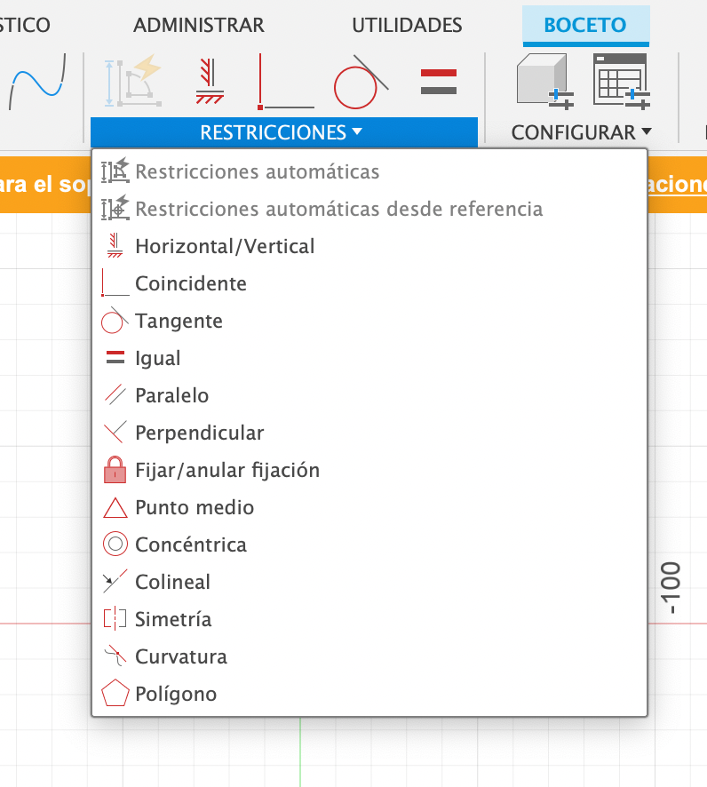

**PARAMETRIZAR**
Esto permite generar parámetros, en lugar de dimensiones fijas establece variables, que al cambiar el diseño, lo adapta matematicamente.

**1-** Abro el Sketch. 
**2-** Modificar/Cambiar parámetros.
 Abre nueva ventana de diálogo, con el **+**, genero un nuevo parámetro y determino que quiero parametrizar. En mi caso generé el **“espesor” de 3mm** 
 **3-** Aceptar
Ahí me aseguro que si el material cambia de espesor por algún motivo, solo tengo que venir aca y ajustar la nueva medida y me van a quedar todas las piezas ajustadas. 
Luego que termino de definir los parámetros, cierro Sketch y al **Extruir** le doy el nombre que puse al parámetro (espesor) y me lo extruye a esa medida. 

**PATRÓN CIRCULAR**

>Esta herramienta crea múltiples copias de un objeto (como caras, cuerpos, etc.) dispuestas de manera repetitiva y predecible a lo largo de una ruta, un patrón rectangular, o de forma circular. (Definicón generada por IA google).

En este caso que es un cubo, todos los lados iguales y simétricos a un eje central, el parámetro circular repitió su cara 4 veces y formó el cubo. 
**1-** Crear/patrón circular

Tuve una complicación en la aplicación del patrón, porque el eje me lo tomaba desde distintos lados de la cara, pero no desde el centro y no lograba generar el cubo, hasta que hice un plano paralelo y ahí tomé el centro para que fuera el eje (saqué foto  pero en algun momento la borré sin querer, quedaba como si fuese una cruz entre planos).
Esto evidentemente no había entendido el motivo porque el que trabajaba Joaquín en un plano paralelo, pensé que era porque ya tenía un dibujo previo. 

Tengo los cuatro planos verticales y ahora necesito base y tapa (planos horizontales del cubo).

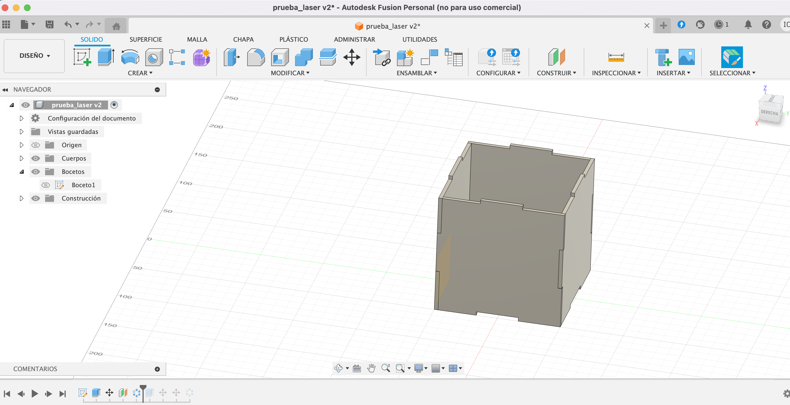

**PROYECTAR**
Para generar los otros planos puedo proyectar desde las caras superiores o inferiores los planos verticales, con la función de 
**1-** Crear/proyectar.
Selecciono en el plano superior lo que quiero proyectar (entidades específicas). Y termino el Sketch.
Proyecto y me une toda la cara a las paredes de los planos verticales hasta que doy cuenta que al extruir tengo que elegir **Nuevo cuerpo**, lo tenía en **Unir**.

Al querer simetrizar la tapa de abajo cree un nuevo plano a la mitad y simetricé respecto este nuevo plano creado. No tengo claro de que otra forma puedo hacerlo ya que no esta centro al punto de origen el dibujo.

**TAREA**

Siguiendo la clase de Joaquín y luego de haber evaluado distintas opciones, resolví hacer una caja que me permita guardar cartas (napies), ya que tengo unas en una bolsa *ziploc* porque se me rompió la caja de cartón en que venían.
Pensé en hacer algo útil y descarté las otras opciones porque vi que los tiempos no me daban y realmente para mi ya es un desafío por más simple que parezca la caja, generar un archivo, sus encastre, parámetros, grabados, son pequeñas cosas que intento razonar e incorporar para futuros ejercicios. Mi pequeña investigación de opciones me hizo ver que hay muchas cosas para considerar y ahora lo que me quiero centrar es en la parte práctica y constructiva, más allá de su forma final. Addemás que esta lleno de planos dibujados, pero en mi caso quería dibujarlo yo.

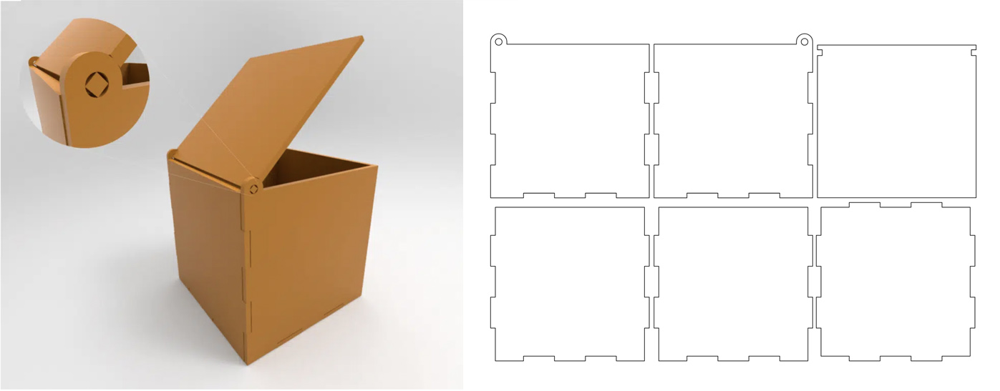
>Esta caja tiene la particulariedad del encastre con la tapa

Como primer punto es cambiar las medias del cubo que encontré de ejemplo y adaptarlo a las medidas de las cartas. 

**Consideraciones antes de ponerme a dibujar**
Releve las medidas de la carta y la caja que tenía para que entraran bien dejando 1cm aproximado de aire. En este caso tengo 3mm de espesor que me lo come el encastre. Luego observé el  sistema de abertura que tiene la tapa, es un encastre cuadrado, dentro de un hueco circular. Tengo que resolver esas medidas. 
Va a medir 10cm de frente (X), por 3cm de alto (Y) y 8cm de fondo (Z).
Comienzo a dibujar.
Siguiendo con el ejericio del cubo realizado en la clase práctica de Fusion 360, repito los primeros pasos explicados anteriormente.

**1-**	Hago un plano en paraleo en X donde voy a dibujar frente y fondo (10cm x 3cm).
**2-**	Parametrizo el espesor en 3mm. 
**3-**	Tomo las medidas de restricción (dientes del encastre), marco que sean iguales los espacios de corte. Tuve presente los encastres, en que lugares y cantidades.
Como comenté anteriormente, es más fácil tirar las líneas y luego ajustar con la herramienta.
 Son varios fragmentos de encastre que quiero que queden iguales y lleva como una lógica de “este” es igual a “este “y así seguir en orden, sino no sale. Me pasó que la primera vez no respeté esa lógica y no me quedaban bien.

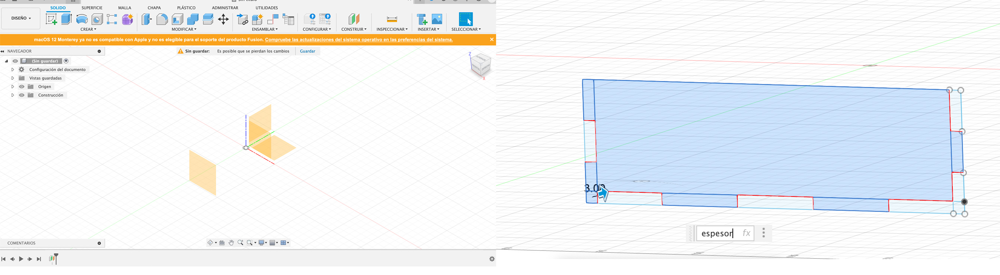

**4-**	Siemtrizo los lados verticales
**5-**	Extruir
**6-**	Simetrizo el cuerpo. Ahí me doy cuenta que lo primero que dibujé tenía las medidas del lateral (8cm de largo) y no del frente (10cm de largo). Los laterales tienen el encastre con la tapa, así que no era la medida y dibujo correcto. Como en un principio pensé que era el lateral 10cm, y había hecho el plano a esa distancia, ahora tuve que simetrizar y correr el plano a 10cm y no a 8cm.
  No supe como duplicar y modificar la distancia de planos, así que hice un nuevo boceto para el frente y fondo. Con el dibujo de atrás simetricé el de adelante.

  
  >Corregí la distancia entre los planos

Se van presentando problemas cada vez que avanzo en algo, surgen cosas no pensadas, mal calculadas o no tenidas en cuenta. Volver a hacer el boceto quizás es el camino más largo pero voy avanzando.

**LATERALES**
Me genero un nuevo plano pero esta vez en el eje de Y
Para los laterales tengo que dibujar el encaste con la tapa. Aca considero que el espesor de la tapa es de 3mm y debe girar dentro del hueco del encaste de los laterales. Lo hago un poco mas grande, medio a ojo. El hueco lo alinea abajo y a 3mm del lado del encastre.
Luego procedo a hacer los mismos pasos que hice con el frente y fondo.
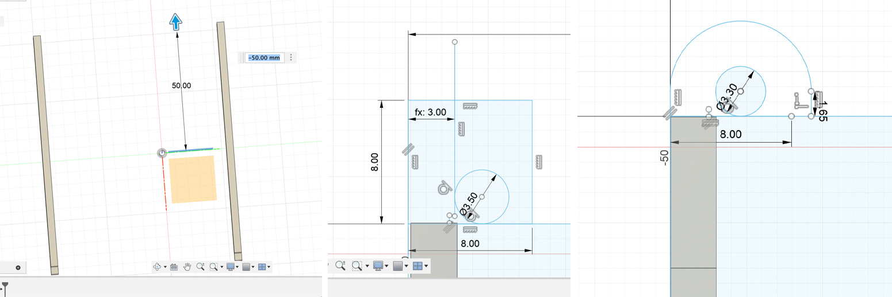

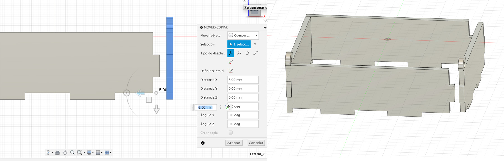

**TAPA**

Para dibujarla tuve que ir al plano horizontal y ahí comencé el Sketch con las medidas relevadas. Acá era bastante fácil la forma, solo debía dejar el encastre para que pudiera abrir y cerrar correctamente.
Al extruirla con el espesor de 3mm, noté que no había sido suficiente el espacio que dejé en el hueco para que gire, así que tuve que volver a dibujar en los laterales el hueco. Fui al Sketch cambié esa medida y al estar simetrizados me lo cambió en ambas medidas.

**BASE**

Intenté proyectar los planos como había hecho en el cubo, pero por algún motivo que no termié de entender, me proyectaba todo o solo algunos dientes, pero nunca los que quería.
 Sino me tomaba todo desde abajo y no del plano de arriba. Asi que terminé redibujando lo que quería y lo extruí.

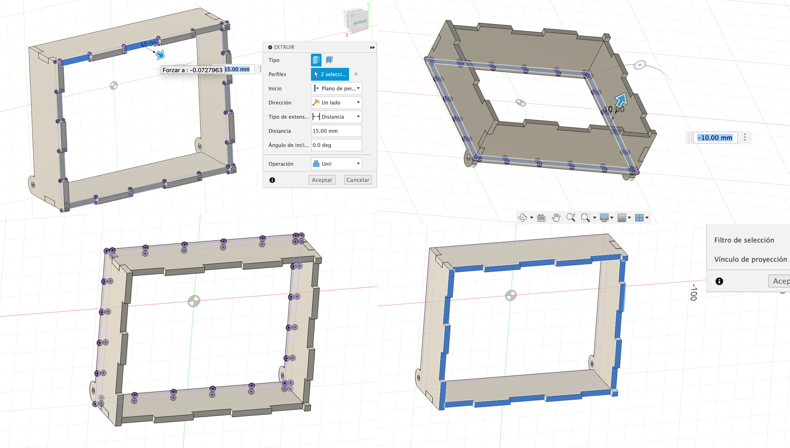

Finalmente logré terminar la caja y pude ver que todo calza perfectamente.
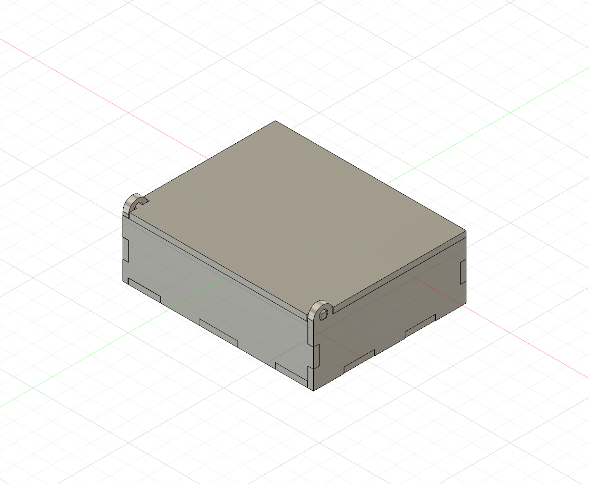

**ORGANIZAR**

Con el dibujo pronto, necesito organizar las piezas eficientemente para maximizar el uso del espacio de impresión. Esta función permite reducir el tiempo de preparación y facilitar el proceso de fabricación. 

**1-** Selecciono los componentes (las piezas, caras del cubo). Las selecciono como cuerpo, asi me aseguro que el dibujo no quede repetido o partes sin proyectar, en caso de que fuese algo más complejo.
**2-** Modificar / Organizar
Me abre una nueva ventana de diálogo y elijo un plano y determino las dimensiones que va a tener, en este caso no puede superar 600mm x 450mm.
Hay distitnos parámetros que se pueden modificar como el espacio entre piezas o el marco del lienzo. Yo no lo tengo tan claro, si bien hablamos de esto en clase, y dejo lo que viene por defecto.
 Estas variantes dependen de la cantidad de cortes que se van a hacer de una misma pieza, del material, del dibujo, etc.

 

Exporto los bocetos como DXF en mi computadora

**PROGRAMA VECTORIAL**
En mi caso trabajé con Adobe Illustrator.
Abro el archivo con sus dimensiones reales que exporté en DXF. A la tapa de la caja le voy a poner una imagen que redibujé de manera más simple, la conseguí de internet, algunas partes son grabadas y otras marcadas.
 A partir de esa iamgen con la herramienta de linea y circulo lo dibujo por encima de forma que me quede vectrorizado. 
 La idea de trabajar en este programa es que puedo separar en capas y tener otro nivel de libertad y detalle en las imagenes.

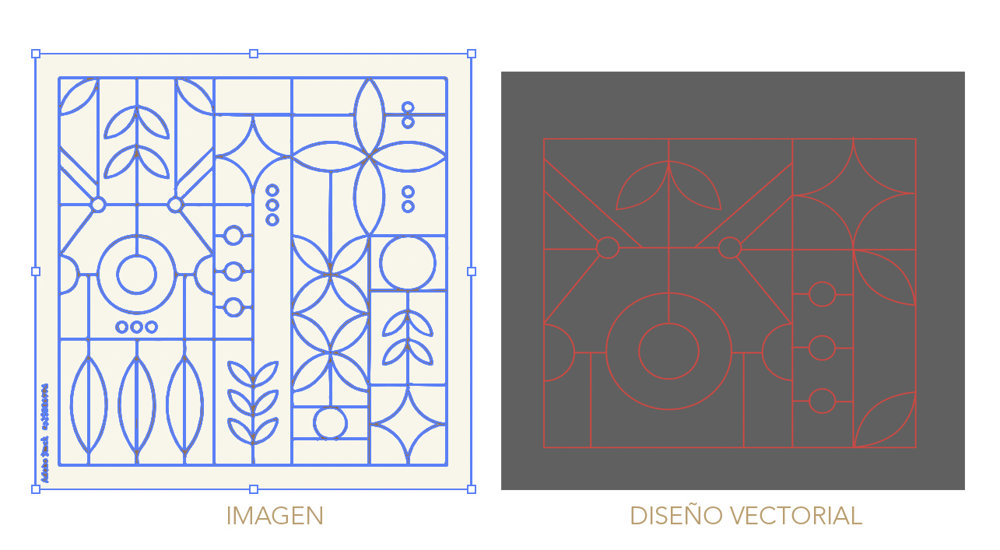
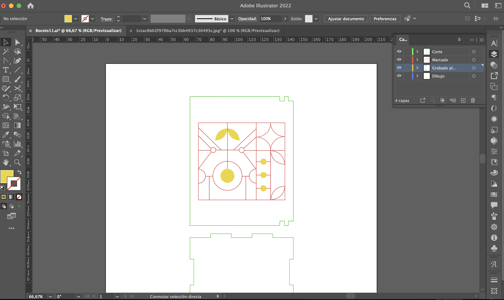

Ya esta pronto para abrirlo en **Thunder** o programas similares que su función principal es es traducir los diseños de la computadora, en movimientos precisos del láser para realizar cortes o marcas detalladas en los materiales. 
Se puede ajustar distintos parámetros como que corta primero, que es grabado, las velocidades, el tipo de materiales, entre otras cosas.

**REFELEXIONES**
Cada ejericio es un desafio nuevo, donde voy sumando conocimientos y métodos de trabajo.
En esta oportunidad se me fueron presentando distintos obstáculos, que de poco pude superar, quizás por el camino más largo pero puede ir armando un método de trabajo e ir pensando cada pieza.
En este caso, más alla de las herramientas utilizadas lo bueno estuvo en pensarlo tridimencionalmente y lo importante de pensar antes de arrancar como lo voy a dibujar, que necesito.
Ahora falta verlo en mis manos y si fue lo que quise dibujar.

**LABORATORIO DURAZNO_**

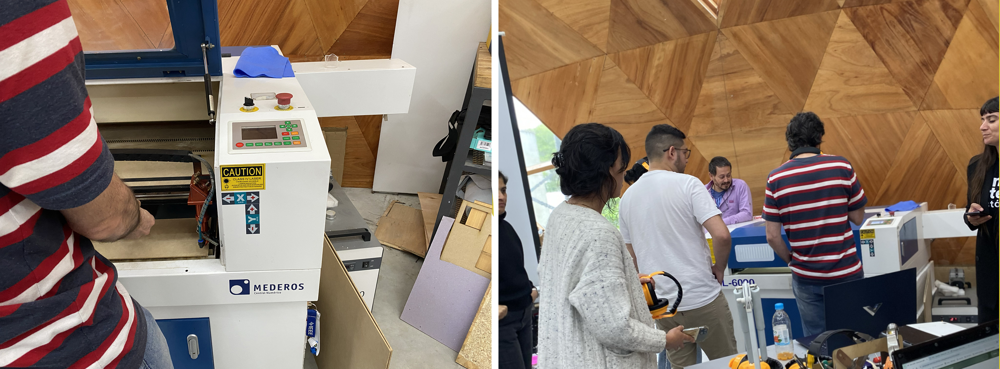

**1-**	Chequeo del dibujo

Lo primero fue (y debe ser siempre así) revisar los dibujos. En mi caso tenía unas dobles líneas que borré para que la máquina no pase dos veces por el mismo lugar.
Además el dibujo en Fusion 360 no estaba fijo y es otra cosa que siempre hay que hacer al arrancar, de manera de asegurarnos que no se muevan las cosas, sobre todo al modificar. 
Quizás con eso me hubiese ahorrado el tema de mover los planos (algo que ya tenía claro que no debía hacer, pero no lograba modificiar de otra forma), e ir al sketch y modificar el propio dibujo en lugar del plano.
En este caso era un dibujo simple, pero para trabajos futuros, con dibujos más complejos, puede resultar más difícil a la hora de ajustar cambios.

**2-**	RD works - Thunder Laser

Este es el programa que utilizan en UTEC para controlar los parámetros de corte y grabado en la máquina del laboratorio.
 En Mac (que es el sistema operativo que uso), no funciona y no hay versión, por lo que me prestaron una PC. 
La maquina que utilizamos es la SKL -6090.
-	En RD works, separamos en capas cada tarea y le asignamos un color. Así lo entiende la máquina y nos ordena.
**Negro – corte** (60% potencia) (15 mm/s)
**Rojo- Marcado** (11% potencia) (50 mm/s)
**Verde o Azul _ Raster** (11% velocidad) (100 mm/s)

Estos parámetros son los que usan en este laboratorio para esta máquina (lo definieron a partir de las pruebas y trabajos que realizan). Cada máquina tiene sus parámetros. Utilizando estos parámetros nos aseguramos que el trabajo salga bien.

-	Lo otro a determinar es el Área de trabajo, esta máquina es de 900x600 mm

-	Marcar el cero de la maquina, esquina derecha superior (en este caso)

-	Intervalo 0,2 en *marcado*, es la densidad que le voy a dar. Teniendo en cuenta el modelo que nos mostraron que en 0,1 se notan las líenas, lo cambié a 0,2.

-	Marcar *Independent output* en el grabado corta entre uno y otro (si hay más de un grabado), sino lo hace todo corrido.

*Cuando hay una imagen_*
Bipmao hundle para cuando tengo imagen, hago los ajustes.
Defino la *frecuencia*, le digo cuanto pasar, o sea que tanto va a oscuercer con el laser en una foto. 

Una vez que tengo todos los ajustes, tengo un archivo .rld editable (lo guardo así para poder seguir trabajando o ajustando si hace falta).
.rd pronto para llevar a la máquina a cortar, grabar o marcar.

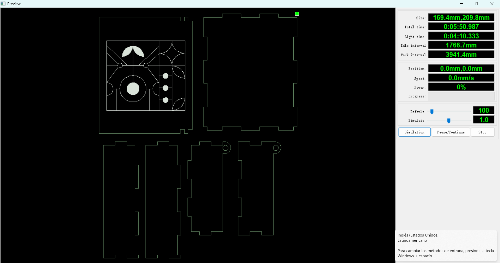

**3-**	Máquina SKL -6090
Me copio el archivo a la máquina, lo puedo visualizar chiquito en la pantalla de la máquina.
Mido la altura del láser a la cama (tienen una herramienta de medición) asi me seguro que el punto focal esta bien y no desenfoca.
Pongo el puntero donde va a arrancar y le doy ENTER.

En la primer pasada el cambié el intervalo a 0,2 y me quemó demasiado lo que era grabado, asi que volví a hacerla 0,1 y quedó bien, en la capa de marcado.
Otra cosa fue la tapa me hacía un poco de tope, no lograba subirla del todo, asi que la lijé un poco y abre y cierra sin problema.

**REFLEXIONES**

Estas instancias son muy enriquecedoras no solo por la parte social de trabajar en conjunto, ir viendo lo que otros hacen e intercambiar, sino el propio hecho de pasar de lo digital a lo tangible, entender esta parte final del proceso y otras variantes, además de ganar confianza a la hora de utilizar las máquinas.

