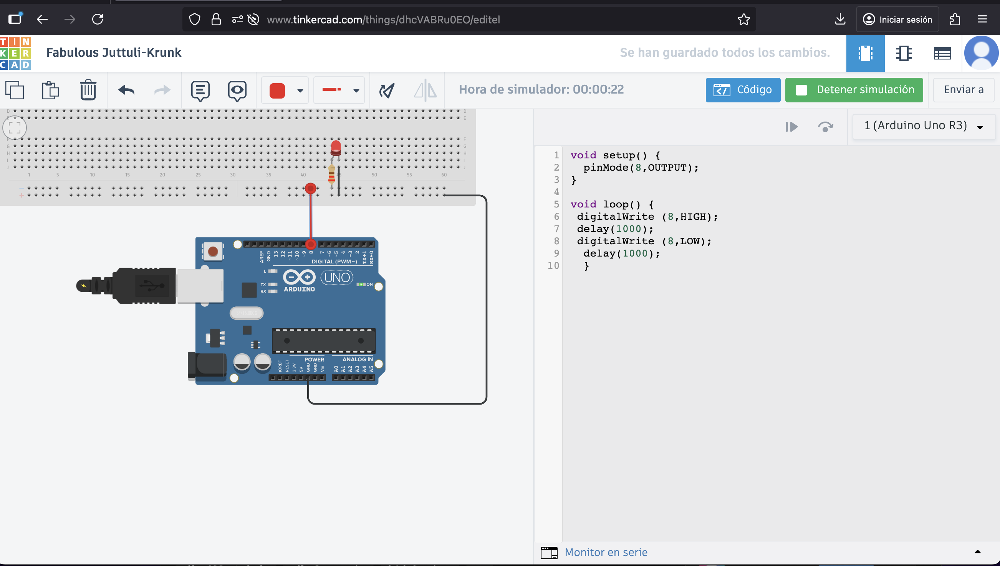
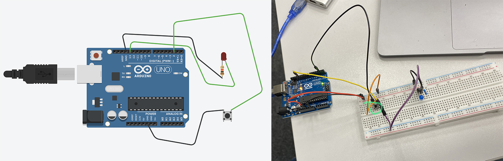
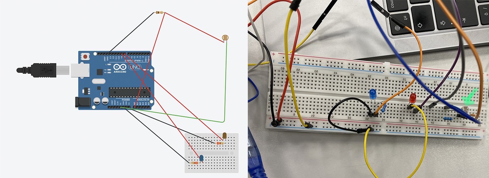

# MT04

**Introducción a electrónica y programación**

Conceptos básicos para entender cómo funcionan estos circuitos a través de la electrónica y la programación.

**Corriente eléctrica**
Para comenzar con la electrónica, mínimamente hay que saber que existe una corriente continua (CC) que tiene un flujo constante de electrones en una misma dirección y se lo proporciona una fuente de alimentación (como puerto USB o batería) y una corriente alterna (CA), que es la que viene de una red eléctrica y cambia constantemente de dirección (la de los enchufes del hogar).

**Arduino**
Lo primero que hice fue descargar el software de Arduino, este programa es donde se escribe el código que luego manda órdenes a la placa física a través de datos de sensores (entradas - INPUT) y controla dispositivos electrónicos (salidas - OUTPUT) para que procese diferentes cosas que queramos. 

-	Lo primero es **seleccionar la placa con la que estoy trabajando** Tools> Boards y Tools> Port.
-	Lo segundo es que siempre trabajo con las **Librerías**, (puedo subir propias o usar las que hay) ayudan con colecciones de objetos y formas prediseñadas que facilitan la creación de nuevos modelos de manera rápida y sencilla.
Con estas dos pasos puedo ponerme a escribir (o traerme) código en el *Sketch* y se guardan como archivos .ino
Verifico que esta ok, sino me va a decir donde hay un error.
Luego compilo y lo sube o pasa a la placa con el botón de *upload*.

**Tinkercad y Wokwi**
Son simuladores de circuitos electrónicos en línea y gratuitos, usados principalmente para programar y probar proyectos con microcontroladores como Arduino. Tinkercad es más sencillo, ideal para principiantes y se enfoca en el diseño 3D, el diseño de circuitos y la codificación por bloques. Wokwi es más avanzado, ofrece más tipos de microcontroladores (como ESP32 y STM32), soporta lenguajes de programación como C++ y tiene una simulación más detallada, incluyendo conectividad WiFi. 
 *(Visión general creada por IA)*

En mi caso trabajé con Tinkercad, con este tipo de simuladores es más fácil ver si hay un error y corregir antes de quemar una placa o que algo no funcione.

Como para mi todo esto es bastante nuevo, busqué la placa con la que íbamos a trabajar (existen muchos tipos de placas) para tener mejor visualizadas sus partes y que función o funciones tiene cada una.

Partes de la placa Arduino UNO
https://www.tiktok.com/@edtplus/video/7299524779390848261  (video de partes de placa básica)

*_Apunte del código_*

True – 1
False – 0

If (condición variable)
&& ( y )
II (diyunción)
! (negación)

Void setup () (indico como arranca)
Void loop () (como continúa muchas veces)

; (siempre al terminar una acción)
{ } (agrupo bloques de código)

Int (variable)
Serial.println (imprime en pantalla)

else if (si no se coumple, si)
else (si no)

// comentarios
*/ comentarios largos, todo lo que quiera

~ Nº (es entrada analógica y digital) EN PLACA

Para comenzar realicé un ejercicio básico de Arduino donde enciende una LED, esté me gustó porque además del ejercicio explicaba todo lo que iba a hacer y que era cada cosa.
Ejercicio con Arduino Leonardo
https://www.youtube.com/watch?v=_wTsIslUtNs

En Tinkercad cuando hay un error lo indica, sea en el código o en la conexión de la placa.

**Placa Arduino**

- *Componentes*
Los componentes son dispositivos físicos.

– *Pines*
En todas las placas los pines son multifunción o multipropósito, es decir en función de la configuración tienen una funcionalidad u otra.

— *Pines digitales*
•  pinMode() – configura en el pin especificado si se va a comportar como una entrada o una salida. http://arduino.cc/en/Reference/PinMode
•  digitalWrite() – Escribe  un valor HIGH o LOW en el pin digital especificado. Si el pin está configurado como OUTPUT pone el voltaje correspondiente en el pin seleccionado. Si el pin está configurado como INPUT habilita o deshabilita la resistencia interna de pull up del correspondiente pin. http://arduino.cc/en/Reference/DigitalWrite
•  digitalRead() – lee el valor del pin correspondiente como HIGH o LOW. http://arduino.cc/en/Reference/DigitalRea

– *Pines analógicos*
•	analogReference() – configura la referencia de voltaje usada para la entrada analógica.  http://arduino.cc/en/Reference/AnalogReference
•	analogRead() – lee el valor del pin analógico especificado.  http://arduino.cc/en/Reference/AnalogRead
•	analogWrite() – escribe un valor analógico (onda PWM) al pin especificado. No en todos los pines digitales se puede aplicar PWM. http://arduino.cc/en/Reference/AnalogWrite

- *Sensores*
Un sensor es todo aquello que tiene una propiedad sensible a una magnitud del medio, y al variar esta magnitud también varía con cierta intensidad la propiedad, es decir, manifiesta la presencia de dicha magnitud, y también su medida.
Las variables de instrumentación pueden ser por ejemplo: intensidad lumínica, temperatura, distancia, aceleración, inclinación, presión, desplazamiento, fuerza, torsión, humedad, movimiento, pH, etc. Una magnitud eléctrica puede ser una resistencia eléctrica (como en una RTD), una capacidad eléctrica (como en un sensor de humedad), una tensión eléctrica (como en un termopar), una corriente eléctrica, etc.

>>   Estos conceptos que fui explicando fueron dados en clase de forma un poco más profunda y lo tomé como base para entender las distintas partes y sus funciones.

**PRÁCTICA**

La práctica fue presencial en el LATU, donde nos plantearon distintos ejercicios. Compartí mesa con Lucía y juntamos fuimos armando los distintos circuitos.

 - Ejercicio - 1
Programar el Arduino para que lea un botón y encienda un LED únicamente mientras el botón está presionado.

 const int buttonPin = 2; const int ledPin = 13;
void setup() {
  pinMode(ledPin, OUTPUT);
// Pin donde está conectado el botón
// Pin del LED
       // LED como salida
  pinMode(buttonPin, INPUT_PULLUP);
}
void loop() {
int buttonState = digitalRead(buttonPin); // Leemos el botón
if (buttonState == LOW) {
// Botón presionado digitalWrite(ledPin, HIGH);
} else {
// Botón suelto
    digitalWrite(ledPin, LOW);
  }
}

https://www.youtube.com/shorts/YMi2F67RLWs

 - Ejercicio - 2
Programar el Arduino para que lea el valor de un potenciómetro y controle el brillo de un LED.
Cuando el potenciómetro esté en valores bajos, el LED debe estar tenue; cuando el potenciómetro esté en valores altos, el LED debe brillar más fuerte.
El cambio debe ser progresivo: a mayor giro del potenciómetro → mayor brillo.
 
  int potPin = A0; int ledPin = 9; int valor = 0; int brillo = 0;
// Pin analógico donde va conectado el potenciómetro
// Pin PWM para controlar el brillo del LED
// Variable para guardar la lectura del potenciómetro
// Variable para guardar el valor convertido a PWM
void setup() {
  pinMode(ledPin, OUTPUT);
Serial.begin(9600); // Para ver los valores por pantalla }
void loop() {
valor = analogRead(potPin); // Leer el potenciómetro (0 a 1023)
brillo = map(valor, 0, 1023, 0, 255); // Transformar el rango 0–1023 a 0–255 para PWM analogWrite(ledPin, brillo);// Enviar el brillo al LED
  // Mostrar valores en el monitor serie
  Serial.print("Valor del potenciómetro: ");
  Serial.print(valor);
  Serial.print("  --> Brillo LED: ");
  Serial.println(brillo);
} delay(20);

https://www.youtube.com/shorts/DtKbCzLqefs

 - Ejercicio - 3
Programar el Arduino para que use el sensor de distancia SRF05 y encienda un LED cuando un objeto esté a menos de 20 cm.
Si el objeto está más lejos, el LED debe permanecer apagado.
Además, el programa debe mostrar en el Monitor Serie la distancia medida en centímetros.
 
  const int trigPin = 9; // const int echoPin = 8; // const int ledPin = 13;
void setup() {
  pinMode(trigPin, OUTPUT);
  pinMode(echoPin, INPUT);
  pinMode(ledPin, OUTPUT);
  Serial.begin(9600);
Pin que envía el pulso
Pin que recibe el pulso
// El pin de Trig es salida
// El pin de Echo es entrada
// LED interno como salida
// Para ver distancia en el monitor serie
}
void loop() {
// --- Enviar un pulso al SRF05 ---
digitalWrite(trigPin, LOW);
delayMicroseconds(2);
digitalWrite(trigPin, HIGH);
delayMicroseconds(10);
digitalWrite(trigPin, LOW);
// Asegura nivel bajo
// Pequeña pausa
// Envía pulso de inicio
// Pulso de 10us
// Termina el pulso
// --- Medir el tiempo del eco ---
long duracion = pulseIn(echoPin, HIGH); // Tiempo en microsegundos
// --- Convertir tiempo a distancia ---
long distancia = duracion * 0.034 / 2;
// --- Mostrar en pantalla ---
Serial.print("Distancia: ");
Serial.print(distancia);
Serial.println(" cm");
// Fórmula oficial del SRF05
// --- Condición para encender LED ---
if (distancia < 20) { // Si está a menos de 20 cm
digitalWrite(ledPin, HIGH); // Enciende LED interno } else {
digitalWrite(ledPin, LOW); // Apaga LED }
delay(200); // Pequeña pausa antes de volver a medir

https://www.youtube.com/shorts/m_HqPudPuIo

  - Ejercicio - 4
Programar el Arduino para que lea un potenciómetro y controle el ángulo de un servo SG90 en tiempo real.
Mientras el servo esté moviéndose (cambiando de ángulo), debe encenderse un LED rojo.
Cuando el servo esté quieto (el ángulo no cambió respecto a la lectura anterior), debe encenderse un LED verde.
 
 #include <Servo.h>
// Librería para controlar el servo
Servo motor;
int potPin = A0;
int ledRojo = 12;
int ledVerde = 13;
int anguloActual =
int anguloAnterior = 0;
// Creamos un objeto Servo
// Potenciómetro en A0
// LED que indica movimiento
// LED que indica quieto
0; // Último ángulo leído
void setup() {
motor.attach(9); // Conectado al pin 9 pinMode(ledRojo, OUTPUT); // LED movimiento pinMode(ledVerde, OUTPUT); // LED quieto Serial.begin(9600); // Monitor serie
}
void loop() {
int lectura = analogRead(potPin); // Leemos el potenciómetro anguloActual = map(lectura, 0, 1023, 0, 180); // Convertimos a grados motor.write(anguloActual); // Mover el servo al nuevo ángulo Serial.print("Ángulo: ");
Serial.println(anguloActual);
// Determinar si el servo está moviéndose
if (anguloActual != anguloAnterior) {
digitalWrite(ledRojo, HIGH); // Servo moviéndose
digitalWrite(ledVerde, LOW); } else {
    digitalWrite(ledRojo, LOW);
digitalWrite(ledVerde, HIGH); // Servo quieto }
anguloAnterior = anguloActual; // Guardamos el último ángulo
delay(50); // Pequeño delay para estabilidad }

https://www.youtube.com/shorts/0pwXq70JE1A

  - Ejercicio - 5
Programar el Arduino para que lea una fotoresistencia conectada a un pin analógico.
Si la luz ambiente es alta, debe encenderse un LED.
Si la luz es baja, debe encenderse otro LED diferente. Solo uno de los dos LEDs debe estar encendido a la vez. Además, el valor leído debe mostrarse en el Monitor Serie.

 int sensorLuz = A0; int ledAlta = 8; int ledBaja = 9;
// Pin donde está la fotoresistencia
// LED que se enciende con mucha luz
// LED que se enciende con poca luz
void setup() {
  Serial.begin(9600);
  pinMode(ledAlta, OUTPUT);
  pinMode(ledBaja, OUTPUT);
}
void loop() {
int valor = analogRead(sensorLuz); Serial.print("Luz detectada: ");
} }
// Hay poca luz
Serial.println(valor);
// Punto de separación entre "mucha" y "poca" luz
int umbral = 500;
if (valor > umbral) { digitalWrite(ledAlta, HIGH);
  digitalWrite(ledBaja, LOW);
}
else {
digitalWrite(ledAlta, LOW);
digitalWrite(ledBaja, HIGH);
delay(300); // Pequeña pausa para estabilidad

https://www.youtube.com/shorts/ZgEucokR4AQ

En este último ejercicio debimos ajustar distintas escalas, dependía de cada sensor el rango que se le daba, fuimos probando hasta que respondió correctamente. 

**REFELXIONES**
Comprendiendo como funciona cada pieza o componente, y minimamente el código, de manera de poder corregir algún error, estos cinco ejericios permiten ver varias de las acciones más comunes y poder combinarlas entre ellas. Me parece una buena base para entrarle al mundillo de la electrónica y ganar confianza para trabajos más complejos.

