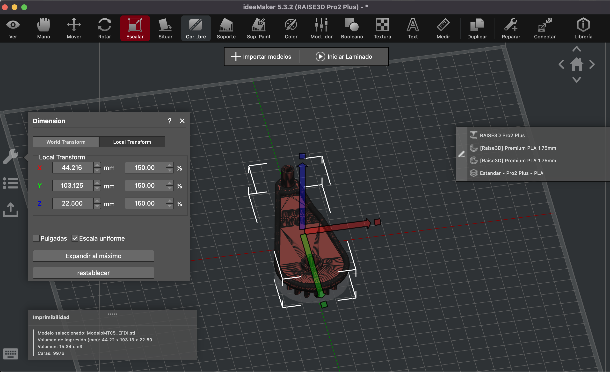
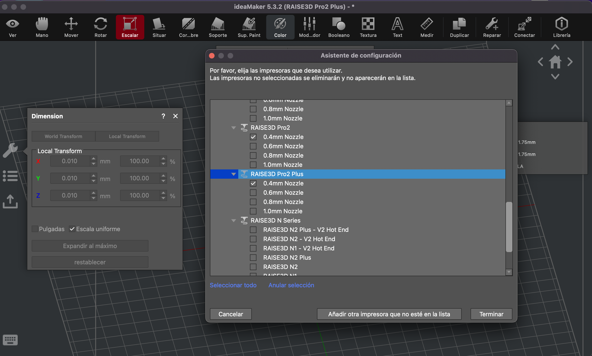
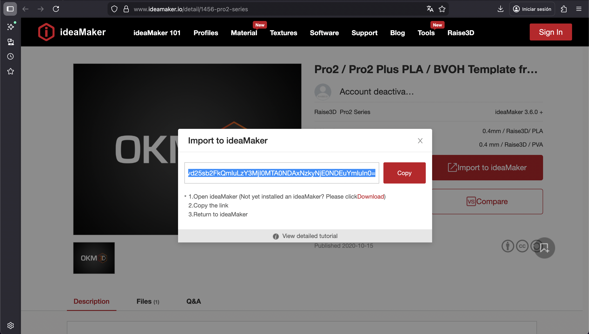
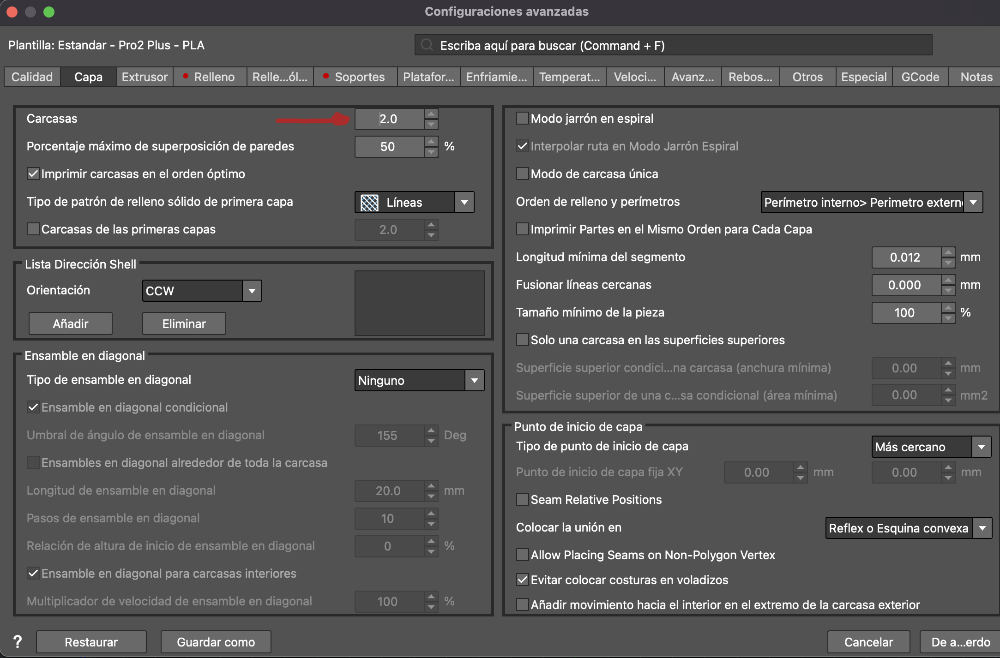
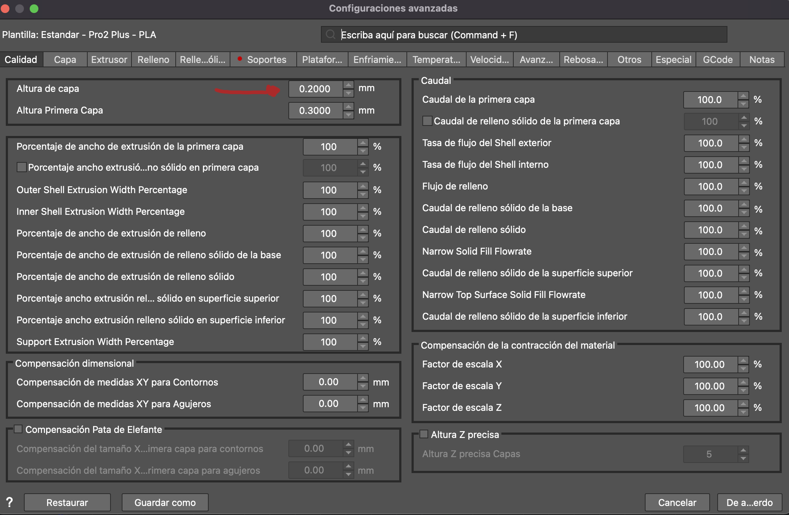
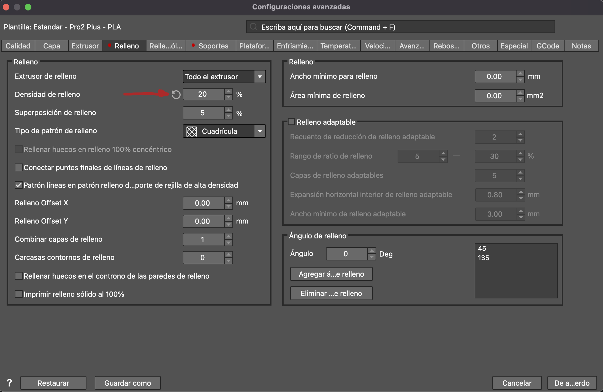

# MT05

**Impresión y escaneo 3D**

En este módulo se plantea preparar un archivo para imprimir en una impresora 3D. 
La impresora que hay en el laboratorio de UTEC  es la RAISE3D Pro2Plus, y el programa que se utiliza para laminar (slicer)  es IdeaMaker.
Esta máquina con la que trabajamos tiene doble extrusor dependiente, esto es un único cabezal con dos extrusores, dos boquillas. Imprime con una u otra boquilla. Sube una o baja otra, pero nunca a la vez.

***1-Programas*** 
Los primero es obtener todos los programas para trabajar. En este caso necesito Fusion 360 e IdeaMaker, este útlimo no lo tengo.
Descargar  IdeaMaker  (https://www.raise3d.com/download/) se hace de forma muy fácil e intuitiva, no presenta ninguna complicación. 

>> IdeaMaker es un software gratuito de laminado (slicer) para impresión 3D, desarrollado por Raise3D, que convierte modelos 3D (archivos STL, OBJ, 3MF) en código G-code que las impresoras pueden entender, y es conocido por ser potente, intuitivo y compatible con casi cualquier impresora 3D FDM, permitiendo preparar, modificar y optimizar modelos, gestionar soportes, e incluso aplicar texturas y compartir archivos desde su biblioteca. 
*(Visión general creada por IA en Google, ¿Qué es Ideamaker?)*

***2- De archivo .stl diseño 3D a archivo .f3d malla***
Una vez descargado el archivo .stl en mi computadora, lo abro en Fusion 360 (archivo que fue compartido por los doscentes para este ejericio). Es una pieza de un engranaje.
Lo exporto como malla y dejo por defecto las opciones que me sugiere el programa; como ser la unidad de medida, la densidad y desviación que controlan la caldiad y nivel de detalle, asi como la precisión. 
El significado de estas variables las fui buscando en Google para entender, si bien había que dejarlo tal cual, que es lo que significan. Me ayuda a comprender los pasos que voy realizando y de a poco dimensionar la cantidad de variantes que tienen todos estos archivos.
>>El archivo .f3d (malla .stl) a diferencia del .stl común contiene el modelo 3D completo con su historial de diseño, parámetros y datos, permitiendo edición, mientras que un archivo común es un formato universal para impresión 3D que solo almacena la geometría superficial del modelo como una malla.
*(Google, Diferencias entre formatos stl y f3d)*

***3- Laminar en IdeaMaker***
Abro el archivo .f3d en IdeaMaker.

*— Escala*
Lo primero que hago es escalar de forma proporcional al 150% como lo pide la premisa.

*— Definir impresora*
Debo definir con que impresora voy a trabajar para tener claro los estándares de parámetros, visualizar el área de impresión de la máquina, etc.
En el menú voy a:
Impresora /asistente de configuración
En UTEC trabajamos con RAISE3D Pro2Plus, nos aseguramos tenerla seleccionada.
El estándar es 0,4 pero puedo seleccionar las otras boquillas. La boquilla de la izquierda L(left) es la principal y con la que suele trabajar por defecto.
Las boquillas suelen ir de 0,2 en 0,2. Por ejemplo 0,6 si tenes que imprimir mucha cantidad u objetos grandes es más rápido. La boquilla más chica tiene mayor precisión, pero demora más.

*- Definir plantilla*
Para asegurarme que quede bien la impresión debo cargar plantillas de Raise3D, que son perfiles con configuraciones específicas que el programa reconoce, y me permite lograr impresiones de calidad. O puedo tener en la biblioteca plantillas de trabajos anteriores.
En mi caso no tengo nada, asi que fui a la página para elegir un perfil https://www.ideamaker.io/ 
En el buscador de la página escribí Pro2 Plus (la impresora que voy a usar) y me busca los que son compatibles. Hay que elegir una opción y copiar el link. Luego en IdeaMaker automaticamente aparece una ventana que te dice pegar y ahí ya queda en las opciones para laminar.

 Fui probando con las distintas opciones que me ofreció.
 Primero copié una que decía *smartfil*, un filamento distinto. Ajusté los parametros tal como había visto en clase y me fijé lo que demoraba, 1 hora, 39 minutos. Luego volví a la web y cargué la otra opción de plantilla que solo decía Pro2, ajusté los parámetros, la opción de *Alta resolución* tardaba 2 horas, 25 mununtos y por último probé la opción *Estandar* y me dio 1 hora, 4 minutos, asi que resolví esta tercer opción. 
 
 

Los parámetros que definí manualmentes que fueron hablados en el curso, fueron:
- Velocidad de relleno
- Densidad de relleno
- Carcasa
- Altura de capa 

Imagen del video tutorial con los parámetros anteriormente mensionados. 

*- Balsa*
Luego de ajustados los parámetros debo generar la cama, donde se apoya la pieza, en este caso decidí la *balsa*, que entiendo es la más común (hay otras opciones) y es la opción que se dió en clase.
 El apoyo es muy importante porque es el inicio de la impresión y si no esta bien plantada corremos riesgo de que se vayan acumulando errores en la pieza.
>>La balsa (raft), es una base gruesa para mejorar la adhesión y aplanar la primera capa, existen otras plataformas como la falda (skirt) (un borde alrededor de la pieza sin tocarla para purgar la boquilla) y el borde (brim) (líneas que se unen a la pieza para más superficie de contacto), siendo la balsa la más conservadora, ideal para materiales difíciles como el ABS o piezas pequeñas, aunque consume más material y tiempo. *(Visión general creada por IA en google. La balsa y otras opciones en impresión 3D)*

Con todo definido le doy *Laminar* y puedo previsualizar (menú superior).
Cierro la vista previa si veo todo correcto y el doy *Exportar al disco local* como .gcode y lo guardo.
Esta pronto para imprimir.

**Conclusiones**

Este ejericio sirvió para tener presentes las variables más significativas, yver como estos ajustes  incide en la pieza final,  como en el proceso (tiempo, soportes, dureza, materiales,etc.).
Pude probar con los tiempos de impresión, y los soportes. Luego tendré que ver con la práctica y mayor conocimiento, que tanto cambia la caldiad y definición de la pieza.

Para determinar el perfil de impresión entiendo que también dependen de cada pieza, por lo cual es importante saber para que se va a usar, que función va a tener, cuanta cantidad de piezas se van a imprimir, y así ir definiendo el material, la posición, velocidad, etc.
Por todo esto también es que suelen realizarse varias pruebas.

Lo bueno de trabajar con estas plantillas es que son una base con la cual comenzar y luego puedo ir haciendo ajustes en la medida que conozca la máquina (experiencia) y cual es el fin de esa pieza.

**Reflexiones**

Pasaron varias semanas entre las clases y que me pude sentar a realizar el trabajo. Diciembre es un mes muy cargado por el cierre del año, y si bien tuvimos más tiempo, me costó reenganchar y recordar las clases y los teóricos que había leído sobre este tema que tengo poco conocimiento. 
Por eso me fue de ayuda ir buscando conceptos en Google de para que sirve cada cosa, e ir refrescando las ideas trabajadas en calse, me permitió hacer mi propio hilo. Además de el videotutirual con el que refesqué el proceso de trabajo.

En paraleo estuve buscando tutoriales y viendo algunos videos sobre Meschmixer, pero la verdad no me ha dado el tiempo para practicar. Me pareció super interesante poder modificar los modelos 3D y generar formas mas orgánicas o estampadas.
Me queda pendiente para poder manipular y editar modelos 3d. Me tomo este descanso pero intentaré practicar alguna cosa.

