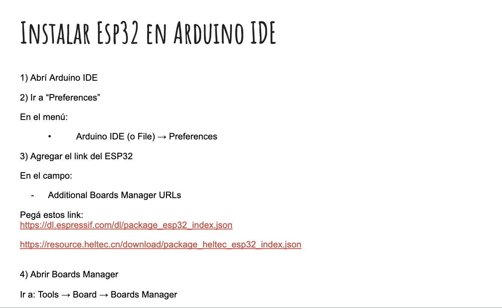
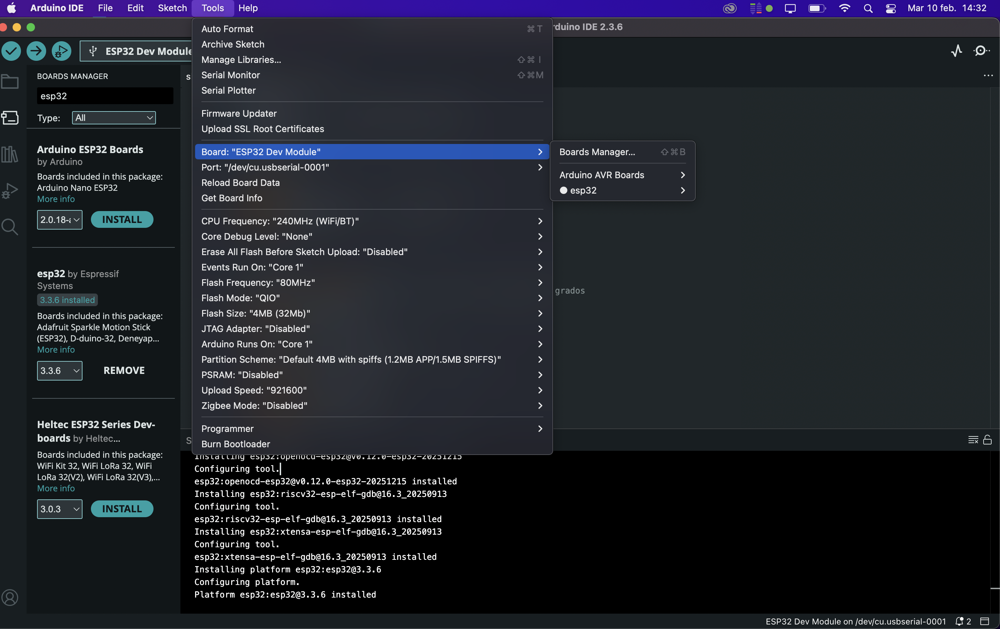
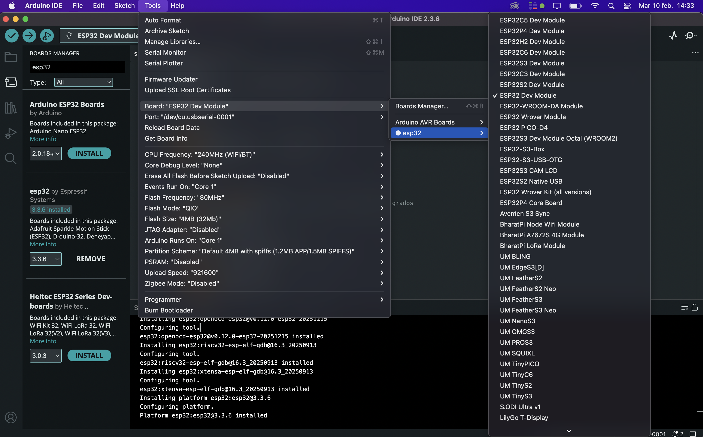
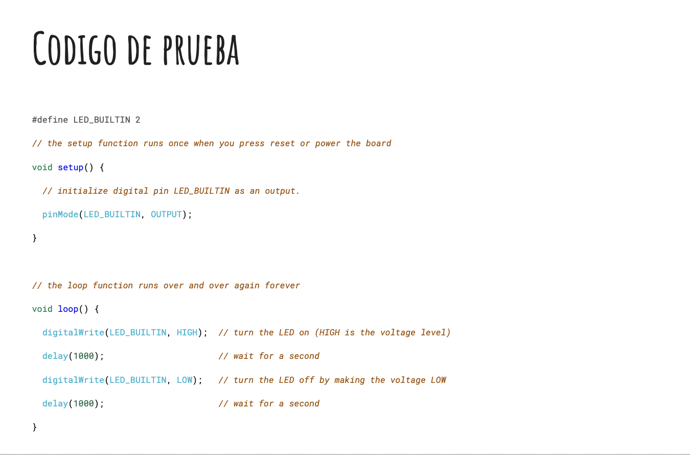
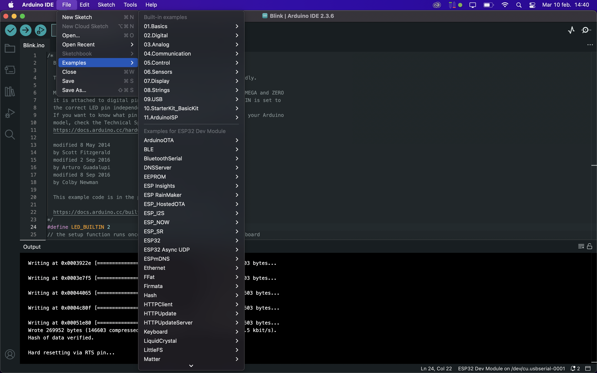
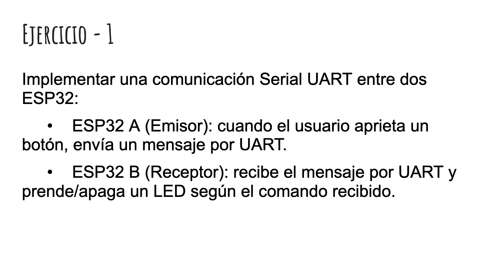
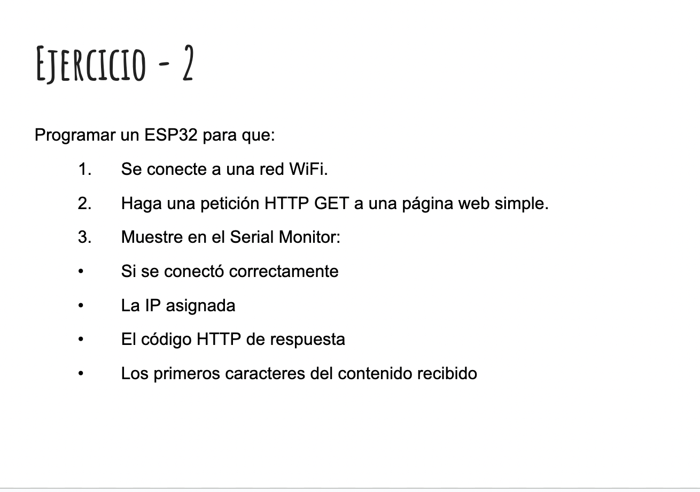
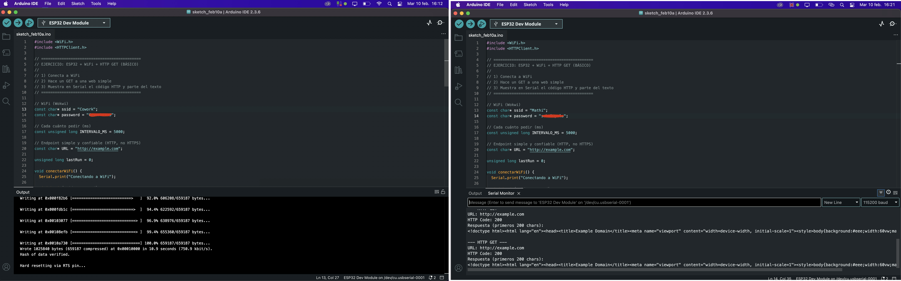

# MT06

**Networking - Comunicación entre dispositivos**

En este módulo al igual que en MT04 utilizamos Arduino para programar el código que enviará las órdenes a los dispositivos y sensores.
En los distintos ejercicios utilizamos la estación ESP32 (se denomina así a los dispositivos que se conectan a una red WiFi o Bluetooth).

Lo primero fue:

Una vez instalado el ESP32 y conectado por cable a la computadora, elegimos un ejemplo a modo de prueba.  Existen códigos ya precargados, en este caso utilizamos uno que enciende y apaga (HIGH-LOW) la luz que tiene el ESP32 con un delay de 1000 segundos.

>> Hay varias códigos precargados que pueden servir a modo de prueba o para trabajar directamente con ellos.

https://youtube.com/shorts/7KtaNQyXu4M?feature=share 
Video de la prueba en funcionamiento

Generamos una comunicación serial entre dos ESP32.
Uno de ellos tiene un botón, que al presionar enciende una luz en el otro y al soltar se apaga.

Este tipo de comunicación opera bit a bit secuencialmente, a través de interfaces UART (Transmisor Receptor Asíncrono Universal) incorporadas, permitiendo al ESP32 comunicarse con la computadora, sensores u otros microcontroladores. Por medio de un pin TX (transmisor) y un pin RX (receptor), uno hace de voz y el otro de oído. 

Indicamos que el *emisor* tiene un botón

y el *receptor* una luz led que responde al botón

https://youtube.com/shorts/KaJdmkJF_ZE
*Sistema en funcionamiento*

 

El objetivo es hacer una petición HTTP GET a una página web simple, lo que significa enviar una solicitud HTTP para recuperar o leer información de un servidor, como páginas web, imágenes o datos. El ESP32 lo programamos en Arduino IDE para solicitar la petición GET.
 Este es un método seguro que no modifica datos en el servidor, ideal para consultas.

En este ejemplo solicitamos leer la información de la web http://example.com en intervalos de 5000 ms.
En una primera prueba no cargaba bien, cambiamos la red de wifi y se conectó sin problema, comenzó a dar respuesta. Esto lo vemos en el monitor que nos manda la inforamción de lo que sucede.

 

 
 

 En este ejercicio usamos un servidor de mensajería MQTT que se accede gratuitamente a través de internet, permitiendo gestionar e intercambiar datos entre distintos dispositivos IoT, sensores y aplicaciones, sin necesidad de configurar un servidor propio. Actúa como intermediario centralizado que recibe, filtra y distribuye mensajes.

 *Extraído de Guía para principiantes sobre brókers MQTT, por el equipo de HiveMQ*
 https://www-hivemq-com.translate.goog/blog/mqtt-brokers-beginners-guide/?_x_tr_sl=en&_x_tr_tl=es&_x_tr_hl=es&_x_tr_pto=sge
 
  

 En este caso usamos MQTT (Mosquitto público) cada compañeros de la EFDI se conectó un sensor de humedad y temperatura. Fuimos nombrandonos con distintas ciudades y veíamos en la pantalla los datos recabados por el sensor y como en la medida que nos movíamos iban variando. 
 En mi caso elegí San José - Uruguay

  
    
 

*Para explicar ciertos conceptos me apoyé en el material teórico proporcionando en clase.*

 

Queda planteado el *Ejercicio 4* opcional en el que hay que comunicar dos placa ESP32 entre bluetooth. 
Es un desafío para ver si puedo siguiendo la logica y con ayuda de IA lograr esta comunciación. 
En breve subiré mi trabajo, aun estoy con algunas dudas a resolver.

**Conclusiones_**
En este ejercicio logramos ver diferentes formas de comunicación por medio del ESP32. Teniendo conexión a internet el ESP32 nos permite recibir, enviar, monitorear y recopilar información.
Esto permite generar muchos tipos de proyectos accesibles y versátiles por medio de una programación medianamente fácil. 

 