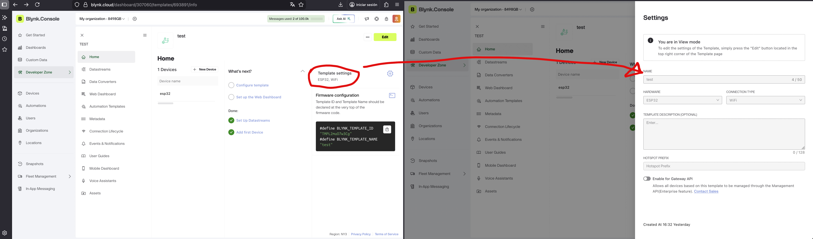
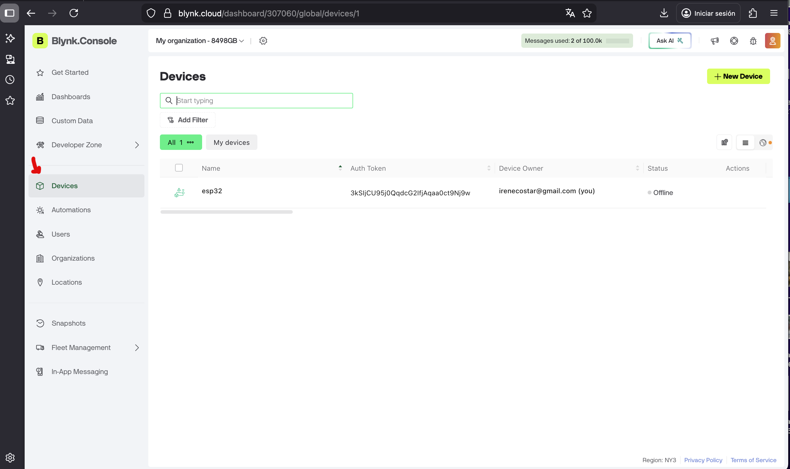
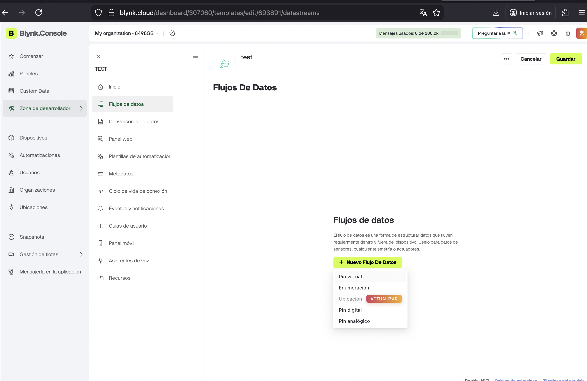
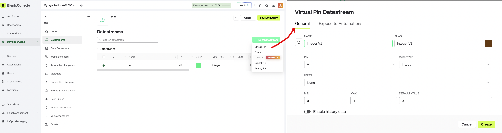
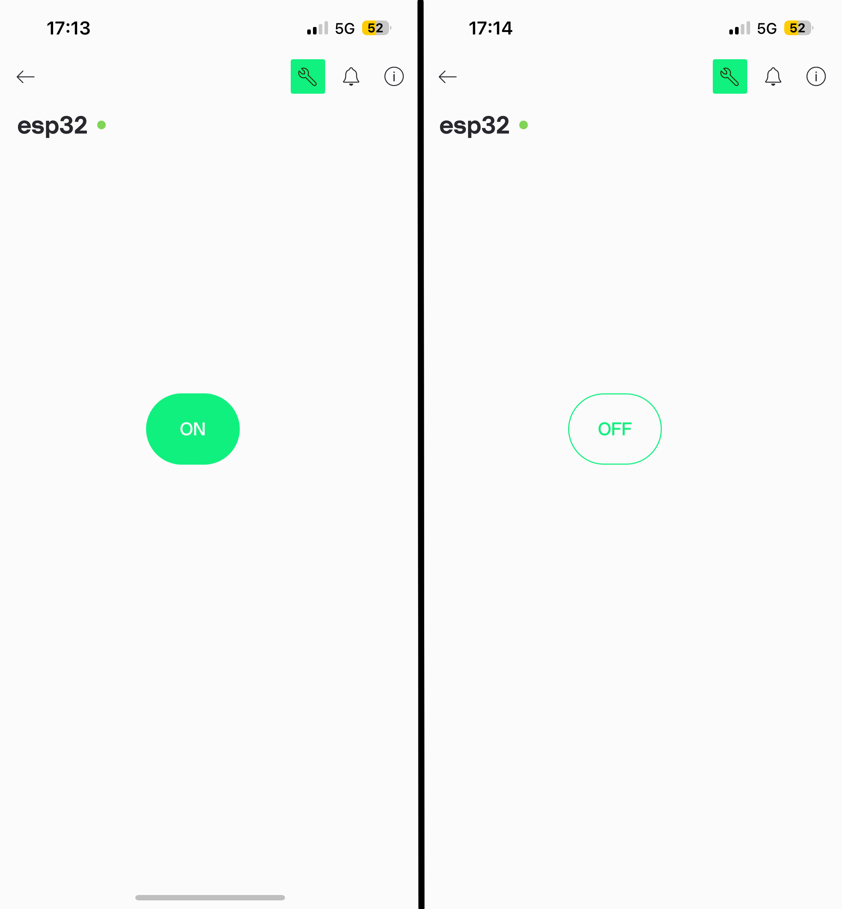
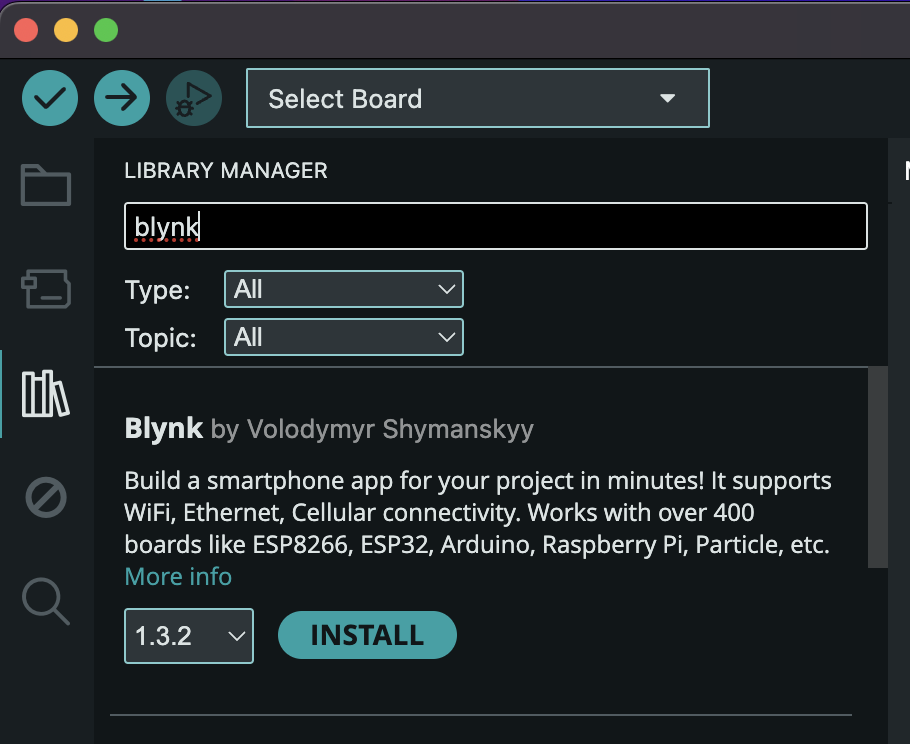
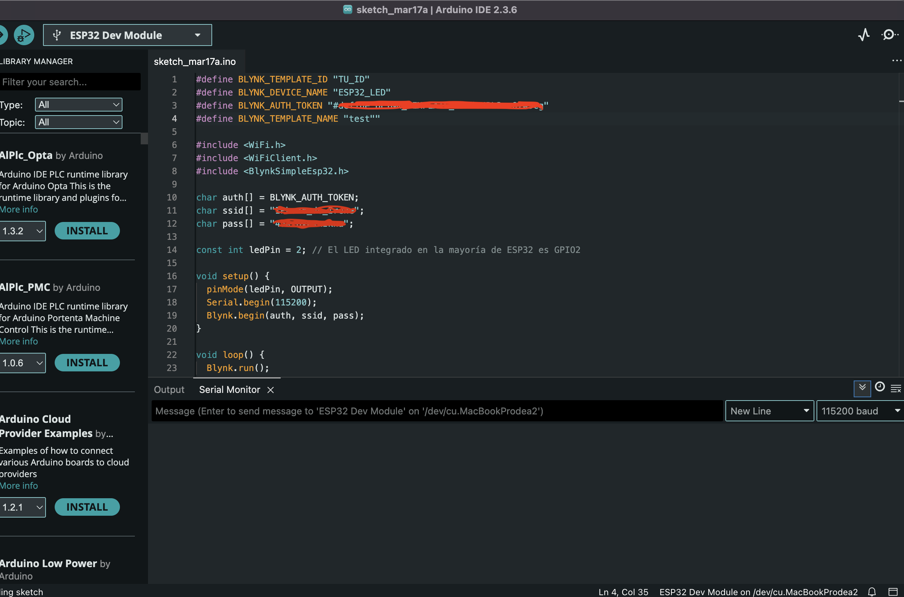
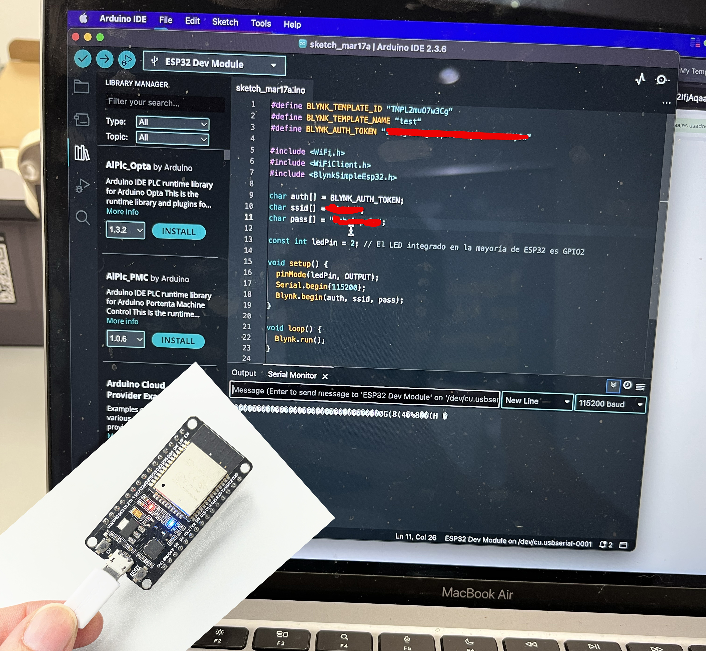
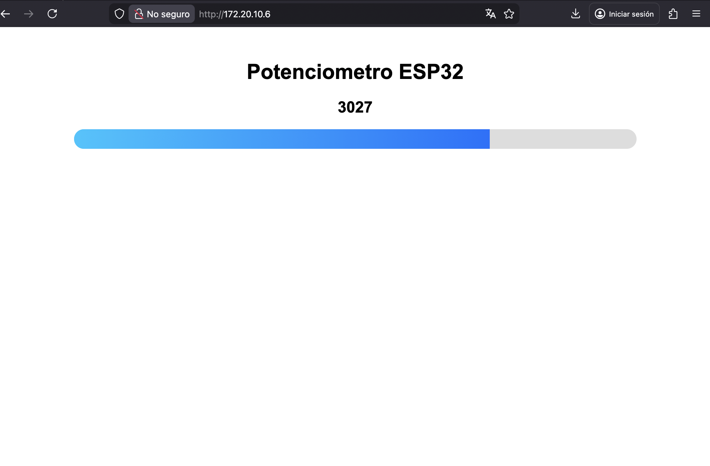
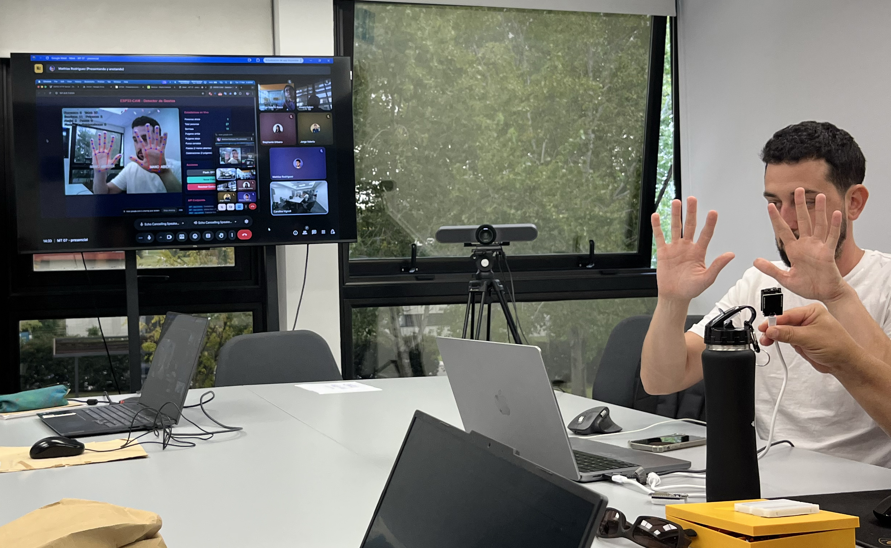

# MT07

**Interfaces y aplicaciones**

Primero realicé un repaso del material teórico compartido por los docentes para comprender mejor lo que estaba haciendo, ya que para mí es todo muy nuevo y me faltan conceptos que me ayuden a realizar el paso a paso sola. 
Si bien, estos ejercicios fueron una demostración de lo que la IA nos puede ayudar sin tener mayores conocimientos, es fundamental razonar los pasos que voy a dar, que quiero lograr y las distintas posibilidades que tengo.

**Interfaz**
En este módulo sumamos la interfaz como puente físico sin tener que meterse todo el tiempo en el código o la placa.
Hay distintos puentes, en este caso utilizamos la app Blynk y una página web. Ambas nos permiten ver estado y ejecutar acciones de forma mucho más cercana a un sistema real y no como una prueba de laboratorio.
Digamos que mejora enormemente la experiencia de uso y amplía las posibilidades de las acciones.
Utilizamos el ESP32 como micorcontrolador para ejecutar las interfaces.

Debo realizarme tres preguntas para que realmente se haga una lectura correcta en la interfaz:

1-	 qué variable o estado quiero mostrar
2-	 qué acción real puede ejecutar el usuario. 
3-	 cómo voy a confirmar lo que pasó

Para poder ordenar las ideas y contestar a estar tres preguntas podemos pensar el sistema en capas:
-	Capa de entrada, donde el microcontrolador recibe información; 
-	Capa de lógica, donde decide qué hacer; 
-	Capa de salida, donde actúa; 
-	Capa de interfaz, donde alguien observa o manda órdenes.
Todo esto ocurre por medio del ESP32 que mantiene ciertas variables, recibe pedidos y ejecuta acciones.

 Las interfaces deben priorizar simplicidad y funcionalidad. 
- Debe ser clave la legibilidad del estado
- Tener acciones claras
- Feedback inmediato tras la acción
- Coherencia
- Mínima carga cognitiva

Opciones de puentes para una interfaz
-	Web (HTML y JavaScript)
HTML (HyperText Markup Language): Define la estructura de la página
(botones, textos, títulos).
-	JavaScript (JS) Permite la interactividad; es el encargado de tomar el evento
del usuario (ej. clic en un botón) y enviarlo al ESP32.
-	Node-RED (Dashboards) Node-RED es una herramienta de programación visual para cablear hardware, APIs y servicios en línea. Es excelente para crear dashboards sencillos que permitan interactuar con múltiples dispositivos, visualizar datos en gráficos y aplicar lógica compleja sin escribir mucho código.
-	Plataformas IoT (Blynk)
Blynk es una plataforma especializada en IoT que facilita la creación rápida de aplicaciones móviles (iOS/Android) y dashboards web. La ventaja es que abstrae mucha de la complejidad de la comunicación. Solo necesitan definir qué tipo de widget quieren (botón, slider, gráfico) y enlazarlo a un pin virtual que el ESP32 entiende.

**Ejercicios_**
**1.	Se nos plantea encender y apagar una LED integrada del ESP32 y controlada desde Blynk.**

- **Blynk** es una plataforma de software IoT (Internet de las Cosas) de bajo código que permite conectar, controlar y monitorear hardware (como ESP32, Arduino, Raspberry Pi) de forma remota a través de aplicaciones móviles y web. Facilita la creación de prototipos rápidos sin necesidad de programar aplicaciones complejas, permitiendo arrastrar y soltar componentes gráficos. (Visión general creada por IA)
¿Para qué lo necesito? Para tener una interfaz (botón) en mi celular.
¿Por qué Blynk? Porque necesito una forma fácil de enviar órdenes sin programar una app de cero y esta app me facilita eso.

Comienzo pidiendo al chat GPT como manejar el ESP32 a través de Blynk en mi celular, de manera de prender y apagar un led azul integrada, y le aclaro que no se hacer nada.

Qué necesitas
•	Un ESP32
•	Cable USB
•	Tu celular con la app Blynk
•	Arduino IDE instalado en tu PC

Me descargo la app Blynk en el celular, y en la computadora abro mi sesión. Arduino ya lo tenía de los módulos anteriores donde trabajamos con él (mirar en MT04).

Comencé generando el botón led en Blynk desde la computadora.

**1)	Crear un proyecto (template)**
Template → el diseño (botón, configuración)

1.	Toca "New Template" (o “Nuevo template”)
2.	Completa:
o	Name: por ejemplo → LED ESP32
o	Hardware: selecciona ESP32
o	Connection: WiFi
3.	Toca Done

En mi caso le puse TEST. Aca lo que estoy haciendo es crear mi “cerebro” en la nube. Qué dispositivo voy a usar (ESP32), como se va a conectar (wifi) y que voy a controlar (que es lo que va a hacer). 
Blynk funciona en la nube y necesita saber estos datos para que funcione, debe tener una identidad en internet.

**2)	 Crear un dispositivo**
Device → el ESP32 real que vas a controlar (este específico que estoy usando), le tengo que decir a donde se va a conectar y que es lo que va a tener que controlar y me asigna un Auth Token para identificar mi ESP32 dentro de Blynk, tiene que saber cuál es el mío.  

Una vez dentro de Devices:
1.	Toca "New Device" (o “+”)
2.	Elige:
👉 From Template
3.	Selecciona el template que hiciste (ej: “LED ESP32”) TEST en mi caso
4.	Dale OK

**3)	Crear el botón (datastream)** *Flujo de datos*
Esto es clave 👇
1.	Ve a tu Template
2.	Entra en la pestaña Datastreams
3.	Toca "New Datastream"
4.	Elige Virtual Pin
5.	Configura:
o	Name: LED
o	Pin: V0
o	Data Type: Integer
o	Min: 0
o	Max: 1
6.	Guarda
Blink_3.2

**4) Crear el botón visual**
1.	Ve a la pestaña Web Dashboard o Mobile Dashboard
2.	Toca Edit (icono lápiz)
3.	Añade un widget:
-	Selecciona Button
4.	Configura el botón:
-	Datastream: selecciona LED (V0)
-	Mode: Switch (IMPORTANTE)
-	Texto opcional:
	ON: Encender
	OFF: Apagar
5.	Guarda

Así se visualizan en mi teléfono

- **Arduino**
Luego que configuré Blynk abro Arduino para ejecutar las órdenes. Como ya he trabajado con el ESP32 en Arduino, voy a herramientas/placa y veo que ya lo tengo instalado y Arduino lo reconoce.

**1) Instalar librería Blynk**
La librería permite que se conecten entre si.
Voy a: Herramientas / Administrar bibliotecas
Buscar “Blynk”
Instalar la versión oficial (by Volodymyr Shymanskyy) 

Copio el código que me sugirió el chat GPT. Debo rempalzar mi auth_token, wifi y password.

- **ESP32**
Conecto mi ESP32 con cable USB a la computadora y se enciende la luz.

**2.	Debo elegir un sensor (en mi caso elegí un potenciómetro) y controlar con ESP32 vía interfaz web.**
Nuevamente recurro a IA para pedirle el paso a paso.

Idea general (qué vas a lograr)
Vas a:
1.	Conectar un potenciómetro al ESP32 
2.	Leer su valor 
3.	Crear una página web en el ESP32 
4.	Ver el valor del potenciómetro en el navegador en tiempo real

Materiales necesarios
•	ESP32 
•	Potenciómetro (10kΩ típico) 
•	Protoboard (para mi no fue necesiario, lo enchufé directamente en el ESP32)
•	Cables 
•	Cable USB

- Paso 1: Conexión del potenciómetro
El potenciómetro tiene 3 patas:
[ GND ] [ SIGNAL ] [ 3.3V ]
Conecta así:
•	Un extremo → GND del ESP32 (Tierra/Ground)
•	Otro extremo → 3.3V del ESP32 (suministra energía positiva, 3.3 voltios)
•	Pin del medio → GPIO 34 (entrada pin analógica) 
📌 El GPIO 34 es ideal porque es solo entrada analógica.

>>Utilizo el cable violeta al medio, conectado al GPIO 35, ya que no tengo 34. En los extremos dejo 3.3v y GND.

- Paso 2: Instalar entorno
Usaremos Arduino IDE:
1.	Descarga Arduino IDE 
2.	Agrega soporte ESP32: 
Archivo → Preferencias 
En "URLs adicionales":
	https://raw.githubusercontent.com/espressif/arduino-esp32/gh-pages/package_esp32_index.json

Luego:
3.	Herramientas → Placa → Gestor de placas 
4.	Busca “ESP32” e instala

*El paso dos ya lo tengo hecho de los ejericios anteriores*

Paso 3: Código completo (copiar y pegar)
Es un código crea un servidor web simple:
*Verificar con chat GPT antes de volverlo a usar*
include <WiFi.h>
include <WebServer.h>
const char* ssid = "TU_WIFI";
const char* password = "TU_PASSWORD";
WebServer server(80);
int potPin = 34;
void handleRoot() {
  int valor = analogRead(potPin);
  String html = "<html><head><meta http-equiv='refresh' content='1'></head>";
  html += "Valor del Potenciometro";
  html += "+ String(valor) +";
  html += "</body></html>"; server.send(200, "text/html", html);
}
void setup() {
  Serial.begin(115200);
  WiFi.begin(ssid, password);
  Serial.print("Conectando...");
  while (WiFi.status() != WL_CONNECTED) {
    delay(500);
    Serial.print(".");
  }
  Serial.println("\nConectado!");
  Serial.println(WiFi.localIP());
  server.on("/", handleRoot);
  server.begin();
}
void loop() {
  server.handleClient();
}

- Paso 4: Configurar WiFi
Cambia esto:
const char* ssid = "TU_WIFI";
const char* password = "TU_PASSWORD";
Por tu red real.

const char* ssid = "TU_WIFI";
const char* password = "TU_PASSWORD";

- Paso 5: Subir el código
1.	Conecta el ESP32 
2.	Selecciona la placa correcta 
3.	Haz clic en Subir 

-  Paso 6: Ver la interfaz web
1.	Abre el monitor serial (115200 baud) 
2.	Verás algo como: 
192.168.1.45
3.	Abre tu navegador y entra a esa IP

https://www.youtube.com/shorts/u8YwxwSKDWg
>>En este link podemos ver como varía la barra en función que se mueve el potenciómetro

Luego si quiero puedo cambiar la interfaz, mejorar lo que me guste o resulte mejor. Las posibilidades son muchas.

**ESP32-CAM**
Dentro de las posibilidades que nos brindan las interfaces, Mathías nos mostró que conectó una cámara al ESP32 y por medio de Blynk la programó para que detecte movimientos de la mano y enviar alertas, dependiendo la gestualidad. 

También capturas de imagen, activar el flash, entre otras cosas.

Luego probó con la misma lógica, pero siguiendo los movimientos de una pelota de ping pong lograr dibujar el trayecto en un lienzo de la interfaz.
https://youtube.com/shorts/A-M09CvsfKo

**CONCLUSIONES_**
Sigue siendo un mundo nuevo para mí y abarca tantas posibilidades que por momentos abruma, de hecho, en la práctica me perdí bastante, me costó entender lo que estaba haciendo, la IA es genial y de mucha ayuda, pero es calve saber preguntarl y entender lo que responde. 
En este caso me pasó que me perdí un poco (sobre todo en el primer ejercicio) porque me sugería hacer tal cosa y tenía que ir a ver que era eso, o para que servía lo que estaba haciendo, y un poco presionada por el tiempo, me costó realizarlo. 
Esto me llevo a mal registro, porque hubo cosas que no documenté correctamente o hice más de una vez. Así y todo, pude ordenar el material que tenía y logré entender todos los pasos.
Luego al repasar el teórico y escribir la bitácora todo se aclaró un poco mas. Aún me desborda y hago mucho automáticamente, pero entiendo que hay pasos reiterativos, como ser a la hora de conectar un sensor al ESP32 que tenga su tierra, voltaje y pin. Esto lleva práctica y tiempo, pero de poco voy entendiendo el lenguaje o procedimientos.
Sumar software IoT (Internet de las Cosas) como Blynk o webs trabajadas con interfaces que podes modificar, me parece de una ayuda inmensa para utilizar la electrónica en mis proyectos de manera fácil y dinámica.

