# MT08

**Control numérico computarizado**

En este módulo preparamos un archivo modelado en Fusion 360 para cortar en el router CNC del laboratorio de UTEC Durazno.
El router utiliza fresas para cortar el material (puede ser madera, plástico, acrílicos, etc.) Dependeindo de la fresa que utilicemos la terminación que nos va a dar.
Podemos controlar velocidades y tipos de movimiento para sustraer el material. Todos esos parámetros son controlables y nos van a definir la pieza final.
A continuación los pasos realizados.
**1-**	Abrir Fusion 360 e ingresa al módulo de **FABRICACIÓN**.

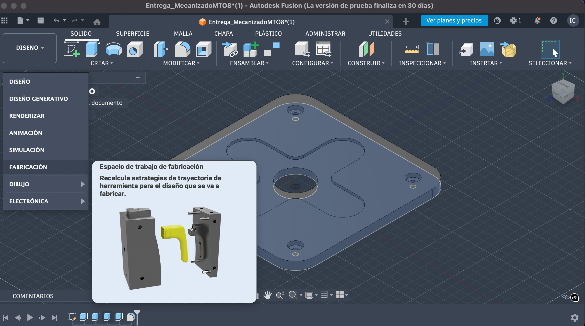

**2-**	Dentro del módulo FABRICACIÓN, configura la máquina a utilizar como fresadora.
Para este ejercicio utilizamos Autodesk Generic 3-axis Router y el archivo ya tengo con que fresa voy a trabajar, en este caso 1/8” Flat Endmill.
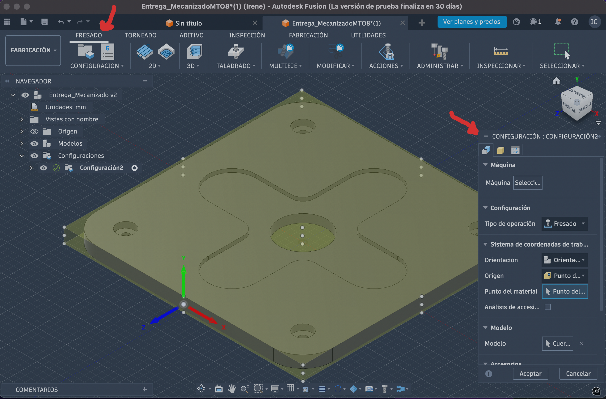
**INSTALAR MÁQUINA**
En mi caso no tengo instalada esa máquina y me dice que es necesito descargarla para continuar con configuración. Doble click y se descarga.
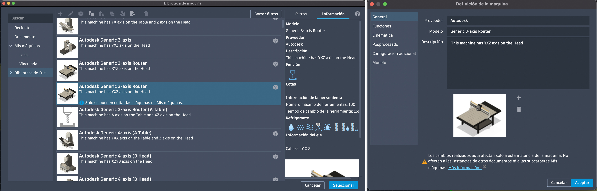

**MATERIAL**
Con click derecho en el circulo arriba, elijo material físico.
Defino caja de tamaño fijo y corroboro las medias tal como dice la premisa 200x200x10mm.
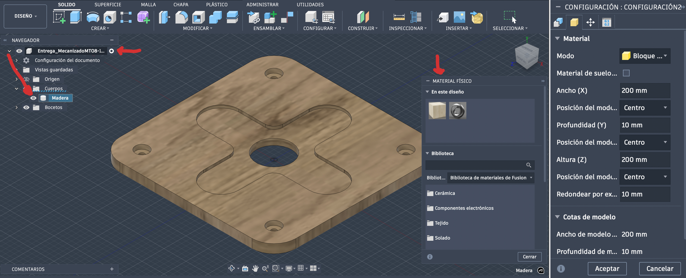

**ORIGEN**
- Orientación del modelo debe estar en x,y,z, con Z en el plano vertical
- En origen selecciono en la esquina izquierda inferior del modelo, el punto superior, como esta pautado en el ejercicio (que quede lo mas cerca posible del origen de la maquina).
Después de definir el origen observé que las coordenas no estaban correctas, asi que en la misma pestaña definí cual era x,y,z.

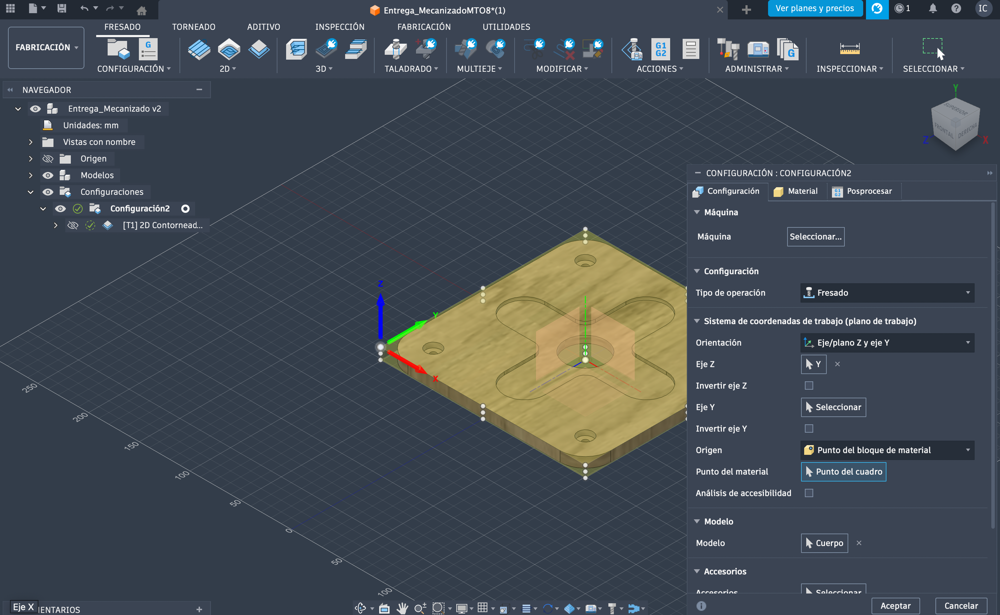

En este modelo vamos a trabajar en fresado 2D y las herramientas serán *Cajeras, Taladro y Contorno*. Suelen ser las más utilizadas, en 2D. Para modelado 3D existen más variantes.

**CAJERAS**
Empiezo con cajeras que es el el desbaste más de mayor superficie. 
Este comando es utilizado para generar un corte delimitado por una línea de perímetro. "Toda superficie que quede dentro, o fuera  de los vectores que seleccionemos va a ser mecanizada a la profundidad y velocidad  que configuremos. La mayoría de las veces este comando es utilizado para cortar y desprender la pieza del material. Y suele ser la última operación que se realiza". (Texto tomado del téorico del módulo).
Selecciono la línea del perímetro o cara  y como va a hacer ese desbaste, pasadas, etc. y las alturas dependiendo el material con que trabaje y lo que busque en cuanto a terminación.
En este caso le di 5mm desde la cara superior.

Altura superior / inferior /numero de pasadas / reduccion de desbaste (escalones).
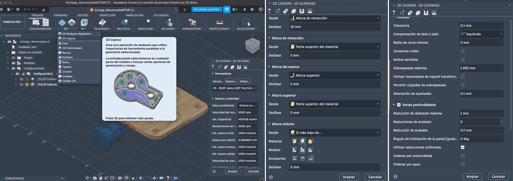

"Para finalizar la configuración de la herramienta, debemos seleccionar el tipo de refrigerante para la fresa. En este caso vamos a seleccionar simplemente AIRE, ya que nuestros equipos no cuentan con sistema de refrigeración por líquido soluble". (Texto tomado del téorico del módulo).

**TALADRO**
El taladrado nos permite generar un orificio a la profundidad configurada sobre cualquiera de las caras SUPERIORES del modelo. 
Selecciono los agujeros y se pintan de azul.

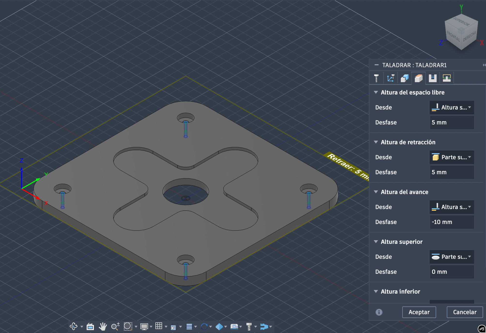

Aca es muy importante definir las distintas alturas de seguridad. De hecho la primera vez que intenté configurarlo me dio error.

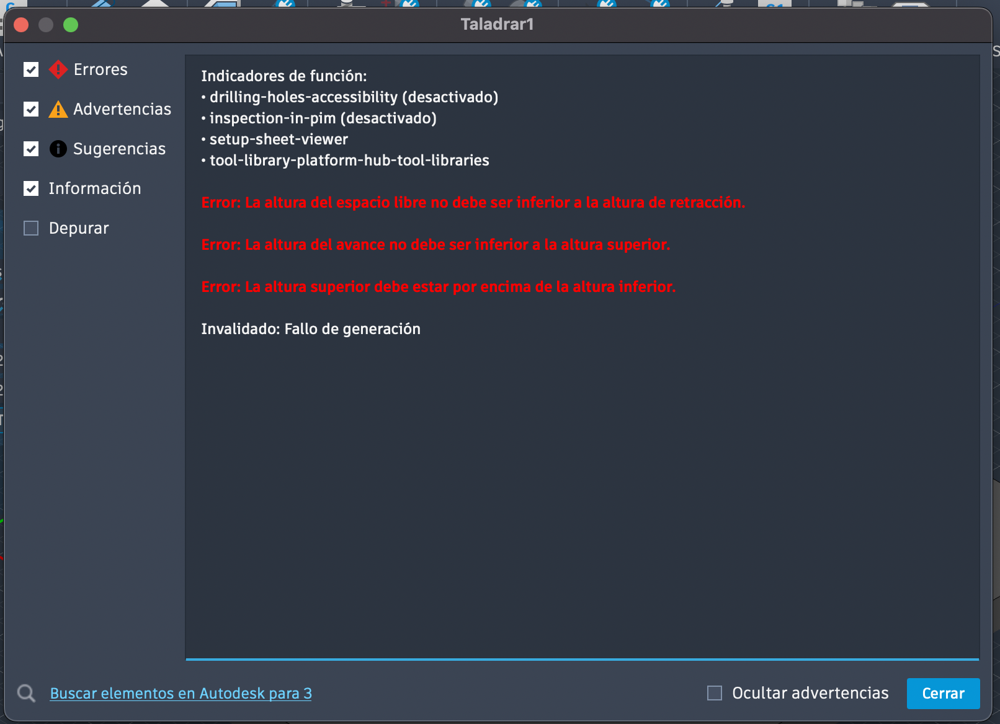

Entonces busqué cada altura que era lo que controlaba para entenderlo en mi pieza donde estaba el error.

Explicación_
1.	Altura superior = Stock top (0 mm) 
-	La fresa empieza a cortar desde la parte superior de la madera. 
2.	Espacio libre y retracción = +5 mm 
-	Esto asegura que la fresa suba y se mueva entre agujeros sin chocar con clamps o la pieza. 
3.	Altura inferior = –10 mm 
-	Material = 10 mm → agujero atraviesa todo. 
4.	Desfase = 0 mm 
-	Cortamos exactamente hasta el fondo.

**CONTORNO**
El objetivo es recorrer el perímetro de la pieza. En este caso tenemos el perimetro de afuera y el circulo del centro. Como medida de seguridad y que la pieza quede correctamente cortada sin moverse, le realizamos pestañas. Así ninguna pieza sale volando ni se mueve nada hasta que la maquina no finalice.

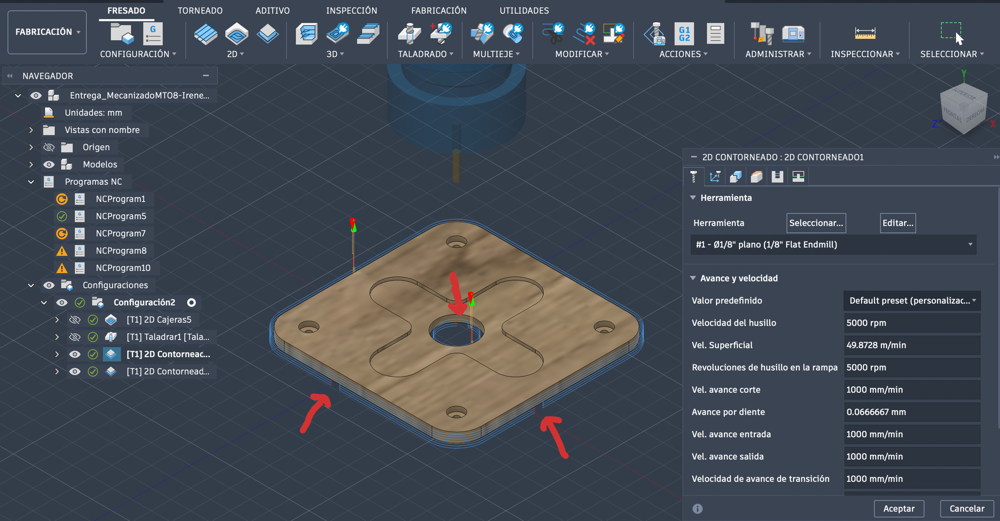

Se pueden configurar las pestañs en tamaño y cantidad.
En este caso realicé dos contronos de manera de configurar cada uno de forma independiente. Por un lado el agujero central y por otro lado el contorno total del perímetro.

**SIMULADOR**
Luego de configuar todo esta la opción de simulador que permite ver como va a trabajar la máquina y en caso de errores te lo muestra, como fue en el caso mio de las alturas.

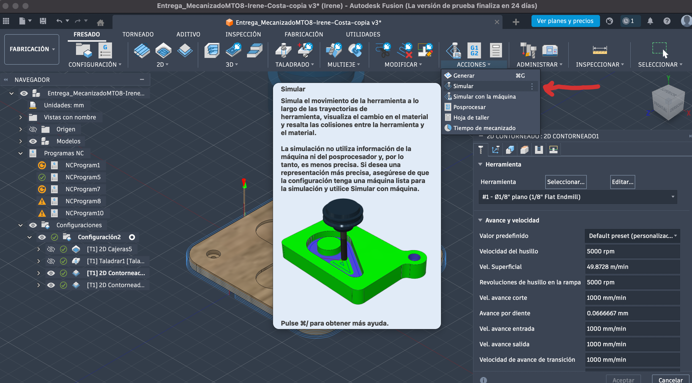

**PRÁCTICA EN EL LABORATORIO**

El laboratorio de UTEC Durazno cuenta con dos routers de corte CNC. Una pequeña y de gran precisión DGSHAPE SRM-20, que es muy usada en placas de elctrónica y la  X-CARVE para piezas más grandes, que fue la que utilizamos en esta práctica.

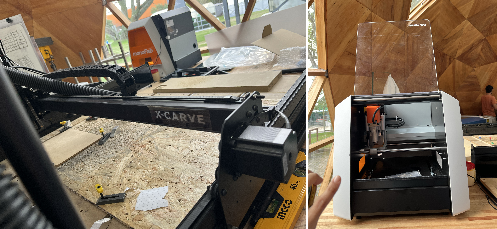

Lo primero fue ver la máquina como lee el archivo, buscar el punto cero y ajustar el material de trabajo. Una vez todo calibrado comenzó con su trabajo.

Realizamos tres pruebas cambiando las fresas para ver sus difrenrecias de acabado. La que quedó mejor en mi opinión fue la del centro en la imagen, que era de punta chata y sin rulo.

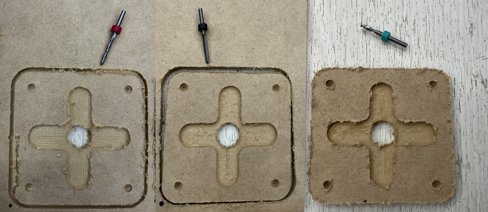

También los docentes nos compartieron otros trabajos realizados en CNC, nos contaron de su proceso, mechas y parámetros trabajados.

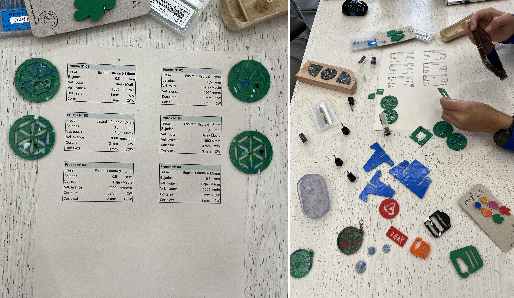

**REFELXIONES**
Estas máquinas son muy potentes, permiten controlar muchísimos parámetros y sus resultados pueden ser bien distintos. Se necesita mucha práctica y conocer la máquina con la que vamos a trabajar para realmente lograr trabajos de gran precisión.

