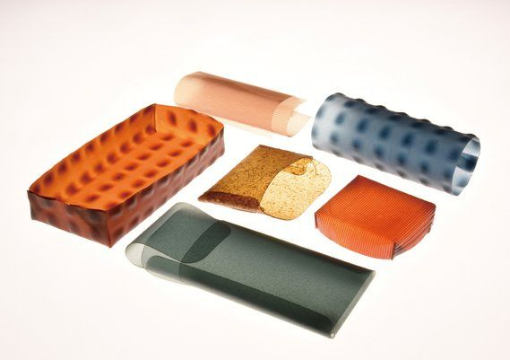
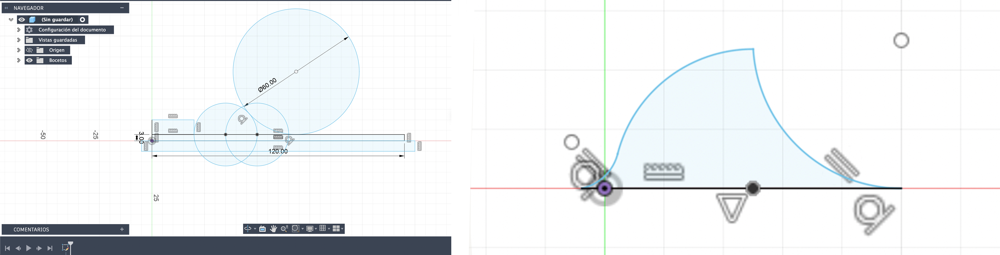
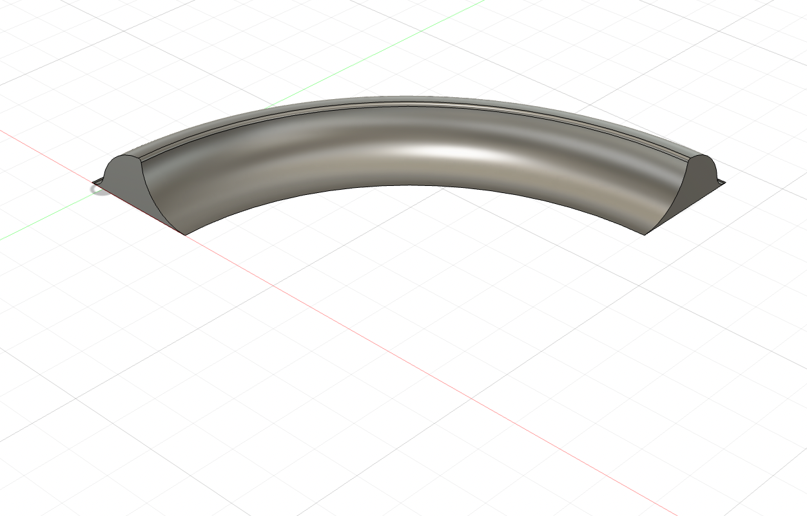
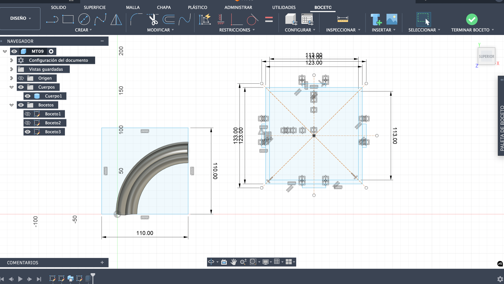
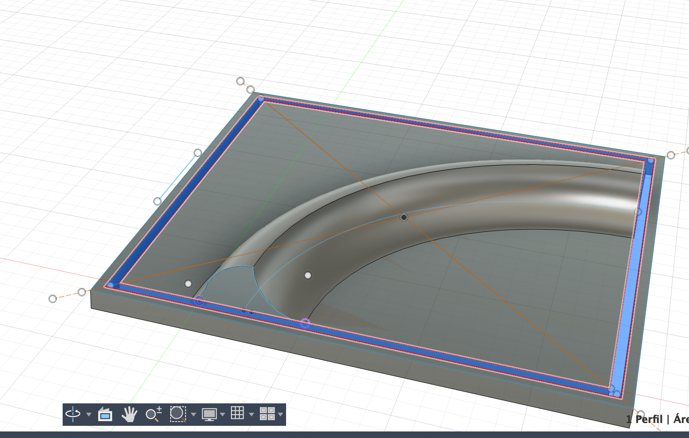
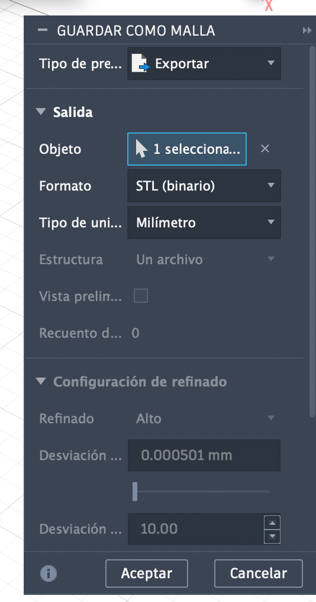
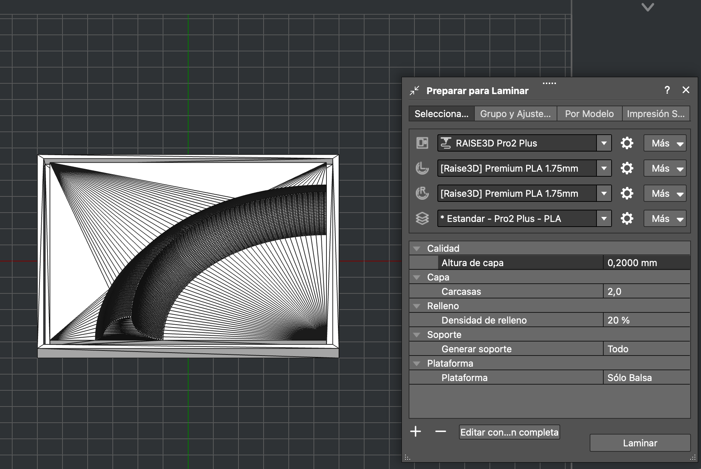
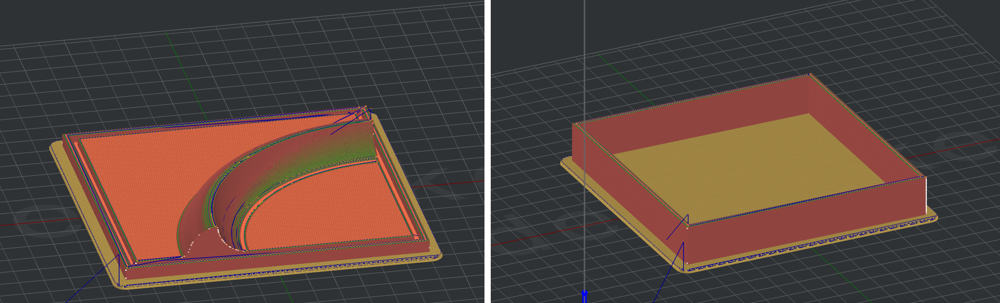

# MT09

**Moldes**

Este ejercicio se aproxima más a mi idea de proyecto final de trabajar con moldes y biomateriales.
Estos tipos de moldes impresos en 3D permiten producir piezas con formas complejas y luego replicarlas de manera exacta.
En este módulo se nos pidió un molde rígido (ideal para posteriormente utilizar con biomateriales de consistencia gelatinosa) y con un máximo de dos taseles.
Este molde no debería presentar mayores complicaciones a la hora de desmoldar ya que es una figura simple, no necesita de escape de ventilación, ni alineadores o ángulo de desmolde. Es una forma simple sobre una cama y sus paredes se desmoldan por encastre. 
Mis dudas están en el diseño, ya que es la primera vez que voy a imprimir algo y si bien fui al MT05 para repasar ciertos conceptos y parámetros, me genera duda si los espesores son correctos.

**Elección del molde**
Pensé en un molde que me permita generar piezas más grandes por encastre o algún tipo de combinación que genere una estampa.

Descarté este tipo de opción porque el tema de encastre requiere de un nivel de detalle para que calce perfecto y tampoco tengo claro las densidades de los materiales.
Así que decidí revisar imágenes de azulejos que tengo guardadas hace tiempo, es algo que me resulta interesante también, poder combinar y generar estampas a partir de un módulo y más aún sumar tecnología al proceso que me permita diseños más complejos y precisos.

También estuve investigando en distitnas opciones de estampado en biomateriales.

https://www.thetechathome.org/makingwithmicrobes

Estas imagenes inspraciones fueron sacadas de Pinterest y una de ellas me redirecciomó a esta página que muestra opciones de estampado.

>> Este ejemplo me resulta sencillo y a su vez permite un montón de variantes, por lo cual resolví tomar como inspiración.

**Modelado en Fusion 360**
 
Primero definí que la baldosa sea de 11x11 cm. Teniendo esa media como referencia, comencé dibujando (sketch) “la ola” desde el plano vertical. Interceptando distintas circunferencias generé una forma que me gustó (luego de probar distintas proporciones e intersecciones). No quería que superara un tercio aproximado del largo de la baldosa, así que tenía que rondar los 3cm de ancho.

Luego hice un segundo sketch desde el plano superior, dibujé el recorrido de la ola que es un cuarto de circunferencia. 

Si bien en ambos sketches les dibujé la baldosa de 11x11 cm como referencia, lo usé como dibujo auxiliar que luego borré, porque sino, no lograba hacer el barrido, me costaba que no seleccionara esa superficie en lugar del cuarto de esfera. También tuve un tema con los planos y resolví volver a empezar para no mover todo. Algo mal estuve haciendo, pero resolví primero dibujar la ola y su trayectoria y luego un tercer sketch donde ahí si dibujé la baldosa y su contorno, dejando la ranura para el encastre de la pared. 
Todos los cuadrados los dibujé desde el punto central, asi me aseguré que quedaron centrados.

Una vez que tuve todo dibujado, comencé a extruir. Primero la baldosa y el contorno, que les dí -5mm. 

El agujero en el medio que es donde se encastran las paredes del molde lo extruí de manera que cubriera el alto de la ola, me quedó de 18mm. Extruí para ambos lados asi cubre la ola y encastra en el agujero.

Me seguía quedando el hueco de abajo y no lograba tapar esa base,me lo extruía desde arriba y no podía extruir desde un poco más abajo. Así que terminé haciendo un nuevo sketch que tomara la superficie del contorno y la baldosa (digamos toda la base) y le di 2mm de espesor.

**Exportar como malla**

Repasé el procedimiento y los parámetros utilizados en MT05 para realizar la exportación.
Primero exporté ambas piezas juntas y cuando lo abrí en Ideamaker me advirtió que la superficie superaba la de la maquina y tendría que achicarlos

Entonces exporte una pieza a la vez. Oculté primero una y con click derecho le di exportar malla, y luego el mismo procedimiento con el otro cuerpo. 

**Idea Maker**

Dejé los parámetros tal cual los tenía guardados para la impresora RAISE3D Pro2 Plus (altura de capa 0,2000 mm, carcasa 2,0, velocidad 80.0 mm/s, densidad de relleno 20.0%)
Laminar y ahí se exporta como gcode.
Los tiempo me parcen elevados, la baldosa demora casi 6 horas y las paredes 3 horas, no manejo aún este parámetro asi que puede que sea lo correcto para estas dimensiones.

- Comparto los archivos del trabajo realizado 

https://drive.google.com/drive/folders/1FYGXMRaKOzNZlEhRm9FeTDGU99Aphysp?usp=drive_link

**Reflexion**

Tuve varios inconvenientes a la hora de modelar, necesito practicar mucho más y dominar ciertas cosas que me trancan y no logro avanzar. Pienso que sigue siendo clave antes de ponerme a dibujar, pensar como lo voy a hacer, porque luego corregir cosas y mover planos resulta más complicado aún.
Me quedan muchas dudas sobre las piezas y sus dimensiones si quedara muy fino o muy gureso, si encastrará bien, que tanto puede variar el margen de error, pero para eso hay que hacer pruebas e ir aprendiendo en la práctica.
Me resulta dificil explicar las complicaciones que tuve, si bien logré resolverlas, me falta tecnicisimo.

En cuanto al ejercicio me motiva mucho, espero que sea un rompe hielo para mi proyecto y poder realizar moldes más complejos.

