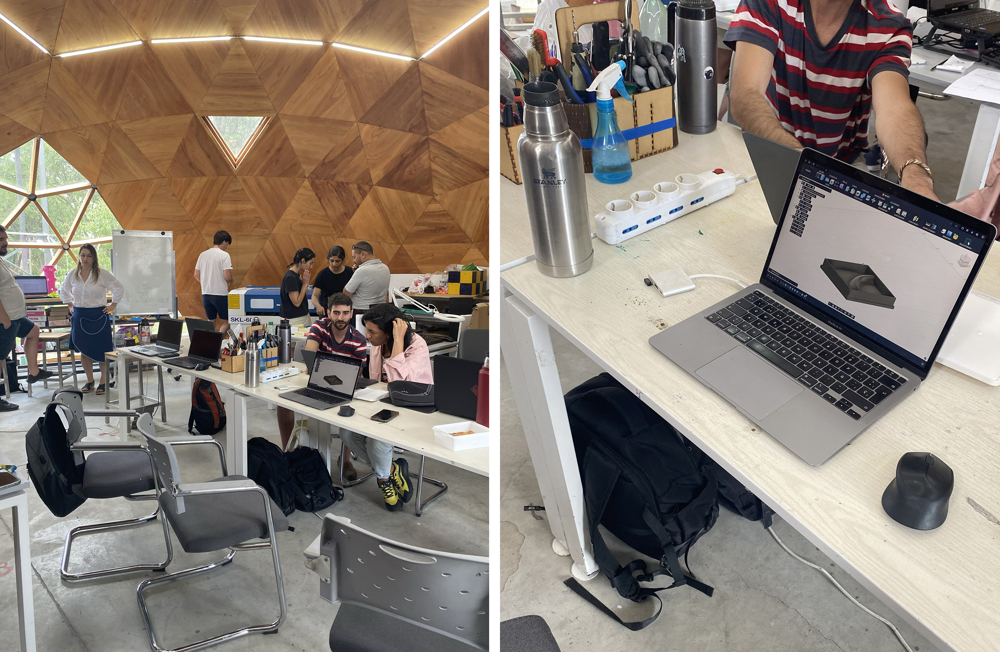

# MT09

**Moldes**

Este ejercicio se aproxima más a mi idea de proyecto final de trabajar con moldes y biomateriales.
Estos tipos de moldes impresos en 3D permiten producir piezas con formas complejas y luego replicarlas de manera exacta.
En este módulo se nos pidió un molde rígido (ideal para posteriormente utilizar con biomateriales de consistencia gelatinosa) y con un máximo de dos taseles.
Este molde no debería presentar mayores complicaciones a la hora de desmoldar ya que es una figura simple, no necesita de escape de ventilación, ni alineadores o ángulo de desmolde. Es una forma simple sobre una cama y sus paredes se desmoldan por encastre. 
Mis dudas están en el diseño, ya que es la primera vez que voy a imprimir algo y si bien fui al MT05 para repasar ciertos conceptos y parámetros, me genera duda si los espesores son correctos.

**Elección del molde**
Pensé en un molde que me permita generar piezas más grandes por encastre o algún tipo de combinación que genere una estampa.

Descarté este tipo de opción porque el tema de encastre requiere de un nivel de detalle para que calce perfecto y tampoco tengo claro las densidades de los materiales.
Así que decidí revisar imágenes de azulejos que tengo guardadas hace tiempo, es algo que me resulta interesante también, poder combinar y generar estampas a partir de un módulo y más aún sumar tecnología al proceso que me permita diseños más complejos y precisos.

También estuve investigando en distitnas opciones de estampado en biomateriales.

https://www.thetechathome.org/makingwithmicrobes

Estas imagenes inspraciones fueron sacadas de Pinterest y una de ellas me redirecciomó a esta página que muestra opciones de estampado.

>> Este ejemplo me resulta sencillo y a su vez permite un montón de variantes, por lo cual resolví tomar como inspiración.

**Modelado en Fusion 360**
 
Primero definí que la baldosa sea de 11x11 cm. Teniendo esa media como referencia, comencé dibujando (sketch) “la ola” desde el plano vertical. Interceptando distintas circunferencias generé una forma que me gustó (luego de probar distintas proporciones e intersecciones). No quería que superara un tercio aproximado del largo de la baldosa, así que tenía que rondar los 3cm de ancho.

Luego hice un segundo sketch desde el plano superior, dibujé el recorrido de la ola que es un cuarto de circunferencia. 

Si bien en ambos sketches les dibujé la baldosa de 11x11 cm como referencia, lo usé como dibujo auxiliar que luego borré, porque sino, no lograba hacer el barrido, me costaba que no seleccionara esa superficie en lugar del cuarto de esfera. También tuve un tema con los planos y resolví volver a empezar para no mover todo. Algo mal estuve haciendo, pero resolví primero dibujar la ola y su trayectoria y luego un tercer sketch donde ahí si dibujé la baldosa y su contorno, dejando la ranura para el encastre de la pared. 
Todos los cuadrados los dibujé desde el punto central, asi me aseguré que quedaron centrados.

Una vez que tuve todo dibujado, comencé a extruir. Primero la baldosa y el contorno, que les dí -5mm. 

El agujero en el medio que es donde se encastran las paredes del molde lo extruí de manera que cubriera el alto de la ola, me quedó de 18mm. Extruí para ambos lados asi cubre la ola y encastra en el agujero.

Me seguía quedando el hueco de abajo y no lograba tapar esa base,me lo extruía desde arriba y no podía extruir desde un poco más abajo. Así que terminé haciendo un nuevo sketch que tomara la superficie del contorno y la baldosa (digamos toda la base) y le di 2mm de espesor.

**Exportar como malla**

Repasé el procedimiento y los parámetros utilizados en MT05 para realizar la exportación.
Primero exporté ambas piezas juntas y cuando lo abrí en Ideamaker me advirtió que la superficie superaba la de la maquina y tendría que achicarlos

Entonces exporte una pieza a la vez. Oculté primero una y con click derecho le di exportar malla, y luego el mismo procedimiento con el otro cuerpo. 

**Idea Maker**

Dejé los parámetros tal cual los tenía guardados para la impresora RAISE3D Pro2 Plus (altura de capa 0,2000 mm, carcasa 2,0, velocidad 80.0 mm/s, densidad de relleno 20.0%)
Laminar y ahí se exporta como gcode.
Los tiempo me parcen elevados, la baldosa demora casi 6 horas y las paredes 3 horas, no manejo aún este parámetro asi que puede que sea lo correcto para estas dimensiones.

- Comparto los archivos del trabajo realizado 

https://drive.google.com/drive/folders/1FYGXMRaKOzNZlEhRm9FeTDGU99Aphysp?usp=drive_link

**Reflexion**

Tuve varios inconvenientes a la hora de modelar, necesito practicar mucho más y dominar ciertas cosas que me trancan y no logro avanzar. Pienso que sigue siendo clave antes de ponerme a dibujar, pensar como lo voy a hacer, porque luego corregir cosas y mover planos resulta más complicado aún.
Me quedan muchas dudas sobre las piezas y sus dimensiones si quedara muy fino o muy gureso, si encastrará bien, que tanto puede variar el margen de error, pero para eso hay que hacer pruebas e ir aprendiendo en la práctica.
Me resulta dificil explicar las complicaciones que tuve, si bien logré resolverlas, me falta tecnicisimo.

En cuanto al ejercicio me motiva mucho, espero que sea un rompe hielo para mi proyecto y poder realizar moldes más complejos.

-------- 

**FP02 DURAZNO**

*Práctica de fabricación en el laboratorio de UTEC Durazno*

En la jornada vimos las distintas máquinas de impresión 3D con que cuenta el laboratorio y que de manera teórica habíamos visto en MT05. Y se planificó chequear los archivos del MT09 para mandar a imprimirlos.

-  *La impresión 3D FDM* (Modelado por Deposición Fundida).
Este tipo de máquinas funciona por la fundición de un material termoplástico, donde la adicción de capas sigue el recorrido de un modelo digital. Cada máquina presenta sus características, varían sus procesos, tiempos y materiales, lo que permite una gran versatilidad.

Es bastante económico su material y fácil de usar, por lo cual es recomendable para hacer prototipos.

En el laboratorio se encuentran distintos tipos de FDM.

DELTA (azul que se ve al fondo en la foto de la izquierda)

Logra una impresión rápida, pero su superficie pequeña y cilíndrica. Es de las primeras que hubo en el laboratorio, están un poco obsoletas.

CARTESIANAS con cama móvil en Z 
Acá tenemos la Ultimaker (blanca en la foto izquierda) y la Raise3D (en la que preparé los archivos para imprimir, foto de la derecha)

-  *Impresión con resina*
En lugar de extruir el material termoplástico, estas máquinas solidifican un polímero que reacciona con la luz ultravioleta.
Estas máquinas tienen un nivel de definición mayor a las impresiones de FDM.
Otra característica es que siempre tienen árboles de los cuales se sostienen las piezas por lo que una vez curada la pieza hay que proceder a cortar estos agarres.
Hay que tener cuidado al manipular la pieza cruda, se debe usar protección y una vez terminada la impresión se limpian con alcohol con cepillo y luego en una centrifugadora, por último, se termina la curación con luz ultravioleta.

Piezas luego de terminar la impresión, porntas para limpiar y curar
https://youtube.com/shorts/322oi1ngMos?feature=share 

Curado de piezas una vez limpias con alcohol
https://youtube.com/shorts/lWAcZi9VZ6A?feature=share 

-  *Impresión 3D SLS* (con polvo)
Esta creo que es la más difícil de comprender (para mi) al ser una cámara cerrada. Cuenta con una cubeta de polvo fino de polímero termoplástico. Esto se calienta y el láser aporta un poco más de temperatura recorriendo el diseño, de esta manera logra sintetizar las partículas de polvo capa a capa.
No precisa de ningún soporte lo cual permite realizar piezas más complejas.
Otra de sus características es que una vez que extraemos la pieza se debe limpiarla con cepillo y retirar el polvo, por lo cual es un método más sucio que los anteriormente nombrados.

>> Aquí las tres piezas. El blanco realizada con FDM, el gris en resina y el de la bandeja realizado en polvo

-  Práctica en impresora Raise3D

Ya con los archivos prontos, luego de lagunas correcciones mandé a imprimir en la Raise3D, tal como lo había preparado en los archivos gcode.
La maquina tenía un tema de calibración lo que hacía que no se adhirieran bien las capas. 
Estas máquinas requieren de mucha precisión en sus piezas a la hora de imprimir, de lo contrario generan distantitos tipos de error. Por un tema de tiempode impresión, sumado al error que generaba, que también requiere de tiempo y pruebas de ajustes, no logré ver la pieza impresa.

Error al imprimir
https://youtube.com/shorts/7jyl1x1v3dU?feature=share 

**Reflexiones_**
La ida al laboratorio permite tomar otra realidad y acercamiento a las nuevas tecnologías que nos presentan, y a su vez, transmiten seguridad a la hora de trabajar. 
Todas estas máquinas de las cuales ya habíamos hablado anteriormente, verlas funcionar, apreciar las diferentes piezas que se obtienen dependiendo de que máquina se utilice, realmente permiten dimensionar todo de otra forma.

En cuanto a la experiencia de mandar a imprimir, tenía muchas dudas si los archivos estaban correctos. Me gustaría que hubiesen más practicas porque ahí uno gana confianza y conocimiento, maneja imprevistos y variables que solo la práctica te lo dan.
Lucho, un compañero de la EFDI que cuenta con una impresora 3D en su casa llevó un montón de pruebas, ensayos y errores que realizó, reafirmando el tiempo que lleva obtener una buena pieza y que requiere de tiempo y dedicación que solo la práctica te da, es la manera de aprender y concluir nuevas cosas.

>> Pruebas realizadas por mi compañero, que nos permitieron intercambiar comentarios y conocer su experiencia

En esta oportunidad tuve que modificar el archivo de la pieza que quería imprimir. Estaba en funcionamiento el extrusor derecho y yo había determinado el izquierdo que es con el que suelen trabajar. Esto pequeños imprevistos y fáciles de solucionar permiten entender mejor los parámetros y todas sus variantes que hasta el mismo momento de imprimir no podés saber si esta todo correcto. 
Por este motivo los archivos gcode que compartí me quedaron con distinto seteo. Como no se dónde se van a imprimir dejé un archivo con los ajustes que tenía y el otro con los cambios que realicé en la práctica del laboratorio. 
Otro problema que surgió fue que el material no se adhería capa a capa debido a algún parámetro de la máquina que no estaba bien calibrado, como pudo haber sido la distancia de la cama al puntero. 

Estos inconvenientes fueron una pequeña muestra de la cantidad de problemas y variantes que puede haber, creo que podría ser un módulo en sí mismo ver los errores más comunes, cuáles pueden ser sus causas y como solucionarlo.

Ahora falta ver las piezas impresas y sacar nuevas reflexiones.

